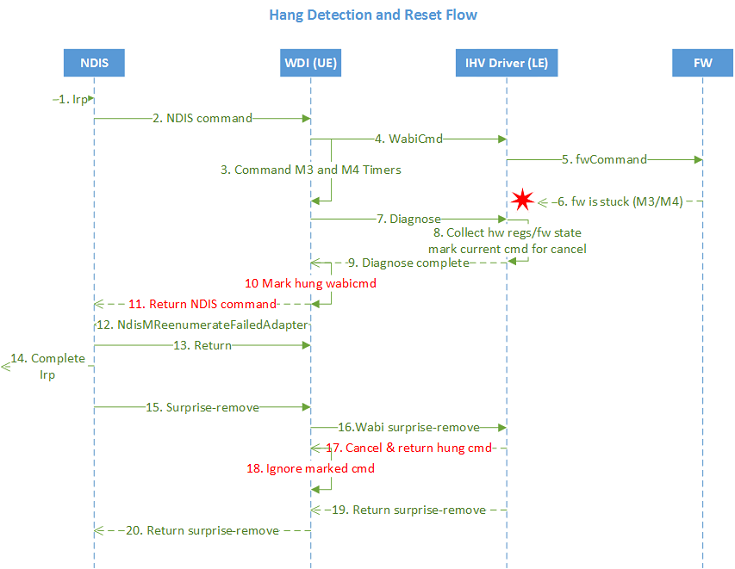

# UE hang detection and recovery flow

This diagram shows the UE hang detection and reset flow.

The diagram consists of main phases:

1.  Hang detection
2.  Log
3.  Reset: surprise-remove handling

It is important to keep in mind that this feature addresses firmware hangs. It does not solve IHV driver hangs. IHV driver hangs can only be solved with a hard reboot. The driver must release all handles and other resources before it can be unloaded. If the driver can't be unloaded, the recovery does not work.

This flow diagram applies generically to all NDIS OIDs and callbacks to miniports. There may be exceptional cases where if NDIS or the Bus can't fully support reset recovery, the recovery part of the reset recovery won’t work. Two example cases are during miniport initialization or during a miniport halt operation.

## Related topics

[UE hang detection: steps 1-14](wdi-ue-hang-detection--step-1-to-step-14.md)

[Reset (surprise remove): steps 15-20](wdi-reset--surprise-remove---steps-15-20.md)

 

 

