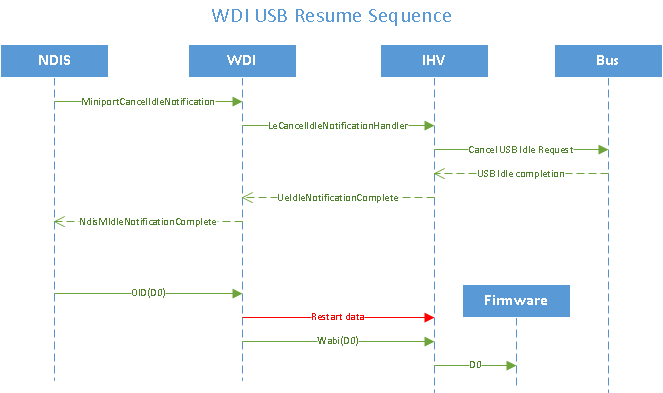

# WDI USB resume sequence

When the operating system needs to use the NIC, it cancels the idle state and resumes the NIC to the D0 working state. NDIS initiates the resume.

The following flow diagram shows the resume sequence.

 

 

