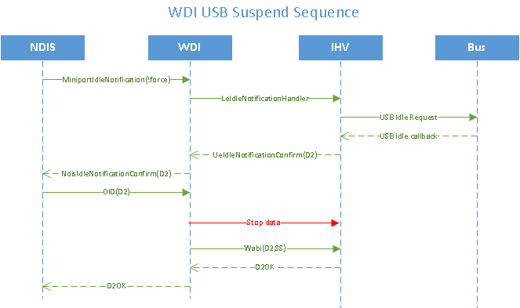

# WDI USB suspend sequence

When NDIS detects idle for longer than the Selective Suspend idle timeout (*SSIdleTimeout*), NDIS calls the UE. The UE may veto the idle notification by returning NDIS\_STATUS\_BUSY. If the UE does not veto the idle notification, the UE calls the LE with **LeIdleNotificationHander**, and the LE may veto or accept.

The UE accepts idle notifications when there is no pending data, commands, or timers that may expire to send data or commands down to the LE.

When WDI receives a D2 OID, it processes the OID as if it is a regular D2, except that it sends the WDI OID with the reason code set to **WDI\_SET\_POWER\_DX\_REASON\_SELETIVE\_SUSPEND**.

The following flow diagram shows the suspend sequence.

## Related topics

[*MiniportWdiIdleNotification*](https://msdn.microsoft.com/library/windows/hardware/mt297563)

[**WDI\_TLV\_SET\_POWER\_DX\_REASON**](https://msdn.microsoft.com/library/windows/hardware/dn898060)

 

 

