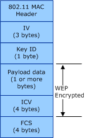

# WEP

**Important**  The [Native 802.11 Wireless LAN](native-802-11-wireless-lan4.md) interface is deprecated in Windows 10 and later. Please use the WLAN Device Driver Interface (WDI) instead. For more information about WDI, see [WLAN Universal Windows driver model](wifi-universal-driver-model.md).

 

Wired Equivalent Privacy (WEP) is the RC4-based algorithm specified in Clause 11.2.2 of the IEEE 802.11-2012 standard and Clause 8.2 of the 802.11i-2004 standard.

The WEP cipher uses a 40- or 104-bit key. If the miniport driver supports the Extensible Station (ExtSTA) mode, the 802.11 station can support a WEP key larger than 104 bits. The miniport driver reports the maximum size of the WEP key supported by the 802.11 station when [OID\_DOT11\_EXTSTA\_CAPABILITY](https://msdn.microsoft.com/library/windows/hardware/ff569366) is queried.

WEP keys can be statically defined on the 802.11 station or dynamically defined through a port-based authentication algorithm, such as IEEE 802.1X.

The 802.11 station uses the following key types for WEP cipher operations:

-   [Default Keys](default-keys.md)

-   [Key-Mapping Keys](key-mapping-keys.md)

The following figure illustrates the format of the 802.11 MAC protocol data unit (MPDU) frame encrypted through the WEP algorithm.

The WEP-encrypted MPDU frame consists of the following:

Initialization Vector (IV)  
A unique 24-bit value combined with the WEP key identified by the Key ID field to form the key used in the RC4 cipher algorithm. If a key-mapping key exists for the receiver address (RA) and transmitter address (TA), the 802.11 station combines the IV value with the key-mapping key to form the RC4 key.

Key Identifier (ID)  
Bits 7 through 6 store the index of the key, within the default key table, used to form the RC4 key. The 802.11 station ignores this field if a key-mapping key exists for the RA/TA pair. Bits 5 through 0 are reserved and set to zero.

Payload Data  
Data from the MAC service data unit (MSDU) packet.

Integrity Check Value (ICV)  
The checksum value computed over the unencrypted payload data.

Frame Check Sequence (FCS)  
The IEEE 32-bit cyclic redundancy code (CRC) computed over all fields of the MPDU.

 

 

