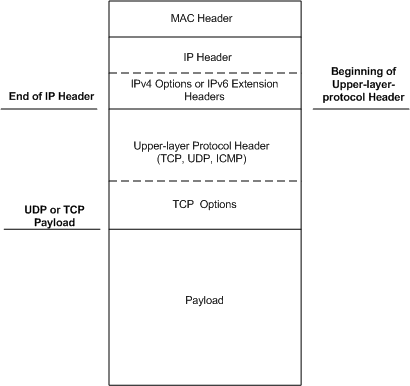

# Where to Split Header and Data

The following are the only valid places where a header-data split provider can split an Ethernet frame:

-   [Beginning of upper-layer-protocol header](splitting-frames-at-the-beginning-of-the-upper-layer-protocol-headers.md).

-   [Beginning of UDP payload](splitting-frames-at-the-udp-payload.md).

-   [Beginning of TCP payload](splitting-frames-at-the-tcp-payload.md).

**Note**  These requirements apply only to header-data split providers. For more information about splitting frames in cases where header-data split is not used, see [Cases Where Header-Data Split Is Not Used](cases-where-header-data-split-is-not-used.md).

 

The following figure shows the major parts of the Ethernet frame and the valid split locations.

 

 

