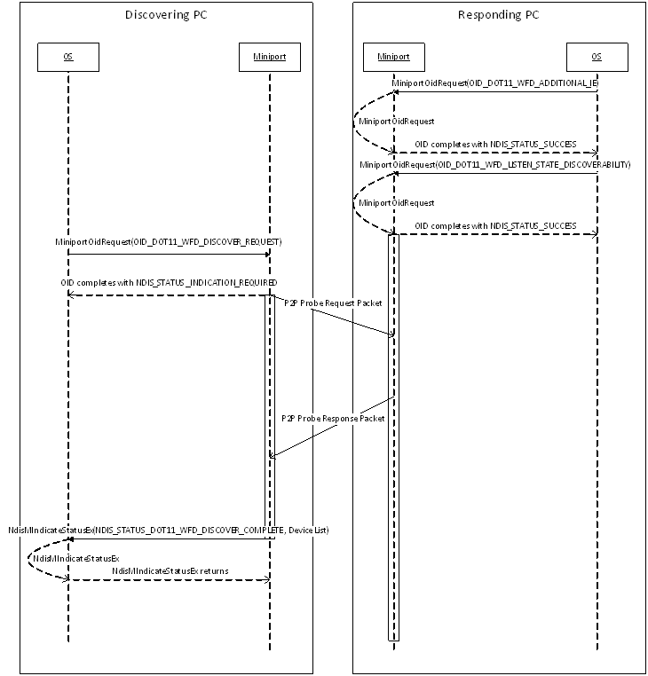

# Wi-Fi Direct Device Discovery

**Important**  The [Native 802.11 Wireless LAN](native-802-11-wireless-lan4.md) interface is deprecated in Windows 10 and later. Please use the WLAN Device Driver Interface (WDI) instead. For more information about WDI, see [WLAN Universal Windows driver model](wifi-universal-driver-model.md).

 

Windows uses the Device Discovery procedure to ask the miniport driver to search for Wi-Fi Direct Devices and optionally search for legacy Wi-Fi networks. Device discovery is only performed on the NDIS port configured in Wi-Fi Direct Device mode.

The figure below shows the typical interactions between Windows and the miniport driver for device discovery.

A Wi-Fi Direct Device on the PC is not discoverable by default. Before it becomes discoverable, Windows will configure the P2P Device Info on the port and provide the set of IEs to include in the probe response. The Device port should only make itself discoverable once Windows has enabled Listen State on the port.

The Wi-Fi Direct device port is requested to perform Device Discovery with the [OID\_DOT11\_WFD\_DISCOVER\_REQUEST](https://msdn.microsoft.com/library/windows/hardware/hh451795). The miniport driver follows the guidelines in the Wi-Fi Peer-To-Peer Technical Specification for performing device discovery. It reports the completion of the discovery process using [**NDIS\_STATUS\_DOT11\_WFD\_DISCOVER\_COMPLETE**](https://msdn.microsoft.com/library/windows/hardware/hh451704). The miniport driver must report the list of discovered devices in this completion indication. This completion behavior is different than scanning in Extensible Station Mode.

Windows may query for the list of discovered devices using [OID\_DOT11\_WFD\_ENUM\_DEVICE\_LIST](https://msdn.microsoft.com/library/windows/hardware/hh451796).

**See Also:**

[**DOT11\_WFD\_DISCOVER\_TYPE**](https://msdn.microsoft.com/library/windows/hardware/hh406652)

[**DOT11\_WFD\_DEVICE\_ENTRY**](https://msdn.microsoft.com/library/windows/hardware/hh464146)

[OID\_DOT11\_WFD\_DISCOVER\_REQUEST](https://msdn.microsoft.com/library/windows/hardware/hh451795)

[**NDIS\_STATUS\_DOT11\_WFD\_DISCOVER\_COMPLETE**](https://msdn.microsoft.com/library/windows/hardware/hh451704)

[OID\_DOT11\_WFD\_ENUM\_DEVICE\_LIST](https://msdn.microsoft.com/library/windows/hardware/hh451796)

[OID\_DOT11\_WFD\_LISTEN\_STATE\_DISCOVERABILITY](https://msdn.microsoft.com/library/windows/hardware/hh451801)

[OID\_DOT11\_WFD\_ADDITIONAL\_IE](https://msdn.microsoft.com/library/windows/hardware/hh451790)

[OID\_DOT11\_WFD\_FLUSH\_DEVICE\_LIST](https://msdn.microsoft.com/library/windows/hardware/hh451797)

[**DOT11\_WFD\_SCAN\_TYPE**](https://msdn.microsoft.com/library/windows/hardware/hh406681)

 

 

