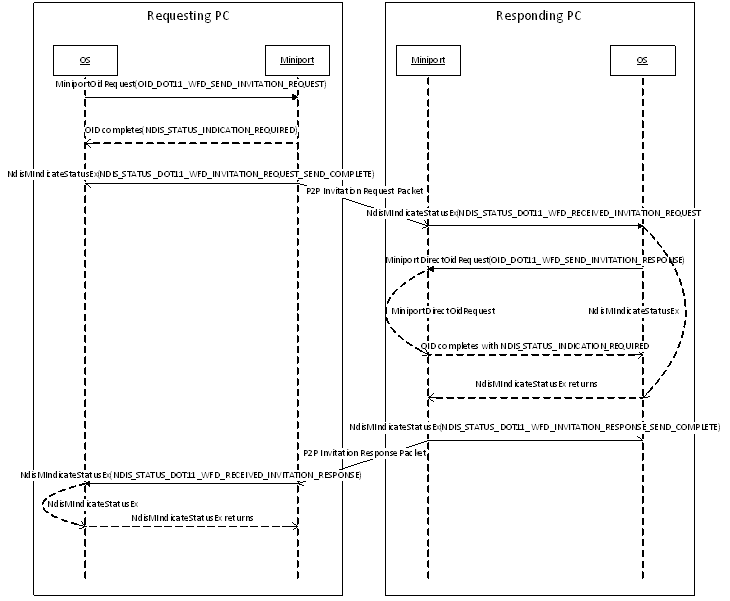

# Wi-Fi Direct Invitation Procedure

**Important**  The [Native 802.11 Wireless LAN](native-802-11-wireless-lan4.md) interface is deprecated in Windows 10 and later. Please use the WLAN Device Driver Interface (WDI) instead. For more information about WDI, see [WLAN Universal Windows driver model](wifi-universal-driver-model.md).

 

The figure below shows the typical OID/Indications and message sequences when performing Invitation procedure between two PCs. This flow assumes that the information to respond to the Invitation Request is already available on the responding PC.

The miniport driver must follow the guidelines for Wi-Fi Direct Action Frames to support this exchange. The miniport driver is not required to maintain Invitation state between the various packets. It can treat each Receive Request/Indication Status/Process Direct OID/Send Response as a distinct action without attempting to correlate to previously exchanged packets.

**See Also:**

[**DOT11\_WFD\_INVITATION\_FLAGS**](https://msdn.microsoft.com/library/windows/hardware/hh406676)

[OID\_DOT11\_WFD\_SEND\_INVITATION\_REQUEST](https://msdn.microsoft.com/library/windows/hardware/hh451806)

[**NDIS\_STATUS\_DOT11\_WFD\_INVITATION\_REQUEST\_SEND\_COMPLETE**](https://msdn.microsoft.com/library/windows/hardware/hh439779)

[**NDIS\_STATUS\_DOT11\_WFD\_RECEIVED\_INVITATION\_REQUEST**](https://msdn.microsoft.com/library/windows/hardware/hh439793)

[OID\_DOT11\_WFD\_SEND\_INVITATION\_RESPONSE](https://msdn.microsoft.com/library/windows/hardware/hh451807)

[**NDIS\_STATUS\_DOT11\_WFD\_INVITATION\_RESPONSE\_SEND\_COMPLETE**](https://msdn.microsoft.com/library/windows/hardware/hh439781)

[**NDIS\_STATUS\_DOT11\_WFD\_RECEIVED\_INVITATION\_RESPONSE**](https://msdn.microsoft.com/library/windows/hardware/hh439795)

 

 

