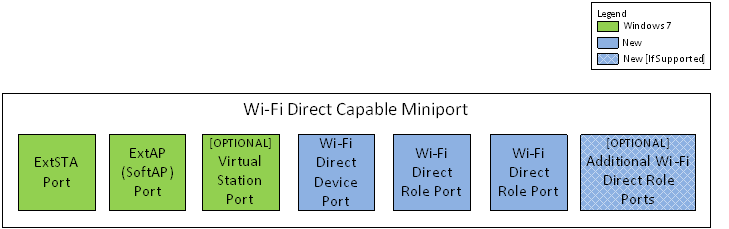

# Wi-Fi Direct Miniport Initialization and Configuration

**Important**  The [Native 802.11 Wireless LAN](native-802-11-wireless-lan4.md) interface is deprecated in Windows 10 and later. Please use the WLAN Device Driver Interface (WDI) instead. For more information about WDI, see [WLAN Universal Windows driver model](wifi-universal-driver-model.md).

 

**Overview**

Wi-Fi Direct functionality is enabled by Windows through additional NDIS ports and operation modes. NDIS ports are used to represent each of the 802.11 MAC entities that the miniport driver supports. When Windows initializes the miniport driver, the first (default) port is implicitly created by Windows to correspond to the default 802.11 MAC entity that is created by the miniport driver. During the lifetime of the miniport driver new ports may be created by Windows, depending on the Virtual WiFi capability reported by the miniport driver in [**DOT11\_VWIFI\_ATTRIBUTES**](https://msdn.microsoft.com/library/windows/hardware/ff548808). As shown in the diagram below, there are at least two new NDIS ports that the miniport driver must support to enable Wi-Fi Direct functionality:

The Wi-Fi Direct Device port is used by Windows to perform Wi-Fi Direct Device functionality such as device discovery, Group Owner Negotiation, and so on. Windows programs the Wi-Fi Direct Role to behave as a Wi-Fi Direct Client or Group Owner to join or host a Wi-Fi Direct group. Miniport drivers may create additional Wi-Fi Direct Role ports that can support multiple Client or Group Owner roles. Three new operation modes are introduced to program a port in the appropriate role. The mode DOT11\_OPERATION\_MODE\_WFD\_DEVICE is programmed only on the Wi-Fi Direct Device port. The modes DOT11\_OPERATION\_MODE\_WFD\_CLIENT and DOT11\_OPERATION\_MODE\_WFD\_GROUP\_OWNER would be programmed on each of the Wi-Fi Direct Role ports. All Wi-Fi Direct Role ports must support being in Wi-Fi Direct Client or Group Owner mode.

The rest of this documentation describes the expected behavior of a miniport driver that supports Wi-Fi Direct functionality.

**Miniport Initialization**
During MiniportInitialize, similar to Windows 7, the miniport driver must initialize the default 802.11 MAC entity. It must also report its Wi-Fi Direct and Virtual WiFi capabilities using the [**NdisMSetMiniportAttributes**](https://msdn.microsoft.com/library/windows/hardware/ff563672) function.

**Port creation and Deletion**
NDIS PORTs are created and deleted using the [OID\_DOT11\_CREATE\_MAC](https://msdn.microsoft.com/library/windows/hardware/ff569124) and [OID\_DOT11\_DELETE\_MAC](https://msdn.microsoft.com/library/windows/hardware/ff569140) OIDs. The maximum number of ports created and the role of the active ports is limited by the number of 802.11 MAC entities and capabilities supported by the miniport driver. For a miniport driver capable of supporting Wi-Fi Direct, there are at least 4 NDIS PORTs that can be created:

1.  Default Port (Port 0) for ExtSTA Operation Mode. This is existing Vista/Windows 7 behavior.
2.  One port for ExtAP Operation Mode. This is existing Windows 7 behavior.
3.  One port for Wi-Fi Direct Device Functionality. This port will be used for all Wi-Fi Direct functionality that happens before a Wi-Fi Direct Group Session has started. An example operation is Group Owner Negotiation.
4.  4. One or more ports for Wi-Fi Direct GO or Client Functionality. These ports will be used for Wi-Fi Direct Group Session. The number of Wi-Fi Direct GO or Client ports created may be limited by Windows.

An additional Virtual Station (VSTA) port may be created for miniport drivers supporting that capability. The following are the guarantees provided by Windows for order of creation and deletion of ports:

1.  The default port (Port 0) must be present before any other ports are created.
2.  The Wi-Fi Direct Device functionality port must be present before any Wi-Fi Direct GO or Client functionality ports are created.

Any other ports are created (and deleted) as needed. The miniport driver must not make an assumption on the port number assignment or order of creation for any other ports.

When a Wi-Fi Direct port is created, it should start in the [DOT11\_OPERATION\_MODE\_EXTENSIBLE\_STATION](https://msdn.microsoft.com/library/windows/hardware/ff569396) operation mode. Windows may then configure it to one of the Wi-Fi Direct operation modes. The set and order in which the Wi-Fi Direct OIDs are submitted to the port are not guaranteed. Each of the Wi-Fi Direct OIDs is addressed to the specific NDIS\_PORT it is sent to and should only modify the configuration of that port.

**Miniport Halting**
On [*MiniportHaltEx*](https://msdn.microsoft.com/library/windows/hardware/ff559388), the miniport must reset and delete all MAC entities when the miniport driver is halted. This should include freeing up all the ports registered with NDIS.

 

 

