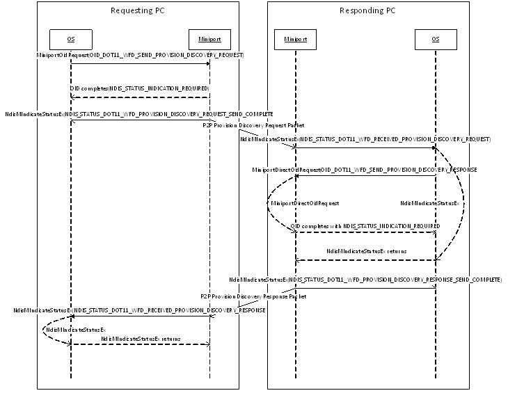

# Wi-Fi Direct Provision Discovery

**Important**  The [Native 802.11 Wireless LAN](native-802-11-wireless-lan4.md) interface is deprecated in Windows 10 and later. Please use the WLAN Device Driver Interface (WDI) instead. For more information about WDI, see [WLAN Universal Windows driver model](wifi-universal-driver-model.md).

 

The figure below shows the typical OID/Indications and message sequences when performing provision discovery between two PCs.

The miniport driver must follow the guidelines for Wi-Fi Direct Action Frames to support this exchange. The miniport driver is not required to maintain state between the various packets. It can treat each Receive Request/Indication Status/Process Direct OID/Send Response as a distinct action without attempting to correlate to previously exchanged packets.

**See Also:**

[OID\_DOT11\_WFD\_SEND\_PROVISION\_DISCOVERY\_REQUEST](https://msdn.microsoft.com/library/windows/hardware/hh464156)

[**NDIS\_STATUS\_DOT11\_WFD\_PROVISION\_DISCOVERY\_REQUEST\_SEND\_COMPLETE**](https://msdn.microsoft.com/library/windows/hardware/hh439783)

[**NDIS\_STATUS\_DOT11\_WFD\_RECEIVED\_PROVISION\_DISCOVERY\_REQUEST**](https://msdn.microsoft.com/library/windows/hardware/hh439797)

[OID\_DOT11\_WFD\_SEND\_PROVISION\_DISCOVERY\_RESPONSE](https://msdn.microsoft.com/library/windows/hardware/hh451808)

[**NDIS\_STATUS\_DOT11\_WFD\_PROVISION\_DISCOVERY\_RESPONSE\_SEND\_COMPLETE**](https://msdn.microsoft.com/library/windows/hardware/hh439785)

[**NDIS\_STATUS\_DOT11\_WFD\_RECEIVED\_PROVISION\_DISCOVERY\_RESPONSE**](https://msdn.microsoft.com/library/windows/hardware/hh439799)

 

 

