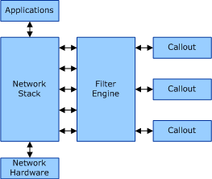

# Windows Filtering Platform Architecture Overview

This section provides a brief overview of the Windows Filtering Platform architecture. For a more thorough discussion of the Windows Filtering Platform architecture, see the [Windows Filtering Platform](http://go.microsoft.com/fwlink/p/?linkid=90220) documentation in the Microsoft Windows SDK.

The following figure shows the basic architecture of the Windows Filtering Platform.

The [filter engine](filter-engine.md) is the core of the Windows Filtering Platform. The filter engine performs all the filtering operations on the TCP/IP-based network data. At key points in the TCP/IP stack there are [filtering layers](filtering-layer.md) where network data is passed to the filter engine for processing. If the filtering conditions for a filter of the filtering layer are all true, the filter engine applies the filter's action.

[Callout drivers](callout-driver.md) provide additional filtering functionality by registering one or more [callouts](callout.md) with the filter engine. [Filters](filter.md) in the filter engine can specify a callout for the filter's action. In this case, the filter engine passes the network data to the specified callout for additional processing.

The Windows Filtering Platform includes several built-in callouts. See [Built-in Callout Identifiers](https://msdn.microsoft.com/library/windows/hardware/ff543857) for a description of each of these callouts.

 

 

