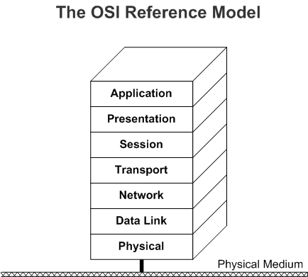

# Windows Network Architecture and the OSI Model

## Overview 

The Microsoft Windows operating systems use a network architecture that is based on the seven-layer networking model developed by the International Standards Organization (ISO). Introduced in 1978, the ISO Open Systems Interconnection (OSI) Reference model describes networking as "a series of protocol layers with a specific set of functions allocated to each layer. Each layer offers specific services to higher layers while shielding these layers from the details of how the services are implemented. A well-defined interface between each pair of adjacent layers defines the services offered by the lower layer to the higher one and how those services are accessed." The following diagram illustrates the OSI reference model.

Microsoft Windows network drivers implement the bottom four layers of the OSI Reference Model:

## Physical Layer  
The physical layer is the lowest layer of the OSI model. This layer manages the reception and transmission of the unstructured raw bit stream over a physical medium. It describes the electrical/optical, mechanical, and functional interfaces to the physical medium. The physical layer carries the signals for all of the higher layers. In Windows, the physical layer is implemented by the network interface card (NIC), its transceiver, and the medium to which the NIC is attached.

## Data Link Layer  
The data link layer is further divided by Institute of Electrical and Electronics Engineers (IEEE) into two sublayers: logical link control (LLC) and media access control (MAC).

### LLC

The LLC sublayer provides error-free transfer of data frames from one node to another. The LLC sublayer establishes and terminates logical links, controls frame flow, sequences frames, acknowledges frames, and retransmits unacknowledged frames. The LLC sublayer uses frame acknowledgement and retransmission to provide virtually error-free transmission over the link to the layers above.

### MAC

The MAC sublayer manages access to the physical layer, checks frame errors, and manages address recognition of received frames.

In the Windows network architecture, the LLC sublayer is implemented in the transport driver, and the MAC sublayer is implemented in the NIC. The NIC is controlled by a software device driver called the [miniport driver](ndis-miniport-drivers2.md). Windows supports several variations of miniport drivers including WDM miniport drivers, miniport call managers (MCMs), and miniport [intermediate drivers](ndis-miniport-drivers.md).

## Network Layer
The network layer controls the operation of the subnet. This layer determines the physical path that the data should take, based on the following:

-   Network conditions.

-   Priority of service.

-   Other factors, such as routing, traffic control, frame fragmentation and reassembly, logical-to-physical address mapping, and usage accounting.

## Transport Layer

The transport layer ensures that messages are delivered error-free, in sequence, and with no loss or duplication. This layer relieves the higher-layer protocols from any concern with the transfer of data between them and their peers. A minimal transport layer is required in protocol stacks that include a reliable network or LLC sublayer that provides virtual circuit capability. For example, because the NetBEUI transport driver for Windows an OSI-compliant LLC sublayer, its transport layer functions are minimal. If the protocol stack does not include an LLC sublayer, and if the network layer is unreliable and/or supports datagrams (as with TCP/IP's IP layer or NWLink's IPX layer), the transport layer should include frame sequencing and acknowledgment, as well as retransmission of unacknowledged frames.

In the Windows network architecture, the LLC, network, and transport layers are implemented by software drivers known as [protocol drivers](ndis-protocol-drivers.md), which are sometimes referred to as *transport drivers*.

 

 

