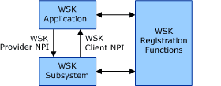

# Winsock Kernel Architecture

The architecture of Winsock Kernel (WSK) is shown in the following diagram.

At the core of the WSK architecture is the WSK subsystem. The WSK subsystem is a [network module](network-module.md) that implements the provider side of the WSK [Network Programming Interface (NPI)](network-programming-interface.md). The WSK subsystem interfaces with transport providers on its lower edge that provide support for various transport protocols.

Attached to the WSK subsystem are WSK applications. WSK applications are kernel-mode software modules that implement the client side of the WSK NPI in order to perform network I/O operations. (In this context, "client" should not be confused with the term as used in client-server systems). . The WSK subsystem can call the functions in the WSK client NPI to notify the WSK application of asynchronous events.

WSK applications discover and attach to the WSK subsystem by using a set of [WSK registration functions](https://msdn.microsoft.com/library/windows/hardware/ff571179). Applications can use these functions to dynamically detect when the WSK subsystem is available and to exchange dispatch tables that constitute the provider and client side implementations of the WSK NPI.

Alternately, WSK applications can attach to the WSK subsystem by using the [Network Module Registrar (NMR)](network-module-registrar2.md). For more information, see [Using NMR for WSK Registration and Unregistration](using-nmr-for-wsk-registration-and-unregistration.md).

 

 

