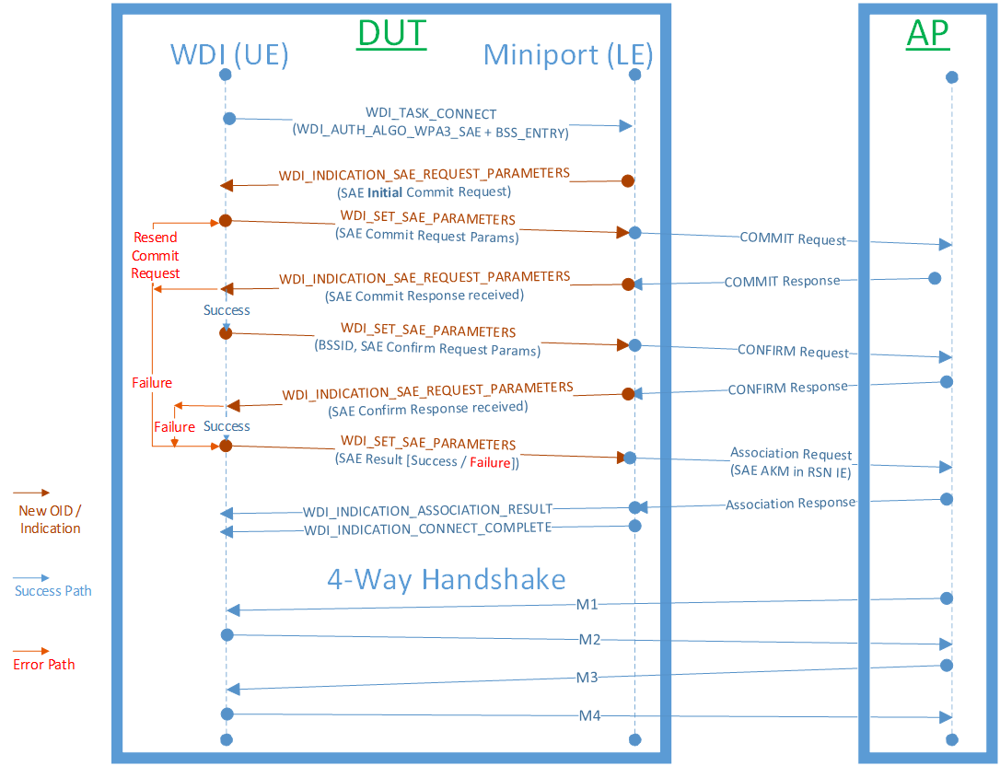

# WPA3-SAE authentication

WPA3-SAE, also known as WPA3-Personal, is supported in Windows with WDI version 1.1.8 and later. Frame content generation and parsing for SAE (Secure Authentication of Equals) authentication is done within Windows, but the OS requires driver support for sending and receiving WPA3-SAE authentication frames.

## WPA3-SAE capabilities

Miniport drivers indicate SAE support by doing the following:

1. Set SAE supported capability.  
    The driver sets the **SAEAuthenticationSupported** capability in [WDI_TLV_INTERFACE_ATTRIBUTES](wdi-tlv-interface-attributes.md) during the call to [OID_WDI_GET_ADAPTER_CAPABILITIES](oid-wdi-get-adapter-capabilities.md).
2. Set MFP capability.  
    The driver sets the **MFPCapable** capability in [WDI_TLV_STATION_ATTRIBUTES](wdi-tlv-station-attributes.md) during the call to [OID_WDI_GET_ADAPTER_CAPABILITIES](oid-wdi-get-adapter-capabilities.md).
3. Add the **WDI_AUTH_ALGO_WPA3_SAE** auth method.  
    The driver includes **WDI_AUTH_ALGO_WPA3_SAE** in the list of auth-cipher combinations returned in the call to [OID_WDI_GET_ADAPTER_CAPABILITIES](oid-wdi-get-adapter-capabilities.md). This should be added in the following sections:
    - [WDI_TLV_STATION_ATTRIBUTES](wdi-tlv-station-attributes.md) : : [WDI_TLV_UNICAST_ALGORITHM_LIST](wdi-tlv-unicast-algorithm-list.md)
    - [WDI_TLV_STATION_ATTRIBUTES](wdi-tlv-station-attributes.md) : : [WDI_TLV_MULTICAST_DATA_ALGORITHM_LIST](wdi-tlv-multicast-data-algorithm-list.md)

## WPA3-SAE authentication flow

### Connection initiation

SAE connections are initiated with [OID_WDI_TASK_CONNECT](oid-wdi-task-connect.md) or [OID_WDI_TASK_ROAM](oid-wdi-task-roam.md). WDI specifies **WDI_AUTH_ALGO_WPA3_SAE** as the auth method when the driver is required to do SAE authentication. If WDI provides the PMKID in the BSS list in the Connect/Roam task, then the driver skips SAE authentication and performs Open Authentication instead, followed by a reassociation request with the PMKID.

### Authentication flow

#### Initial request for SAE parameters

The driver first selects a BSS to which to connect or roam and, if WDI did not provide the PMKID for that BSS, the driver requests Commit parameters from WDI with [NDIS_STATUS_WDI_INDICATION_SAE_AUTH_PARAMS_NEEDED](ndis-status-wdi-indication-sae-auth-params-needed.md). In this initial indication, the driver sets the indication type to **WDI_SAE_INDICATION_TYPE_COMMIT_REQUEST_PARAMS_NEEDED**. In response, WDI sends [OID_WDI_SET_SAE_AUTH_PARAMS](oid-wdi-set-sae-auth-params.md) to the driver with one of the following options.

- Send Commit request (**WDI_SAE_REQUEST_TYPE_COMMIT_REQUEST**)
- Fail SAE authentication (**WDI_SAE_REQUEST_TYPE_FAILURE**)

#### Upon receiving a Commit response

On receiving a Commit response, the driver sends [NDIS_STATUS_WDI_INDICATION_SAE_AUTH_PARAMS_NEEDED](ndis-status-wdi-indication-sae-auth-params-needed.md) with the type set to **WDI_SAE_INDICATION_TYPE_COMMIT_RESPONSE**. In response, WDI sends [OID_WDI_SET_SAE_AUTH_PARAMS](oid-wdi-set-sae-auth-params.md) with one of the following requests:

- Send Commit request (**WDI_SAE_REQUEST_TYPE_COMMIT_REQUEST**)
- Send Confirm request (**WDI_SAE_REQUEST_TYPE_CONFIRM_REQUEST**)
- Fail SAE authentication (**WDI_SAE_REQUEST_TYPE_FAILURE**)

#### Upon receiving a Confirm response

On receiving a Confirm response, the driver sends [NDIS_STATUS_WDI_INDICATION_SAE_AUTH_PARAMS_NEEDED](ndis-status-wdi-indication-sae-auth-params-needed.md) with the type set to **WDI_SAE_INDICATION_TYPE_CONFIRM_RESPONSE**. WDI then sends [OID_WDI_SET_SAE_AUTH_PARAMS](oid-wdi-set-sae-auth-params.md) with the SAE status field set to success or failure. If SAE authentication fails in the driver due to timeouts or other reasons, the driver sends an [NDIS_STATUS_WDI_INDICATION_SAE_AUTH_PARAMS_NEEDED](ndis-status-wdi-indication-sae-auth-params-needed.md) indication with the type se to **WDI_SAE_INDICATION_TYPE_ERROR** and the failure reason specified in [WDI_TLV_SAE_STATUS](wdi-tlv-sae-status.md).

### Timeouts and retransmissions

These are handled by the driver.

## WPA3-SAE association

The device connects to an SAE network using one of the following options.

### (Re)Association following SAE exchange

This is normally the first association attempt to an SAE network. The driver sets the SAE AKM in the RSN IE in the Association Request frame.

### (Re)Association using PMKID

If WDI provided a PMKID for the BSS entry in the connect/roam task, then the driver does the following:

1. The driver performs an Open authentication followed by inclusion of the PMKID in the (Re)association request.
2. If the device does not receive a response from the AP within a short time, or if the AP returns an association error in the response, the driver skips SE authentication with this AP and either moves to another AP, or falls back to doing full SAE authentication with this AP.

SAE connection completes once the SAE authentication/association is complete. As before, the driver sends the following indications on conclusion of the connect or roam task:

- [NDIS_STATUS_WDI_INDICATION_ASSOCIATION_RESULT](ndis-status-wdi-indication-association-result.md)
- [NDIS_STATUS_WDI_INDICATION_CONNECT_COMPLETE](ndis-status-wdi-indication-connect-complete.md)

## Error handling

### Resending the SAE Commit request frame

If the driver needs to resend a Commit frame due to a timeout, it can either resend the original Scalar/Element values that were provided by WDI, or request a new set of Scalar/Element values from WDI with an [NDIS_STATUS_WDI_INDICATION_SAE_AUTH_PARAMS_NEEDED](ndis-status-wdi-indication-sae-auth-params-needed.md) indication.

### Resending the SAE Confirm response frame

If the driver needs to resend a Confirm frame due to a timeout, it should request a new set of **SendConfirm** and **Confirm** values from WDI with an [NDIS_STATUS_WDI_INDICATION_SAE_AUTH_PARAMS_NEEDED](ndis-status-wdi-indication-sae-auth-params-needed.md) indication, setting the type to **WDI_SAE_INDICATION_TYPE_CONFIRM_REQUEST_RESEND_REQUEST**.
