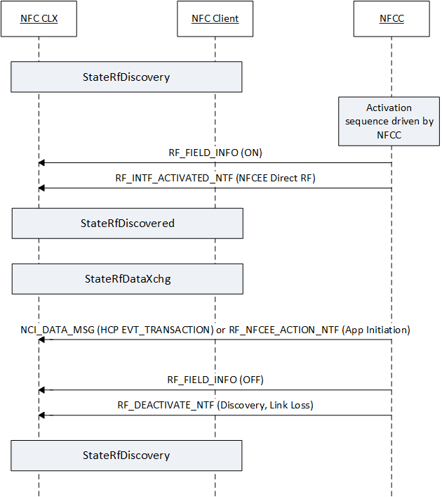

# Card emulation RF sequence

The following figure illustrates the state sequences for StateRfDiscovered and StateRfDataXchg during NFCEE card emulation mode. An example of this is when a UICC SE is tapped against an external reader.

 

 
## Related topics
[NFC device driver interface (DDI) overview](https://msdn.microsoft.com/library/windows/hardware/mt715815)  
[NFC class extension (CX) reference](https://msdn.microsoft.com/library/windows/hardware/dn905536)  
