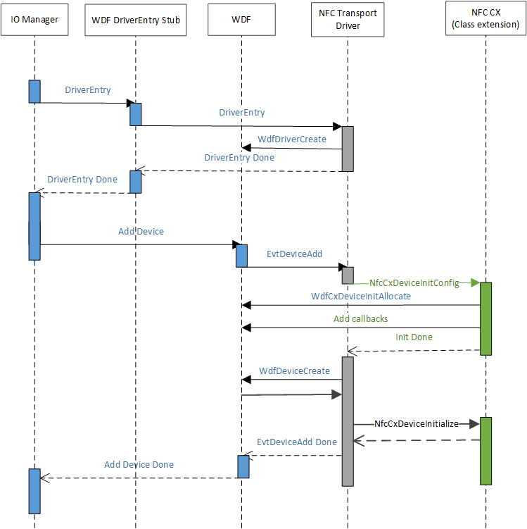

# NFC driver load order

When ACPI creates the device node to represent the NFCC, PnP matches against the NFC client driver-provided .inf and is installed for that device node. The NFC client driver will, during its AddDevice routine, initialize the class extension, which will allow the Microsoft-provided NFC class extension (NfcCx.dll) to load and let itself setup any I/O queue handling it must implement for top portion of the NFC class extension driver. The following diagram illustrates the driver load mechanism.

 

 
## Related topics
[NFC device driver interface (DDI) overview](https://msdn.microsoft.com/library/windows/hardware/mt715815)  
[NFC class extension (CX) reference](https://msdn.microsoft.com/library/windows/hardware/dn905536)  

