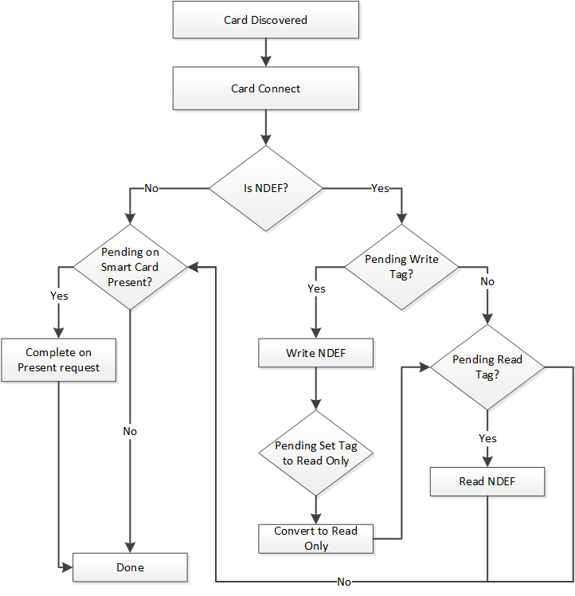

# Functional flow

Because the Smart Card is sharing the driver with NFP, when a smart card approaches, NDEF processing takes priority so that we give a chance for the higher level services to work on the NDEF message type before an application can communicate with the card.

 

 
## Related topics
[NFC device driver interface (DDI) overview](https://msdn.microsoft.com/library/windows/hardware/mt715815)  
[Smart card DDI and command reference](https://msdn.microsoft.com/library/windows/hardware/dn905601)  
