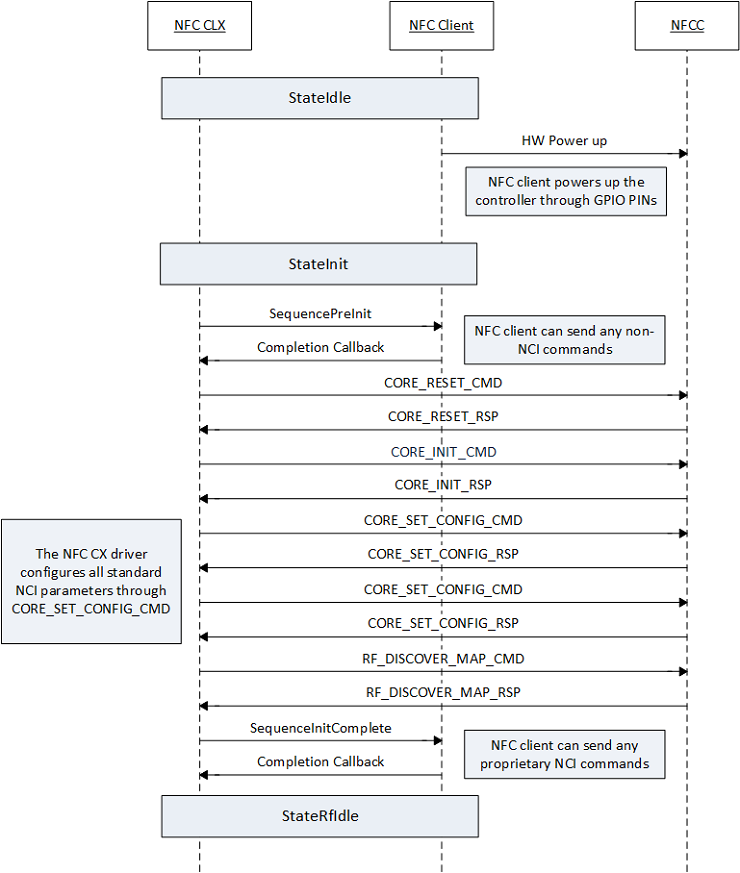
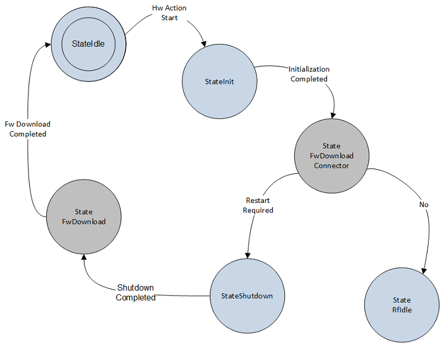
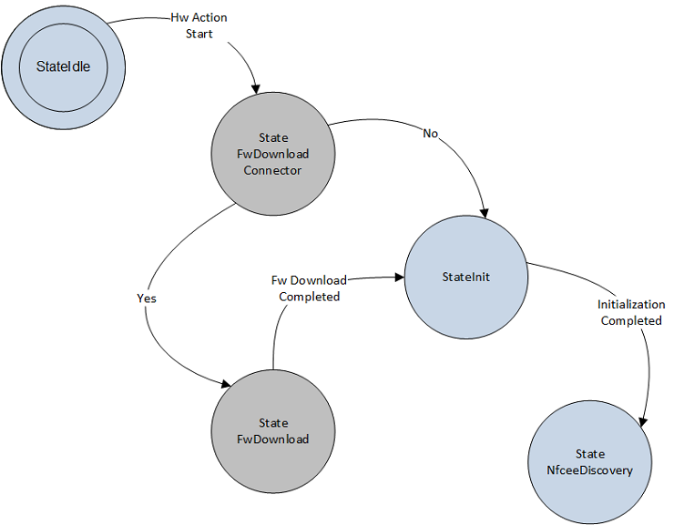

# Initialization sequence

The figure below illustrates a high-level set of NCI packets that are exchanged by the NFC CX and the NFCC during initialization. Prior to start of the initialization, the NFC CX driver invokes the client driver’s Pre-Init sequence handler if one is registered. StateInit comprises the following high-level sequences: NCI reset, NCI initialization, standard NCI configuration of parameters, and RF Interface and RF Protocol mapping. Note, the NFC client driver can set the defaults of some of the NCI configuration parameters used during initialization through NFC CX interface functions such as [**NfcCxSetRfDiscoveryConfig**](https://msdn.microsoft.com/library/windows/hardware/dn905616) and [**NfcCxSetLlcpConfig**](https://msdn.microsoft.com/library/windows/hardware/dn905615). Following the completion of initialization, the initialize complete sequence handler is invoked. The next state after initialization is completed is StateRfIdle.

One of the key requirements for the proper functioning of the NFCC is handling firmware download operation from the NFC client driver. The NFC CX design is flexible enough to support multiple different designs for downloading firmware to the controller.

Some chipsets require NCI initialization for firmware versioning information to determine if a firmware download is required. For such designs, the state machine of the NFC CX and NFC client driver for accomplishing firmware download would appear as shown below. The BLUE states correspond to the states specified by the NFC CX, and the GRAY states correspond to the states in the NFC client driver. Post NCI initialization i.e. in initialization complete sequence handler, the client driver checks the current version from the CORE\_INIT\_RSP message, and determines if firmware download operation is required. If ‘No’ then normal state transition of NFC CX driver continues to the next state. If ‘Yes’ the client driver requests the NFC CX to perform a restart. On completion of shutdown, the NFC client driver can implement the firmware download.

Some NFCC firmware implementations have an out of band mechanism, i.e. outside the context of NCI, to determine if a firmware download is required. In such cases, when handling the pre-initialization sequence, the NFC client driver can implement its connector state to determine if a firmware download is required. If ‘Yes’ then the firmware download operations are carried out by the client driver. If ‘No’ i.e. firmware download isn’t required, then normal operation to the next state continues. The figure below shows the state machine handling for Firmware Download Pre-NCI initialization.

 

 
## Related topics
[NFC device driver interface (DDI) overview](https://msdn.microsoft.com/library/windows/hardware/mt715815)  
[NFC class extension (CX) reference](https://msdn.microsoft.com/library/windows/hardware/dn905536)  

------------------
[Send comments about this topic to Microsoft](mailto:wsddocfb@microsoft.com?subject=Documentation%20feedback%20%5Bnfpdrivers\nfpdrivers%5D:%20Initialization%20sequence%20%20RELEASE:%20%284/5/2016%29&body=%0A%0APRIVACY%20STATEMENT%0A%0AWe%20use%20your%20feedback%20to%20improve%20the%20documentation.%20We%20don't%20use%20your%20email%20address%20for%20any%20other%20purpose,%20and%20we'll%20remove%20your%20email%20address%20from%20our%20system%20after%20the%20issue%20that%20you're%20reporting%20is%20fixed.%20While%20we're%20working%20to%20fix%20this%20issue,%20we%20might%20send%20you%20an%20email%20message%20to%20ask%20for%20more%20info.%20Later,%20we%20might%20also%20send%20you%20an%20email%20message%20to%20let%20you%20know%20that%20we've%20addressed%20your%20feedback.%0A%0AFor%20more%20info%20about%20Microsoft's%20privacy%20policy,%20see%20http://privacy.microsoft.com/default.aspx. "Send comments about this topic to Microsoft")
