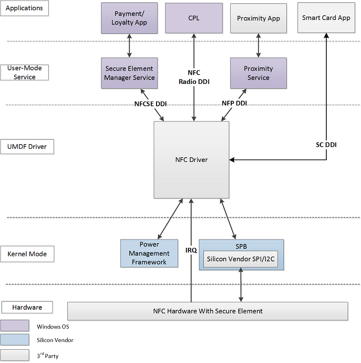

# NFC architecture

The high-level architecture diagram of the NFC stack on Windows is shown further below. NFC UMDF drivers will implement the DDIs described in this specification.

-   [Near Field Proximity DDI](https://msdn.microsoft.com/library/windows/hardware/jj866056) – Provides publish/subscribe ability for proximity message passing, including peer to peer exchange of proximity messages and receiving and writing data from NFC tags.
-   [Secure Element DDI](https://msdn.microsoft.com/library/windows/hardware/dn905485) – Provides access to enumerate secure elements (SEs) attached to the NFC controller, allows the secure elements to be exposed to external readers and allows forwarding of events from NFCC and applets to higher layers, and also provides access to configure and manage NFC chip listen mode routing configuration. It also provides access to receive and transmit ISO/IEC 7816-4 APDUs in listen mode to a remote device.
-   [Smart Card DDI](https://msdn.microsoft.com/library/windows/hardware/dn905601) – Provides low level access for interacting with smart cards like ability to listen for card arrival/departure, allows requests to be transmitted to the smart card, and allows smart card information to be retrieved.
-   [Radio Management DDI](https://msdn.microsoft.com/library/windows/hardware/dn905577) – Provides access for the Control Panel (CPL) application to set radio states of proximity (P2P and reader/writer modes) and secure element (card emulation mode).

 

 
## Related topics
 [NFC device driver interface (DDI) reference](https://msdn.microsoft.com/library/windows/hardware/mt715815)  
 
