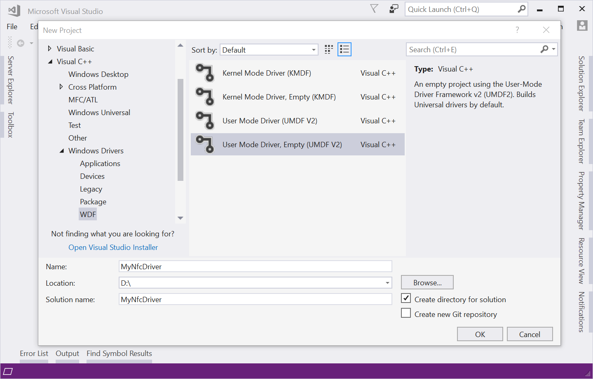
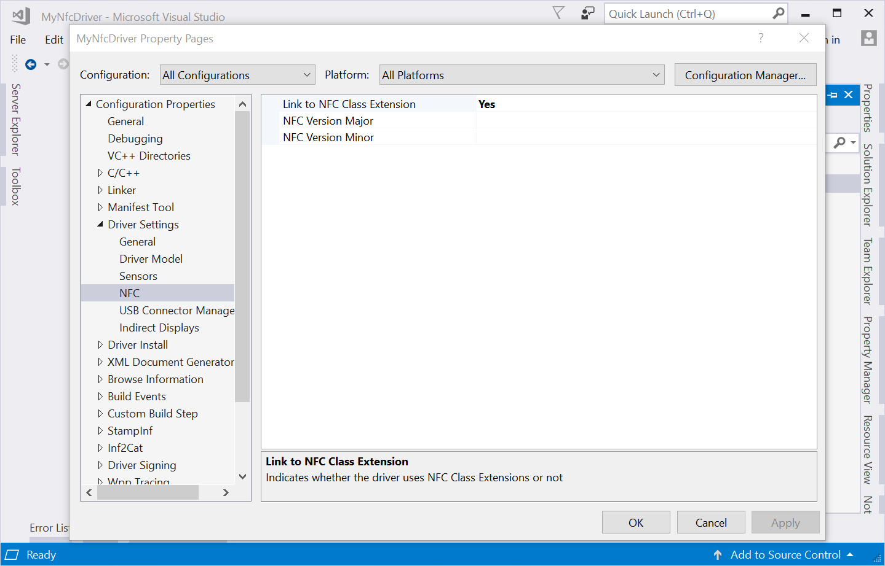

# NFC CX quick start guide

This guide demonstrates how to write an NFC functional driver using the NFC Class Extension (NFC CX) driver.

> [!NOTE]
> A driver that uses a class extension driver in its implementation is known as a 'client driver'. That is to say, a client of the class extension driver.

## Prerequisites

- Your NFC Controller's firmware must implement the NFC Forum's [NFC Controller Interface (NCI)](https://nfc-forum.org/our-work/specification-releases/specifications/) protocol.
- [Visual Studio 2017](https://visualstudio.microsoft.com/downloads/?utm_content=download+vs2017) (or later).
- The [Windows SDK](https://developer.microsoft.com/windows/downloads/windows-sdk/).
- The [Windows Driver Kit (WDK)](../download-the-wdk.md).

## Client driver responsibilities

The NFC CX driver is responsible for handling I/O requests sent to the driver and creating the relevant NCI command packets. The client driver is responsible for sending those NCI packets to the NFC Controller and sending back the NCI response packets to the NFC CX driver.

It's up to the client driver to determine how to send the NCI packets to the NFC Controller. This process varies depending on what type of hardware bus is used. Common buses used by NFC Controllers include I<sup>2</sup>C, SPI and USB.

## Complete project code

A complete version of this sample code is available on GitHub: [NFC CX client driver sample](https://github.com/Microsoft/Windows-driver-samples/tree/main/nfc/NfcCxSample).

## Project setup

1. In Visual Studio, create a new "User Mode Driver, Empty (UMDF V2)" project.

    On the **File** menu, point to **New**, and then select **Project**. In the **Visual C++** node, under **Windows Drivers**, select **WDF**, and then select **User Mode Driver, Empty (UMDF V2)**

    

1. Open the INF file.

   In **Solution Explorer**,  under the **\<project-name>** node, in the **Driver Files** folder, double-click **\<project-name>.inf**.

1. In the INF file, remove the custom device class, by using the following steps:

    1. Remove the following two sections:

        ```inf
        [ClassInstall32]
        AddReg=SampleClass_RegistryAdd

        [SampleClass_RegistryAdd]
        HKR,,,,%ClassName%
        HKR,,Icon,,"-10"
        ```

    1. Under the `[Strings]` section, remove the following line.

        ```inf
        ClassName="Samples" ; TODO: edit ClassName
        ```

1. In the INF file, set driver's device class to **Proximity**:

    1. Change the value of `Class` to `Proximity`
    1. Change the value of `ClassGuid` to `{5630831C-06C9-4856-B327-F5D32586E060}`
        - This is the GUID of the Proximity device class.

    ```ini
    [Version]
    ...
    Class=Proximity
    ClassGuid={5630831C-06C9-4856-B327-F5D32586E060} ; Proximity class GUID
    ...
    ```

1. In the INF file, add a reference to the NFC Class Extension. Doing this ensures that Windows Driver Framework (WDF) loads the NFC CX driver when the client driver loads.
  
    1. Find the `<project-name>_Install` section.
    1. Add `UmdfExtensions=NfcCx0102`.

    ```ini
    [<project-name>_Install]
    ...
    UmdfExtensions=NfcCx0102
    ```

1. In the driver build settings, link to the NFC Class Extension. Doing this ensures that the NFC CX API is available during code compilation.

    1. In **Solution Explorer**, right-click the project, and click **Properties**. In **Configuration Properties**, under **Driver Settings**, click **NFC**.
    1. Ensure that **Configuration** is set to `All Configurations`.
    1. Ensure that **Platform** is to set to `All Platforms`.
    1. Set **Link to NFC Class Extension** to `Yes`.

    

1. Add file named `Driver.cpp` to the project.

1. Create a `DriverEntry` routine in `Driver.cpp`. This is the entry point for the driver. Its primary purpose is to initialize WDF and to register the [`EvtDriverDeviceAdd`](/windows-hardware/drivers/ddi/wdfdriver/nc-wdfdriver-evt_wdf_driver_device_add) callback function.

    ```cpp
    #include <windows.h>
    #include <wdf.h>

    #include "Device.h" // created in Step 9

    // The entry point for the driver.
    extern "C" NTSTATUS DriverEntry(
        _In_ PDRIVER_OBJECT DriverObject,
        _In_ PUNICODE_STRING RegistryPath
        )
    {
        NTSTATUS status = STATUS_SUCCESS;

        // Specify `DeviceContext::AddDevice` as the
        // `EvtDriverDeviceAdd` function for the driver.
        WDF_DRIVER_CONFIG driverConfig;
        WDF_DRIVER_CONFIG_INIT(&driverConfig, DeviceContext::AddDevice);

        // Initialize WDF.
        status = WdfDriverCreate(
            DriverObject,
            RegistryPath,
            WDF_NO_OBJECT_ATTRIBUTES,
            &driverConfig,
            WDF_NO_HANDLE);
        if (!NT_SUCCESS(status))
        {
            return status;
        }

        return STATUS_SUCCESS;
    }
    ```

1. Add two files named `Device.cpp` and `Device.h` to the project.

1. In `Device.h`, define the `DeviceContext` class.

    ```cpp
    #pragma once

    #include <windows.h>
    #include <wdf.h>
    #include <NfcCx.h>

    // The class that will store the driver's custom state for
    // a device instance.
    class DeviceContext
    {
    public:
        // Implementation of `EvtDriverDeviceAdd`.
        static NTSTATUS AddDevice(
            _In_ WDFDRIVER Driver,
            _Inout_ PWDFDEVICE_INIT DeviceInit);

    private:
        // Implementation of `EvtDevicePrepareHardware`.
        static NTSTATUS PrepareHardware(
            _In_ WDFDEVICE Device,
            _In_ WDFCMRESLIST ResourcesRaw,
            _In_ WDFCMRESLIST ResourcesTranslated);

        // Implementation of `EvtDeviceReleaseHardware`.
        static NTSTATUS ReleaseHardware(
            _In_ WDFDEVICE Device,
            _In_ WDFCMRESLIST ResourcesTranslated);

        // Implementation of `EvtDeviceD0Entry`.
        static NTSTATUS D0Entry(
            _In_ WDFDEVICE Device,
            _In_ WDF_POWER_DEVICE_STATE PreviousState);

        // Implementation of `EvtDeviceD0Exit`.
        static NTSTATUS D0Exit(
            _In_ WDFDEVICE Device,
            _In_ WDF_POWER_DEVICE_STATE TargetState);

        // Implementation of `EvtNfcCxWriteNciPacket`.
        static void WriteNciPacket(
            _In_ WDFDEVICE Device,
            _In_ WDFREQUEST Request);
    };

    // Define the `DeviceGetContext` function.
    WDF_DECLARE_CONTEXT_TYPE_WITH_NAME(DeviceContext, DeviceGetContext);
    ```

1. In `Device.cpp`, begin the `DeviceContext::AddDevice` function's definition.

    ```cpp
    #include "Device.h"

    NTSTATUS DeviceContext::AddDevice(
        _In_ WDFDRIVER Driver,
        _Inout_ PWDFDEVICE_INIT DeviceInit)
    {
        NTSTATUS status;

    ```

1. Set the NFC CX device configuration. The device configuration includes providing the [`EvtNfcCxWriteNciPacket`](/windows-hardware/drivers/ddi/nfccx/nc-nfccx-evt_nfc_cx_write_nci_packet) callback function. This callback receives the NCI packets from the NFC CX driver that the client driver should forward to the NFC Controller.

    ```cpp
        // Create the NfcCx config.
        NFC_CX_CLIENT_CONFIG nfcCxConfig;
        NFC_CX_CLIENT_CONFIG_INIT(&nfcCxConfig, NFC_CX_TRANSPORT_CUSTOM);
        nfcCxConfig.EvtNfcCxWriteNciPacket = WriteNciPacket;
        nfcCxConfig.DriverFlags = NFC_CX_DRIVER_ENABLE_EEPROM_WRITE_PROTECTION;

        // Set the NfcCx config.
        status = NfcCxDeviceInitConfig(DeviceInit, &nfcCxConfig);
        if (!NT_SUCCESS(status))
        {
            return status;
        }
    ```

1. Register the [PnP power callbacks](../wdf/supporting-pnp-and-power-management-in-function-drivers.md) required by your client driver.

    A typical client driver will likely require the [`EvtDevicePrepareHardware`](/windows-hardware/drivers/ddi/wdfdevice/nc-wdfdevice-evt_wdf_device_prepare_hardware), the [`EvtDeviceReleaseHardware`](/windows-hardware/drivers/ddi/wdfdevice/nc-wdfdevice-evt_wdf_device_release_hardware), the [`EvtDeviceD0Entry`](/windows-hardware/drivers/ddi/wdfdevice/nc-wdfdevice-evt_wdf_device_d0_entry) and the [`EvtDeviceD0Exit`](/windows-hardware/drivers/ddi/wdfdevice/nc-wdfdevice-evt_wdf_device_d0_exit) functions. Requirements can vary depending on how your client driver handles power management.

    ```cpp
        // Create the PnP power callbacks configuration.
        WDF_PNPPOWER_EVENT_CALLBACKS pnpCallbacks;
        WDF_PNPPOWER_EVENT_CALLBACKS_INIT(&pnpCallbacks);
        pnpCallbacks.EvtDevicePrepareHardware = PrepareHardware;
        pnpCallbacks.EvtDeviceReleaseHardware = ReleaseHardware;
        pnpCallbacks.EvtDeviceD0Entry = D0Entry;
        pnpCallbacks.EvtDeviceD0Exit = D0Exit;

        // Set the PnP power callbacks.
        WdfDeviceInitSetPnpPowerEventCallbacks(DeviceInit, &pnpCallbacks);
    ```

1. Call the [`WdfDeviceCreate`](/windows-hardware/drivers/ddi/wdfdevice/nf-wdfdevice-wdfdevicecreate) function to create the [`WDFDEVICE`](/windows-hardware/drivers/ddi/wdfdevice/) object.

    ```cpp
        // Create WDF object attributes for the WDFDEVICE object.
        WDF_OBJECT_ATTRIBUTES deviceAttributes;
        WDF_OBJECT_ATTRIBUTES_INIT_CONTEXT_TYPE(&deviceAttributes, DeviceContext);

        // Create the device.
        WDFDEVICE device;
        status = WdfDeviceCreate(&DeviceInit, &deviceAttributes, &device);
        if (!NT_SUCCESS(status))
        {
            return status;
        }
    ```

1. Call the [`NfcCxDeviceInitialize`](/windows-hardware/drivers/ddi/nfccx/nf-nfccx-nfccxdeviceinitialize) function.

    This function should be called after the [`WDFDEVICE`](/windows-hardware/drivers/ddi/wdfdevice/) object has been created to allow the NFC CX driver to complete its initialization of the device instance.

    ```cpp
        // Let NFC CX finish initializing the device instance.
        status = NfcCxDeviceInitialize(device);
        if (!NT_SUCCESS(status))
        {
            return status;
        }
    ```

1. Call [`NfcCxSetRfDiscoveryConfig`](/windows-hardware/drivers/ddi/nfccx/nf-nfccx-nfccxsetrfdiscoveryconfig) to specify the NFC technologies and protocols supported by the NFC Controller.

    ```cpp
        // Create the RF config. (Enable everything.)
        NFC_CX_RF_DISCOVERY_CONFIG discoveryConfig;
        NFC_CX_RF_DISCOVERY_CONFIG_INIT(&discoveryConfig);
        discoveryConfig.PollConfig =
            NFC_CX_POLL_NFC_A | NFC_CX_POLL_NFC_B |
            NFC_CX_POLL_NFC_F_212 | NFC_CX_POLL_NFC_F_424 |
            NFC_CX_POLL_NFC_15693 | NFC_CX_POLL_NFC_ACTIVE |
            NFC_CX_POLL_NFC_A_KOVIO;
        discoveryConfig.NfcIPMode =
            NFC_CX_NFCIP_NFC_A | NFC_CX_NFCIP_NFC_F_212 |
            NFC_CX_NFCIP_NFC_F_424 | NFC_CX_NFCIP_NFC_ACTIVE |
            NFC_CX_NFCIP_NFC_ACTIVE_A | NFC_CX_NFCIP_NFC_ACTIVE_F_212 |
            NFC_CX_NFCIP_NFC_ACTIVE_F_424;
        discoveryConfig.NfcIPTgtMode =
            NFC_CX_NFCIP_TGT_NFC_A | NFC_CX_NFCIP_TGT_NFC_F |
            NFC_CX_NFCIP_TGT_NFC_ACTIVE_A | NFC_CX_NFCIP_TGT_NFC_ACTIVE_F;
        discoveryConfig.NfcCEMode =
            NFC_CX_CE_NFC_A | NFC_CX_CE_NFC_B |
            NFC_CX_CE_NFC_F;

        // Set the RF config.
        status = NfcCxSetRfDiscoveryConfig(device, &discoveryConfig);
        if (!NT_SUCCESS(status))
        {
            return status;
        }
    ```

1. End the `DeviceContext::AddDevice` function.

    ```cpp
        return STATUS_SUCCESS;
    }
    ```

1. Implement the [`PrepareHardware`](/windows-hardware/drivers/ddi/wdfdevice/nc-wdfdevice-evt_wdf_device_prepare_hardware) and [`ReleaseHardware`](/windows-hardware/drivers/ddi/wdfdevice/nc-wdfdevice-evt_wdf_device_release_hardware) callback functions.

    These two functions are used to initialize and uninitialize the hardware resources assigned to the NFC Controller's device instance. Their implementation will depend on what type of bus the device is connected to (e.g. I<sup>2</sup>C, SPI and USB).

    ```cpp
    NTSTATUS DeviceContext::PrepareHardware(
        _In_ WDFDEVICE Device,
        _In_ WDFCMRESLIST ResourcesRaw,
        _In_ WDFCMRESLIST ResourcesTranslated)
    {
        // FIX ME: Initialize hardware resources.
        return STATUS_SUCCESS;
    }

    NTSTATUS DeviceContext::ReleaseHardware(
        _In_ WDFDEVICE Device,
        _In_ WDFCMRESLIST ResourcesTranslated)
    {
        // FIX ME: Uninitialize hardware resources.
        return STATUS_SUCCESS;
    }
    ```

1. Call the [`NfcCxHardwareEvent`](/windows-hardware/drivers/ddi/nfccx/nf-nfccx-nfccxhardwareevent) function with [`HostActionStart`](/windows-hardware/drivers/ddi/nfccx/ne-nfccx-_nfc_cx_host_action) and [`HostActionStop`](/windows-hardware/drivers/ddi/nfccx/ne-nfccx-_nfc_cx_host_action) to start and stop the NCI state machine at the appropriate times.

    Some drivers do this during the [`D0Entry`](/windows-hardware/drivers/ddi/wdfdevice/nc-wdfdevice-evt_wdf_device_d0_entry) and [`D0Exit`](/windows-hardware/drivers/ddi/wdfdevice/nc-wdfdevice-evt_wdf_device_d0_exit) PnP power callbacks. This can vary depending on how your client driver handles power management, though.

    ```cpp
    // Device exiting low power state (or is booting up).
    NTSTATUS DeviceContext::D0Entry(
        _In_ WDFDEVICE Device,
        _In_ WDF_POWER_DEVICE_STATE PreviousState)
    {
        (void)PreviousState;

        NTSTATUS status;

        // Invoke the HostActionStart event, so that the NFC CX initializes
        // the NFC Controller.
        NFC_CX_HARDWARE_EVENT eventArgs = {};
        eventArgs.HostAction = HostActionStart;

        status = NfcCxHardwareEvent(Device, &eventArgs);
        if (!NT_SUCCESS(status))
        {
            return status;
        }

        return STATUS_SUCCESS;
    }

    // Device entering low power state.
    NTSTATUS DeviceContext::D0Exit(
        _In_ WDFDEVICE Device,
        _In_ WDF_POWER_DEVICE_STATE TargetState)
    {
        (void)TargetState;

        NTSTATUS status;

        // Trigger the HostActionStop event, so that the NFC CX
        // uninitializes the NFC Controller.
        NFC_CX_HARDWARE_EVENT eventArgs = {};
        eventArgs.HostAction = HostActionStop;

        status = NfcCxHardwareEvent(Device, &eventArgs);
        if (!NT_SUCCESS(status))
        {
            return status;
        }

        return STATUS_SUCCESS;
    }
    ```

1. Implement the [`WriteNciPacket`](/windows-hardware/drivers/ddi/nfccx/nc-nfccx-evt_nfc_cx_write_nci_packet) function.

    This callback is called by the NFC CX when there's an NCI packet to send to the NFC Controller.

    ```cpp
    void DeviceContext::WriteNciPacket(
        _In_ WDFDEVICE Device,
        _In_ WDFREQUEST Request)
    {
        NTSTATUS status;

        // Get the NCI packet as a raw byte buffer.
        void* nciPacket;
        size_t nciPacketLength;
        status = WdfRequestRetrieveInputBuffer(Request, 0, &nciPacket, &nciPacketLength);
        if (!NT_SUCCESS(status))
        {
            WdfRequestComplete(Request, status);
            return;
        }

        // FIX ME: Use the NCI packet in some way.

        // FIX ME: Call `WdfRequestComplete` on `Request` with failure
        // or success `NTSTATUS` code.
    };
    ```

1. Call the [`NfcCxNciReadNotification`](/windows-hardware/drivers/ddi/nfccx/nf-nfccx-nfccxncireadnotification) function when the NFC Controller has an NCI packet that should be sent to the NFC CX. This is typically done in a hardware event callback.

    For example:
    - A [GPIO interrupt](../gpio/gpio-interrupts.md) event callback. (I<sup>2</sup>C and SPI)
    - A [USB continuous reader](../usbcon/how-to-use-the-continous-reader-for-getting-data-from-a-usb-endpoint--umdf-.md) callback.

## Logging

Consider adding logging to the client driver to make it easier to debug. Both [ETW tracing](../devtest/event-tracing-for-windows--etw-.md) and [WPP tracing](../devtest/wpp-software-tracing.md) are good options.
