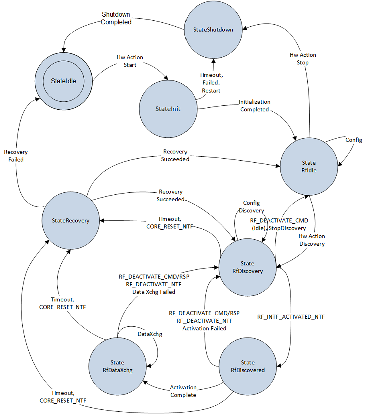

# NFC class extension state machine

The internal design of the NFC CX state machine is shown below. The various states specified by NFC CX and the internal and external events that cause the state transitions are captured in the diagram. Note that some transitions between some states are not shown in the diagram for the ease of reading. The states along with the mapping to the NCI RF state machine are described further below.

| State             | Description                                                                                                                                                                                                                                                                                                                                             |
|-------------------|---------------------------------------------------------------------------------------------------------------------------------------------------------------------------------------------------------------------------------------------------------------------------------------------------------------------------------------------------------|
| StateIdle         | StateIdle is entered when the NFC device is powered up but no NCI commands are sent to the controller, or an unrecoverable error occurred during NCI operation.                                                                                                                                                                                         |
| StateInit         | StateInit is entered when HARDWARE\_ACTION Start is sent to the NFC CX. NCI reset, NCI initialization, and NFC chipset configuration happens in this state. All subsequent states (below in this table) happen after completion of this state.                                                                                                          |
| StateRfIdle       | The NFC controller is initialized successfully, but the RF polling loop is disabled (that is, both poll and listen phases are disabled or not configured). The device enters StateRfIdle when no NFC operation is required. The UMDF idle detection timer is enabled when in this state and post the expiry of this timer, the chipset is deinitialized |
| StateRfDiscovery  | The NFC controller has its discovery loop configured for either poll and/or listen phases. Configuration of some discovery parameters also happens in this state before enabling the discovery loop.                                                                                                                                                    |
| StateRfDiscovered | An RF remote endpoint is discovered and selected and the RF interface has been activated for the device host to communicate with it. This is a transitional state.                                                                                                                                                                                      |
| StateRfDataXchg   | The device host and the RF remote endpoint are actively exchanging data in either poll or listen mode. This state covers both state RFST\_POLL\_ACTIVE or RFST\_LISTEN\_ACTIVE in the NCI RF state machine.                                                                                                                                             |
| StateRecovery     | This state is entered when the NFC device has sent a CORE\_RSET\_NTF to the host or if a fatal I/O error, timeout happens during NCI operation. The NFC CX tries to perform NCI recovery by resetting and reinitializing the controller. Normal operations resume if the recovery is successful, otherwise the state machine transitions to StateIdle.  |
| StateShutdown     | The NFC device is about to be shut down. This is a transitional state. Upon completion of this state, the state machine transitions to StateIdle.                                                                                                                                                                                                       |

 

 

 

[Send comments about this topic to Microsoft](mailto:wsddocfb@microsoft.com?subject=Documentation%20feedback%20%5Bnfpdrivers\nfpdrivers%5D:%20NFC%20class%20extension%20state%20machine%20%20RELEASE:%20%284/5/2016%29&body=%0A%0APRIVACY%20STATEMENT%0A%0AWe%20use%20your%20feedback%20to%20improve%20the%20documentation.%20We%20don't%20use%20your%20email%20address%20for%20any%20other%20purpose,%20and%20we'll%20remove%20your%20email%20address%20from%20our%20system%20after%20the%20issue%20that%20you're%20reporting%20is%20fixed.%20While%20we're%20working%20to%20fix%20this%20issue,%20we%20might%20send%20you%20an%20email%20message%20to%20ask%20for%20more%20info.%20Later,%20we%20might%20also%20send%20you%20an%20email%20message%20to%20let%20you%20know%20that%20we've%20addressed%20your%20feedback.%0A%0AFor%20more%20info%20about%20Microsoft's%20privacy%20policy,%20see%20http://privacy.microsoft.com/default.aspx. "Send comments about this topic to Microsoft")

