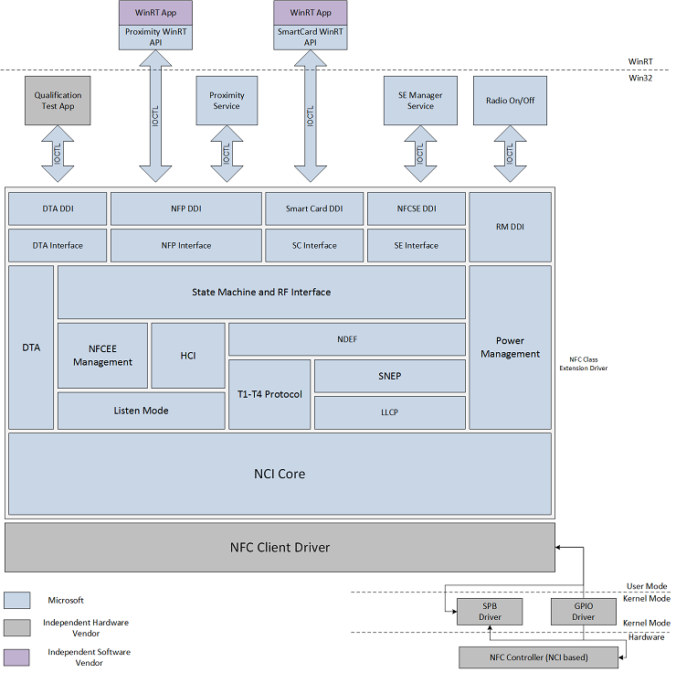

# NFC stack architecture

The following diagram illustrates the NFC stack architecture:

 

 
## Related topics
[NFC device driver interface (DDI) overview](https://msdn.microsoft.com/library/windows/hardware/mt715815)  
[NFC class extension (CX) reference](https://msdn.microsoft.com/library/windows/hardware/dn905536)  
