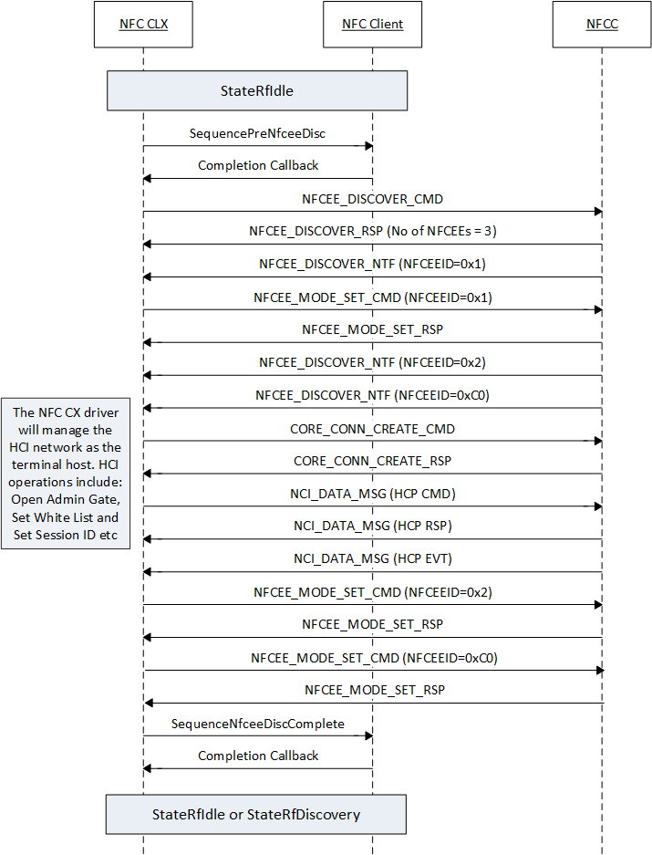

# NFCEE discovery sequence

Due to the limitations of the NCI 1.0 specification, chipset manufacturers have different implementations of NFCEE management. To support these varied implementations, the NFC CX provides two modes of operation:

-   **Standard NCI Mode** – In this mode, NFC CX allows the NFCC to report a single HCI network for all the NFCEEs. There isn’t a separate NFCEE\_DISCOVER\_NTF for the other NFCEEs. NFC CX, however, limits to support a single NFCEE in this configuration. An extension to this mode, if the NFCC reports a HCI network per NFCEE, the NFC CX will pick the first and discard the rest.

-   **Non-standard NCI Mode** – In this mode, NFC CX allows the NFCC to report a single HCI network for all the NFCEEs. Also, it reports the child NFCEEs on the network separately in its NFCEE\_DISCOVER\_NTF. However, the NFC CX has two additional requirements to support this configuration. The number of NFCEEs reported in the NFCEE\_DISCOVER\_RSP much include the child NFCEEs . Also, the NFCEEIDs of the child NFCCs must match the HCI Host IDs (HCI standard requires UICC Host ID to be 0x2).

Most implementations of NFCCs in this configuration report only the HCI network NFCEEID in its NFCEE\_DISCOVER\_RSP. However, since the NFC CX doesn’t know the actual number, its is unable to determine when the discovery process completes. NFC client drivers usually have a proprietary mechanism to know the additional NFCEEs that will be reporting. Therefore, NFC client driver can in its transport handling implement a small workaround to additional the additional NFCEEs in the response to satisfy this requirement.

 

 
## Related topics
[NFC device driver interface (DDI) overview](https://msdn.microsoft.com/library/windows/hardware/mt715815)  
[NFC class extension (CX) reference](https://msdn.microsoft.com/library/windows/hardware/dn905536)  
