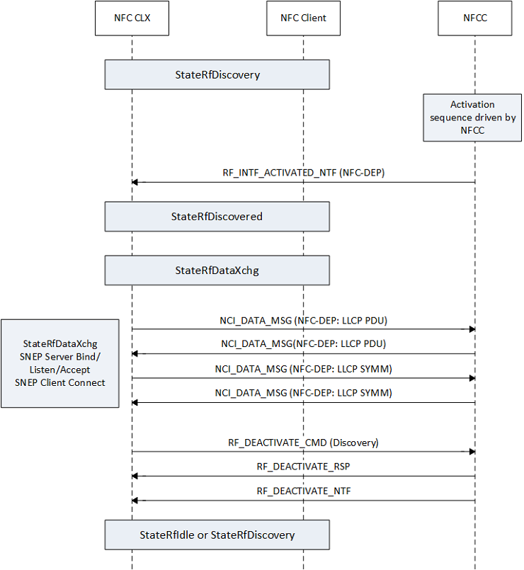

# P2P RF data exchange sequence

The following figure illustrates the state sequences for StateRfDiscovered and StateRfDataXchg for the NFC-DEP protocol. Note that the NFC CX requires the NFCC to support NFC-DEP RF interface for P2P handling. The transition of StateRfDiscovered occurs after RF interface activation. In case of multiple remote endpoints or multiple protocols in StateRfDiscovery, the NFC CX selects a single end point. Preference of NFC-DEP over ISO-DEP is implemented in the NFC CX for improved interoperability. StateRfDiscovered is a transitional state where the NFC CX checks if the remote device supports LLCP. For P2P mode, StateRfDataXchg is broken down into the following sequence of operations: checks if remote device supports LLCP, binds, listens, and accepts connections on default SNEP server, opens a connection to remote default SNEP server. The driver exchanges any available NDEF message requests from the application layer using SNEP commands.

 

 

[Send comments about this topic to Microsoft](mailto:wsddocfb@microsoft.com?subject=Documentation%20feedback%20%5Bnfpdrivers\nfpdrivers%5D:%20P2P%20RF%20data%20exchange%20sequence%20%20RELEASE:%20%284/5/2016%29&body=%0A%0APRIVACY%20STATEMENT%0A%0AWe%20use%20your%20feedback%20to%20improve%20the%20documentation.%20We%20don't%20use%20your%20email%20address%20for%20any%20other%20purpose,%20and%20we'll%20remove%20your%20email%20address%20from%20our%20system%20after%20the%20issue%20that%20you're%20reporting%20is%20fixed.%20While%20we're%20working%20to%20fix%20this%20issue,%20we%20might%20send%20you%20an%20email%20message%20to%20ask%20for%20more%20info.%20Later,%20we%20might%20also%20send%20you%20an%20email%20message%20to%20let%20you%20know%20that%20we've%20addressed%20your%20feedback.%0A%0AFor%20more%20info%20about%20Microsoft's%20privacy%20policy,%20see%20http://privacy.microsoft.com/default.aspx. "Send comments about this topic to Microsoft")

