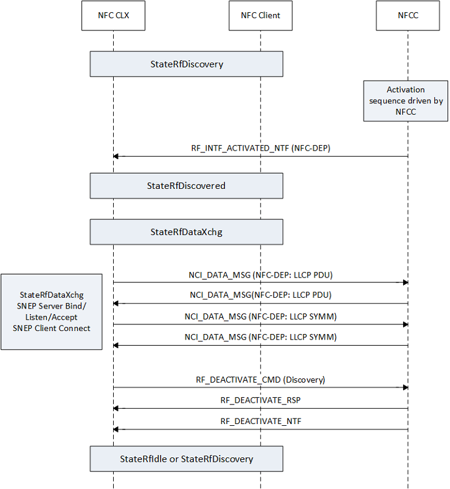

# P2P RF data exchange sequence

The following figure illustrates the state sequences for StateRfDiscovered and StateRfDataXchg for the NFC-DEP protocol. Note that the NFC CX requires the NFCC to support NFC-DEP RF interface for P2P handling. The transition of StateRfDiscovered occurs after RF interface activation. In case of multiple remote endpoints or multiple protocols in StateRfDiscovery, the NFC CX selects a single end point. Preference of NFC-DEP over ISO-DEP is implemented in the NFC CX for improved interoperability. StateRfDiscovered is a transitional state where the NFC CX checks if the remote device supports LLCP. For P2P mode, StateRfDataXchg is broken down into the following sequence of operations: checks if remote device supports LLCP, binds, listens, and accepts connections on default SNEP server, opens a connection to remote default SNEP server. The driver exchanges any available NDEF message requests from the application layer using SNEP commands.

 

 
## Related topics
[NFC device driver interface (DDI) overview](/windows-hardware/drivers/ddi/index)  
[NFC class extension (CX) reference](/windows-hardware/drivers/ddi/index)
