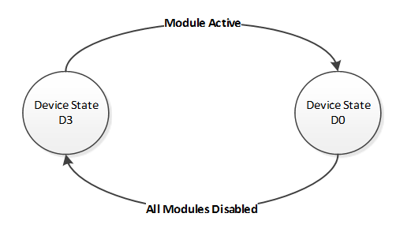
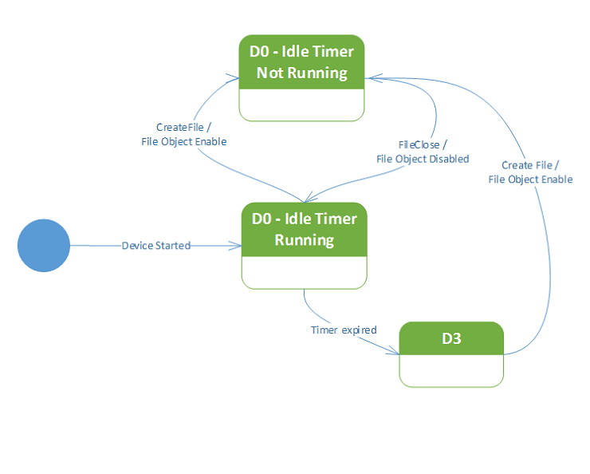

# Power states


The NFC class extension driver serves as the power policy owner for the device, so it calls [**WdfDeviceInitSetPowerPolicyOwnership**](https://msdn.microsoft.com/library/windows/hardware/ff546776)(TRUE) during its device initialization routine.

The NFC CX driver supports device power states D0 and D3. The state diagram below shows the transition between the two power states. The device on idle is in the D3 power state where the NFCC does not have power. When radio mode is active and any modules such as NFP (active publications or subscriptions from NFP DDI), SE (active secure elements in emulation mode from NFCSE DDI) or SmartCard is active, the state transitions to D0. During this transition, the polling state of the device is updated to meet the requirement of all active modules.



Furthermore, the built-in idle detection logic of UMDF is used to power manager the device. During initialization, the WdfDevice is assigned its S0 Idle settings as follows:

```cpp
WdfDeviceAssignS0IdleSettings(
    IdleCannotWakeFromS0,
    PowerDeviceD3,
    IdleTimeout,
    IdleAllowUserControl,
    WdfUseDefault
);
```

The IdleTimeout defaults to 1 second. This setting is configurable via *PowerIdleTimeout* parameter in [**NFC\_CX\_CLIENT\_CONFIG**](https://msdn.microsoft.com/library/windows/hardware/dn905540). The state diagram below illustrates the various power transitions that are implied by the use of the WDF idle detection method.

The client driver can choose to be the power policy owner of the stack through the **IsPowerPolicyOwner** member of the [**NFC\_CX\_CLIENT\_CONFIG**](https://msdn.microsoft.com/library/windows/hardware/dn905540) structure. This might be useful for transports such as USB where additional device power states must be configured.



 

 
## Related topics
[NFC device driver interface (DDI) overview](https://msdn.microsoft.com/library/windows/hardware/mt715815)  
[NFC class extension (CX) reference](https://msdn.microsoft.com/library/windows/hardware/dn905536)  

