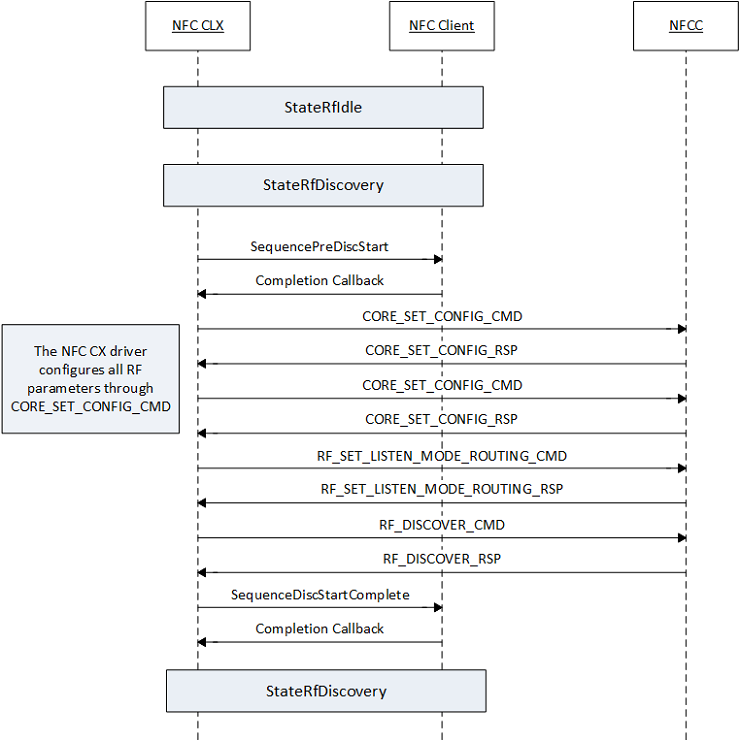

# RF discovery sequence

The following figure illustrates the sequence of NCI operations executed by NFC CX for starting discovery. The StateRfDiscovery entered from StateRfIdle triggers the start RF discovery sequence. The main set of operations performed in this state is configuration of RF discovery parameters, optional configuration for listen mode routing table, and enabling discovery through the RF discover NCI command. An NFC client driver can use SequencePreRfDiscStart to add non-standard NCI commands to optimize the discovery process.

 

 

[Send comments about this topic to Microsoft](mailto:wsddocfb@microsoft.com?subject=Documentation%20feedback%20%5Bnfpdrivers\nfpdrivers%5D:%20RF%20discovery%20sequence%20%20RELEASE:%20%284/5/2016%29&body=%0A%0APRIVACY%20STATEMENT%0A%0AWe%20use%20your%20feedback%20to%20improve%20the%20documentation.%20We%20don't%20use%20your%20email%20address%20for%20any%20other%20purpose,%20and%20we'll%20remove%20your%20email%20address%20from%20our%20system%20after%20the%20issue%20that%20you're%20reporting%20is%20fixed.%20While%20we're%20working%20to%20fix%20this%20issue,%20we%20might%20send%20you%20an%20email%20message%20to%20ask%20for%20more%20info.%20Later,%20we%20might%20also%20send%20you%20an%20email%20message%20to%20let%20you%20know%20that%20we've%20addressed%20your%20feedback.%0A%0AFor%20more%20info%20about%20Microsoft's%20privacy%20policy,%20see%20http://privacy.microsoft.com/default.aspx. "Send comments about this topic to Microsoft")

