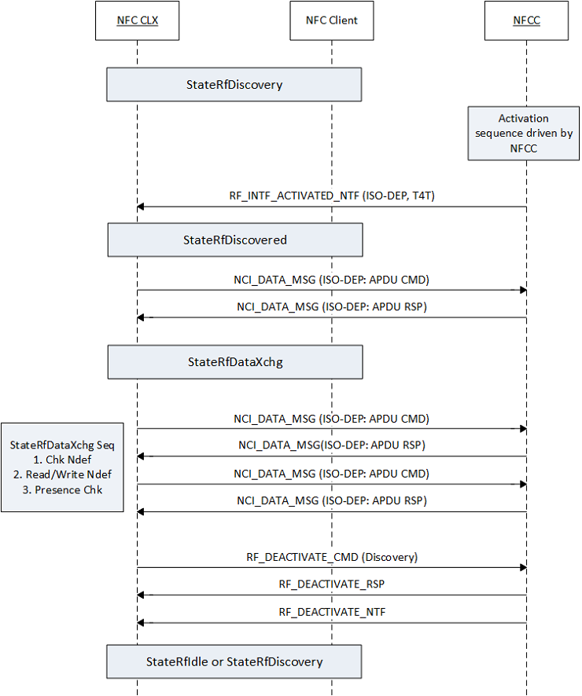

# Tag RF data exchange sequence

The following figures illustrate the state sequences for StateRfDiscovered and StateRfDataXchg for various reader-writer protocols such as T1T, T2T, T3T, and ISO-DEP. The transition to StateRfDiscovered occurs after RF interface activation. In case of multiple remote endpoints or multiple protocols in StateRfDiscovery, the NFC CX selects a single end point and protocol. Preference of NFC-DEP over ISO-DEP is implemented in the NFC CX for improved interoperability in case bail option isn’t supported by the controller. StateRfDiscovered is a transitional state where the NFC CX performs an initial presence check before transitioning to StateRfDataXchg. For reader/writer mode, StateRfDataXchg is broken down into the following sequence of NDEF operations: check NDEF, read or write NDEF, followed by presence checks. The driver also executes additional operations like formatting, read-only, low-level tag operations in this state depending on the requests from the application layer. Note that the NFC CX supports the Frame-RF interface for all NCI-standard protocols (as well as ISO15693) with the exception of ISO-DEP. ISO-DEP RF interface must be supported by the NFC controller to support ISO-DEP protocol.

The following illustrates the T2T RF data exchange sequence:

The following illustrates the T3T RF data exchange sequence:

The following illustrates the ISO-DEP RF Data Exchange Sequence:

The NFC CX performs a presence check in StateRfDataXchg when there is no data to exchange with the remote RF endpoint. This is used to determine if the remote RF endpoint has moved out of range from the DH. As noted in the sequence diagram, the following commands are used for presence check for various tag types:

-   For NFC Forum Type 1 Tags, the NFC CX uses the Read Identification (RID) command, which returns the UID, to perform the presence check detection.

-   For NFC Forum Type 2 Tags, the NFC CX uses the READ block command, which returns the 16-byte block data, to perform the presence check detection.

-   For NFC Forum Type 3 Tags, the NFC CX uses the RF\_T3T\_POLLING\_CMD NCI command (SENSF) to perform the presence check detection.

-   For NFC Forum Type 4 Tags, the NFC CX uses an empty I-block exchange to perform the presence check detection.

 

 
## Related topics
[NFC device driver interface (DDI) overview](https://msdn.microsoft.com/library/windows/hardware/mt715815)  
[NFC class extension (CX) reference](https://msdn.microsoft.com/library/windows/hardware/dn905536)  

------------------
[Send comments about this topic to Microsoft](mailto:wsddocfb@microsoft.com?subject=Documentation%20feedback%20%5Bnfpdrivers\nfpdrivers%5D:%20Tag%20RF%20data%20exchange%20sequence%20%20RELEASE:%20%284/5/2016%29&body=%0A%0APRIVACY%20STATEMENT%0A%0AWe%20use%20your%20feedback%20to%20improve%20the%20documentation.%20We%20don't%20use%20your%20email%20address%20for%20any%20other%20purpose,%20and%20we'll%20remove%20your%20email%20address%20from%20our%20system%20after%20the%20issue%20that%20you're%20reporting%20is%20fixed.%20While%20we're%20working%20to%20fix%20this%20issue,%20we%20might%20send%20you%20an%20email%20message%20to%20ask%20for%20more%20info.%20Later,%20we%20might%20also%20send%20you%20an%20email%20message%20to%20let%20you%20know%20that%20we've%20addressed%20your%20feedback.%0A%0AFor%20more%20info%20about%20Microsoft's%20privacy%20policy,%20see%20http://privacy.microsoft.com/default.aspx. "Send comments about this topic to Microsoft")
