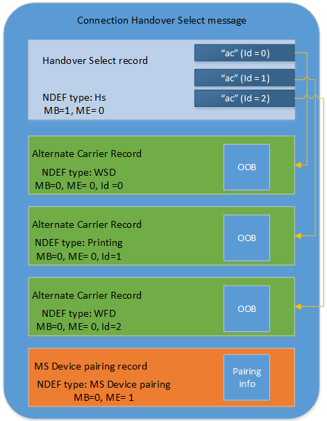

# Wi-Fi direct pairing implementation

This section provides design guidelines and requirements for a peripheral device to participate in the Tap and Setup and Tap and Reconnect use cases.

**Note**  The pairing implementation described in this topic is currently supported in Windows 8.1, for pairing to printer devices only.

 

**Note**  Windows 10 also supports NFC to Wi-Fi Direct static connection handover through the Wi-Fi alliance’s Wi-Fi P2P Carrier Configuration Record. For more information, see [Wi-Fi Alliance](http://www.wi-fi.org).

 

## Peripheral Wi-Fi Direct Device Pairing

During the tap, NFP receives pairing information from the connecting device. NFP passes the pairing information to Windows. Wi-Fi Direct devices follow the Wi-Fi Alliance Out-Of-Band (OOB) pairing procedure and the NFC Forum recommendations. Windows relies on a proprietary pairing message as defined below.

Windows will prompt the user for consent, and if it is given, Windows will attempt to connect to each of the addresses, in order, until one succeeds. There is no further interaction between an NFP provider in the PC and the connecting device.

Using NFC as an example, unidirectional installation is accomplished by storing the pairing information in a static or passive NFC tag (an active NFC tag in static-emulation mode may also be used). Windows subscribes to this pairing information. An NFC-enabled NFP provider on the PC receives the connection information from the tag and passes this to Windows as a subscriber. Upon receipt of the connection information, Windows performs the actual installation of the device in-band using device class specific techniques.

## Interoperability Requirements

To ensure interoperability across NFP providers, the pairing information should be encapsulated in a provider-specific message format.

As described elsewhere in this document, there are no specific requirements for proximity technologies other than for NFC-enabled NFP providers.

Windows requires NFC-enabled NFP providers to support a specific NFC Forum–defined mechanism for conveying the Wi-Fi Direct OOB pairing information for unidirectional pairing. The NDEF message contains a first record with a TNF field value of 0x01 and a TYPE field that is equal to “Hs”, and an alternative carrier record that points to a Wi-Fi Direct Carrier Configuration Record. In this method, only the PAYLOAD of the NDEF record will be used.

## Unidirectional Pairing Using NFC for Wi-Fi Direct

This section provides more details on how NFC, Wi-Fi Direct, and Windows work together to support unidirectional wireless pairing for Wi-Fi Direct devices such as printers.

### NFP Provider References

Wi-Fi Direct pairing is accomplished using an NFC Forum standardized Connection Handover Select message type. The below graphic provides an overview of how a Connection Handover Select message is applied for Wi-Fi Direct device pairing, specifically NDEF records 3 and 4. The Handover Select message describes one or more “ac” or “Alternate Carrier” records. These records follow the Handover Select record sequentially and each have a well defined type. Finally, the message will contain a Microsoft defined device pairing record which provides Windows with information about how to process the pairing operation.

### Wi-Fi Direct Device Pairing Message

In the sample use cases that follow, NFC type 2 tags are used as an illustrative example. If it is necessary to use a different NFC tag type, the NDEF message must be properly encapsulated according to that tag definition.

| Field                 | Value                                            | Description                                                               |
|-----------------------|--------------------------------------------------|---------------------------------------------------------------------------|
| TNF                   | 0x02                                             | Format of the Type field that follows. Media-type as defined in RFC 2046. |
| Type                  | 'application/vnd.ms-windows.wfd.oob'             | New type string we define for this scenario.                              |
| Size of OOB data      | WORD                                             | Up to 64 KB of OOB data supported.                                        |
| Wi-Fi Direct OOB data | &lt;blob of size indicated by previous field&gt; | Wi-Fi Direct OOB data as defined below.                                   |

 

### Wi-Fi Direct OOB format

The following table describes the format of the WiFi Direct OOB data. OOB Unidirectional Data may be transmitted by any unidirectional P2P OOB Device.

<table>
<colgroup>
<col width="25%" />
<col width="25%" />
<col width="25%" />
<col width="25%" />
</colgroup>
<thead>
<tr class="header">
<th align="left">Attributes</th>
<th align="left">Attribute ID</th>
<th align="left">Required/Optional</th>
<th align="left">Note</th>
</tr>
</thead>
<tbody>
<tr class="odd">
<td align="left">
OOB Header

See OOB Header attribute format table.
</td>
<td align="left">N/A</td>
<td align="left">Required</td>
<td align="left">The OOB Header attribute shall be present in P2P OOB Data blob, and have its OOB Type value set to “OOB Unidirectional Provisioning Data”.</td>
</tr>
<tr class="even">
<td align="left">
OOB Device Info

See OOB Device info attribute format table.
</td>
<td align="left">1</td>
<td align="left">Required</td>
<td align="left">This attribute must be present. It provides information about this P2P Device.</td>
</tr>
<tr class="odd">
<td align="left">
OOB Provisioning Info

</td>
<td align="left">2</td>
<td align="left">Required</td>
<td align="left">This attribute must be present. It provides provisioning information that this P2P Device is expecting to use.</td>
</tr>
<tr class="even">
<td align="left">
OOB Configuration Timeout

</td>
<td align="left">5</td>
<td align="left">Required</td>
<td align="left">This attribute must be present. It provides information about how long this P2P Device will wait for a response over Wi-Fi Direct.</td>
</tr>
</tbody>
</table>

 

### OOB Header attribute format

| Field Name        | Size (octets) | Value    | Description                                                                                                    |
|-------------------|---------------|----------|----------------------------------------------------------------------------------------------------------------|
| Total Data Length | 2             | Variable | Length of entire OOB Data Blob (including header).                                                             |
| Length            | 2             | Variable | Length of the following fields in OOB header.                                                                  |
| Version           | 1             | 0x10     | Value identifying the version of this P2P OOB record.                                                          |
| OOB Type          | 1             | Variable | Value identifying the type of OOB transaction. The specific value is defined in *OOB Transaction Types* table. |
| OUI               | 0 or 3        | Variable | Vendor-specific OUI. This is an optional value. Must only be present when OOB Type is Vendor Specific.         |
| OUI Type          | 0 or 1        | Variable | Vendor-specific Type. This is an optional value. Must only be present when OOB Type is Vendor Specific.        |

 

### OOB Transaction Types

| OOB Type (Hex) | Description                          |
|----------------|--------------------------------------|
| 0x00           | OOB Unidirectional Provisioning Data |
| 0x01           | OOB Provisioning Listener Data       |
| 0x02           | OOB Provisioning Connector Data      |
| 0x03           | OOB Reinvoke Data                    |
| 0x04-0xDC      | Reserved                             |
| 0xDD           | Vendor-Specific                      |
| 0xDE-0xFF      | Reserved                             |

 

### OOB Device info attribute format

<table>
<colgroup>
<col width="25%" />
<col width="25%" />
<col width="25%" />
<col width="25%" />
</colgroup>
<thead>
<tr class="header">
<th align="left">Field Name</th>
<th align="left">Size (octets)</th>
<th align="left">Value</th>
<th align="left">Description</th>
</tr>
</thead>
<tbody>
<tr class="odd">
<td align="left">Attribute ID</td>
<td align="left">1</td>
<td align="left">1</td>
<td align="left">Identifying the type of P2P OOB attribute. The specific value is defined in the <em>P2P OOB Attributes</em> table.</td>
</tr>
<tr class="even">
<td align="left">Length</td>
<td align="left">2</td>
<td align="left">Variable</td>
<td align="left">Length of the following fields in the attribute.</td>
</tr>
<tr class="odd">
<td align="left">P2P Device Address</td>
<td align="left">6</td>
<td align="left">As defined in P2P Spec.</td>
<td align="left">An identifier used to uniquely reference a P2P Device.</td>
</tr>
<tr class="even">
<td align="left">Config Methods</td>
<td align="left">2</td>
<td align="left">As defined in P2P Spec.</td>
<td align="left">
The WSC Methods that are supported by this device.

<strong>Note</strong>  Byte ordering within the Config Methods field shall be big-endian.

 

</td>
</tr>
<tr class="odd">
<td align="left">Primary Device Type</td>
<td align="left">8</td>
<td align="left">As defined in P2P Spec.</td>
<td align="left">
Primary Device Type of the P2P Device. Contains only the Data part of the WSC Primary Device Type attribute (excludes Attribute ID and Length fields).

<strong>Note</strong>  Byte ordering within the Primary Device Type field shall be big-endian.

 

</td>
</tr>
<tr class="even">
<td align="left">Device Capability Bitmap</td>
<td align="left">1</td>
<td align="left">As defined in P2P Spec.</td>
<td align="left">A set of parameters indicating P2P Device’s capabilities.</td>
</tr>
<tr class="odd">
<td align="left">Device Name</td>
<td align="left">Variable</td>
<td align="left">As defined in P2P Spec.</td>
<td align="left">
Friendly name of the P2P Device. Contains the entire WSC Device Name attribute TLV format.

<strong>Note</strong>  Byte ordering within the Device Name field shall be big-endian.

 

</td>
</tr>
</tbody>
</table>

 

### P2P OOB Attributes

| OOB Type (Hex) | Description               |
|----------------|---------------------------|
| 0x00           | OOB Status                |
| 0x01           | OOB Device Info           |
| 0x02           | OOB Provisioning Info     |
| 0x03           | OOB Group ID              |
| 0x04           | OOB Listen Channel        |
| 0x05           | OOB Configuration Timeout |
| 0x06-0xDC      | Reserved                  |
| 0xDD           | Vendor specific attribute |
| 0xDE-0xFF      | Reserved                  |

 

### OOB Provisioning Info attribute format

| Field Name                   | Size (octets) | Value                   | Description                                                                                                                                                             |
|------------------------------|---------------|-------------------------|-------------------------------------------------------------------------------------------------------------------------------------------------------------------------|
| Attribute ID                 | 1             | 1                       | Identifying the type of P2P OOB attribute. The specific value is defined in *P2P OOB Attributes* table.                                                                 |
| Length                       | 2             | Variable                | Length of the following fields in the attribute.                                                                                                                        |
| Provisioning Settings Bitmap | 1             | Variable                | A set of provisioning settings options, as defined the *Provisioning settings* table.                                                                                   |
| Selected Config Method       | 2             | As defined in P2P Spec. | The WSC Method that was selected by this P2P device for provisioning.                                                                                                   |
| Pin Length                   | 1             | 0 - 8                   | Number of bytes in the following PIN Data field. This field set to 0 indicates no additional PIN data.                                                                  |
| Pin Data                     | Variable      | n                       | This field is optional. This field is present only if the PIN Length field is not 0, and contains an array of octets which represent a PIN to be used for provisioning. |

 

### Provisioning settings

<table>
<colgroup>
<col width="33%" />
<col width="33%" />
<col width="33%" />
</colgroup>
<thead>
<tr class="header">
<th align="left">Bits(s)</th>
<th align="left">Information</th>
<th align="left">Notes</th>
</tr>
</thead>
<tbody>
<tr class="odd">
<td align="left">0</td>
<td align="left">Create New Group</td>
<td align="left">The Create New Group bit is set to 1 if this provisioning info is for forming a new group with the target P2P device. Otherwise, this provisioning info is for joining an existing group.</td>
</tr>
<tr class="even">
<td align="left">1</td>
<td align="left">Enforce Group Type Setting</td>
<td align="left">The Enforce Group Type Setting bit is set to 1 if Desired Group Type bit must be enforced, Otherwise, Desired Group Type bit is simply a preference.</td>
</tr>
<tr class="odd">
<td align="left">2</td>
<td align="left">Desired Group Type</td>
<td align="left">Desired Group Type bit shall be set to 0 if Desired Group Type is transient, and shall be set to 1 if Desired Group Type is persistent.</td>
</tr>
<tr class="even">
<td align="left">3 - 7</td>
<td align="left">Reserved</td>
<td align="left"></td>
</tr>
</tbody>
</table>

 

### OOB Configuration Timeout attribute format

| Field Name                     | Size (octets) | Value   | Description                                                                                                                                                        |
|--------------------------------|---------------|---------|--------------------------------------------------------------------------------------------------------------------------------------------------------------------|
| Attribute ID                   | 1             | 5       | Identifying the type of P2P OOB attribute. The specific value is defined in *P2P OOB Attributes* table.                                                            |
| Length                         | 2             | 1       | Length of the following fields in the attribute.                                                                                                                   |
| Listener Configuration Timeout | 1             | 0 - 255 | Amount of time this P2P device will spend waiting for Wi-Fi Direct communication after OOB data transfer, in units of 100 milliseconds. (Maximum of 25.5 seconds). |

 

### Windows Device Pairing Record

The Windows Device Pairing Record follows the NDEF specification. It provides additional information to Windows about how to process the Connection Handover Select message. The TNF and Type fields must be specified according to the NDEF specification. The other fields below will be sequentially listed in the Payload field of the NDEF record.

<table>
<colgroup>
<col width="25%" />
<col width="25%" />
<col width="25%" />
<col width="25%" />
</colgroup>
<thead>
<tr class="header">
<th align="left">Field Name</th>
<th align="left">Value</th>
<th align="left">Length Value</th>
<th align="left">Description</th>
</tr>
</thead>
<tbody>
<tr class="odd">
<td align="left">TNF</td>
<td align="left">0x02</td>
<td align="left">3 bits</td>
<td align="left">Format of the Type field that follows. Media-type as defined in RFC 2046.</td>
</tr>
<tr class="even">
<td align="left">Type</td>
<td align="left">&#39;application/vnd.ms-windows.devicepairing&#39;</td>
<td align="left">0x28 bytes</td>
<td align="left">New type string we define for this scenario.</td>
</tr>
<tr class="odd">
<td align="left">MajorVersion</td>
<td align="left">0x1</td>
<td align="left">2 bytes</td>
<td align="left">Major version is required to be 0x1.</td>
</tr>
<tr class="even">
<td align="left">MinorVersion</td>
<td align="left">0x0</td>
<td align="left">2 bytes</td>
<td align="left">Minor version is required to be 0x0.</td>
</tr>
<tr class="odd">
<td align="left">Flags</td>
<td align="left">0x0 or 0x01</td>
<td align="left">4 bytes</td>
<td align="left">
Set to 0x0 to try all transports.

Set to 0x1 to attempt installation sequentially and stop after first success. Preference for transports is indicated by sequence of alternate carrier records.

<strong>Note</strong>  Values 0x0002 through 0x0064 are reserved.

 

</td>
</tr>
<tr class="even">
<td align="left">Length of device friendly name</td>
<td align="left">Length of device friendly name field.</td>
<td align="left">1 byte</td>
<td align="left">Length of Device friendly name.</td>
</tr>
<tr class="odd">
<td align="left">Device friendly name</td>
<td align="left">UTF-8 encoded string up to 255 bytes.</td>
<td align="left">Length of device friendly name</td>
<td align="left">Friendly name for the device which will be shown in consent UI on the client.</td>
</tr>
</tbody>
</table>

 

### Wi-Fi Direct “Just Works” ceremony, Static Connection Handover tag format

As an example, the following is a typical implementation for an NFC passive tag. This corresponds to a static connection handover case with a Wi-Fi Direct carrier record, a network share printer, and the ms-device pairing record.

This first table illustrates the format of the Wi-Fi Direct pairing portion of the tag.

<table>
<colgroup>
<col width="25%" />
<col width="25%" />
<col width="25%" />
<col width="25%" />
</colgroup>
<thead>
<tr class="header">
<th align="left">Offset</th>
<th align="left">Content</th>
<th align="left">Length</th>
<th align="left">Explanation</th>
</tr>
</thead>
<tbody>
<tr class="odd">
<td align="left">0</td>
<td align="left">0x91</td>
<td align="left">1</td>
<td align="left">
NDEF Record Header:

MB=1b, ME=0b, CF=0b, SR=1b, IL=0b, TNF=001b
</td>
</tr>
<tr class="even">
<td align="left">1</td>
<td align="left">0x02</td>
<td align="left">1</td>
<td align="left">Record Type Length: 2 octets</td>
</tr>
<tr class="odd">
<td align="left">2</td>
<td align="left">0x0A</td>
<td align="left">1</td>
<td align="left">Record Type Length: 10 octets</td>
</tr>
<tr class="even">
<td align="left">3</td>
<td align="left">0x48 0x73</td>
<td align="left">2</td>
<td align="left">Record Type: “Hs”</td>
</tr>
<tr class="odd">
<td align="left">5</td>
<td align="left">0x12</td>
<td align="left">1</td>
<td align="left">Version Number: Major = 1, Minor = 2</td>
</tr>
<tr class="even">
<td align="left">6</td>
<td align="left">0xD1</td>
<td align="left">1</td>
<td align="left">
NDEF Record Header:

MB=1b, ME=1b, CF=0b, SR=1b, IL=0b, TNF=001b
</td>
</tr>
<tr class="odd">
<td align="left">7</td>
<td align="left">0x02</td>
<td align="left">1</td>
<td align="left">Record Type Length: 2 octets</td>
</tr>
<tr class="even">
<td align="left">8</td>
<td align="left">0x04</td>
<td align="left">1</td>
<td align="left">Payload Length: 4 octets</td>
</tr>
<tr class="odd">
<td align="left">9</td>
<td align="left">0x61 0x63</td>
<td align="left">2</td>
<td align="left">Record Type: “ac”</td>
</tr>
<tr class="even">
<td align="left">11</td>
<td align="left">0x01</td>
<td align="left">1</td>
<td align="left">Carrier Flags: CPS=1, &quot;active&quot;</td>
</tr>
<tr class="odd">
<td align="left">12</td>
<td align="left">0x01</td>
<td align="left">1</td>
<td align="left">Carrier Data Reference Length: 1 octet</td>
</tr>
<tr class="even">
<td align="left">13</td>
<td align="left">0x30</td>
<td align="left">1</td>
<td align="left">Carrier Data Reference: “0”</td>
</tr>
<tr class="odd">
<td align="left">14</td>
<td align="left">0x00</td>
<td align="left">1</td>
<td align="left">Auxiliary Data Reference Count: 0</td>
</tr>
<tr class="even">
<td align="left">15</td>
<td align="left">0x1A</td>
<td align="left">1</td>
<td align="left">
NDEF Record Header:

MB=0b, ME=0b, CF=0b, SR=1b, IL=1b, TNF=010b
</td>
</tr>
<tr class="odd">
<td align="left">16</td>
<td align="left">0x22</td>
<td align="left">1</td>
<td align="left">Record Type Name Length: 34 octets</td>
</tr>
<tr class="even">
<td align="left">17</td>
<td align="left">0x3E</td>
<td align="left">1</td>
<td align="left">Payload Length: 62 octets</td>
</tr>
<tr class="odd">
<td align="left">18</td>
<td align="left">0x01</td>
<td align="left">1</td>
<td align="left">Id Length: 1 octet</td>
</tr>
<tr class="even">
<td align="left">19</td>
<td align="left">
0x61 0x70 0x70 0x6C

0x69 0x63 0x61 0x74

0x69 0x6F 0x6E 0x2F

0x76 0x6E 0x64 0x2E

0x6D 0x73 0x2D 0x77

0x69 0x6E 0x64 0x6F

0x77 0x73 0x2E 0x77

0x66 0x64 0x2E 0x6F

0x6F 0x62
</td>
<td align="left">34</td>
<td align="left">Record Type Name: &#39;application/vnd.ms-windows.wfd.oob&#39;</td>
</tr>
<tr class="odd">
<td align="left">53</td>
<td align="left">0x30</td>
<td align="left">1</td>
<td align="left">Id: “0”</td>
</tr>
<tr class="even">
<td align="left">54</td>
<td align="left">0x3E 0x00</td>
<td align="left">2</td>
<td align="left">
Wi-Fi Direct OOB data length: 62 octets. The length is read as an unsigned short and is inclusive

of the entire blob. Includes 2 length octets. This value must be stored in little-endian format.
</td>
</tr>
<tr class="odd">
<td align="left">56</td>
<td align="left">0x02, 0x00</td>
<td align="left">2</td>
<td align="left">Header length: 2 octets</td>
</tr>
<tr class="even">
<td align="left">58</td>
<td align="left">0x10</td>
<td align="left">1</td>
<td align="left">Version: 0x10</td>
</tr>
<tr class="odd">
<td align="left">59</td>
<td align="left">0x00</td>
<td align="left">1</td>
<td align="left">OOB type: 0x00 (unidirectional)</td>
</tr>
<tr class="even">
<td align="left">60</td>
<td align="left">0x01</td>
<td align="left">1</td>
<td align="left">Attribute: 0x01 (Device information attribute)</td>
</tr>
<tr class="odd">
<td align="left">61</td>
<td align="left">0x22 0x00</td>
<td align="left">2</td>
<td align="left">Device information length: 34 octets</td>
</tr>
<tr class="even">
<td align="left">63</td>
<td align="left">
0x01 0x23 0x34 0xab

0xcd 0xef
</td>
<td align="left">6</td>
<td align="left">Wi-Fi Direct P2P device MAC address: “01:23:34🆎cd:ef”</td>
</tr>
<tr class="odd">
<td align="left">69</td>
<td align="left">0x01 0x00</td>
<td align="left">2</td>
<td align="left">Config type</td>
</tr>
<tr class="even">
<td align="left">71</td>
<td align="left">
0x00 0x01 0x00 0x50

0xF2 0x00 0x00 0x00
</td>
<td align="left">8</td>
<td align="left">Primary device type</td>
</tr>
<tr class="odd">
<td align="left">79</td>
<td align="left">0x12</td>
<td align="left">1</td>
<td align="left">Capability</td>
</tr>
<tr class="even">
<td align="left">80</td>
<td align="left">0x10 0x11</td>
<td align="left">2</td>
<td align="left">Attribute: Device name</td>
</tr>
<tr class="odd">
<td align="left">82</td>
<td align="left">0x00 0x0d</td>
<td align="left">2</td>
<td align="left">Device name length: 13 octets</td>
</tr>
<tr class="even">
<td align="left">84</td>
<td align="left">
0x43 0x6f 0x6e 0x74

0x6f 0x73 0x6f 0x20

0x4d 0x6f 0x75 0x73

0x65
</td>
<td align="left">13</td>
<td align="left">
Device friendly name in UTF-8. Note that there is no NULL terminating character and that UTF-8

may be one or two bytes per character. This example reads “Contoso Mouse”
</td>
</tr>
<tr class="odd">
<td align="left">97</td>
<td align="left">0x02</td>
<td align="left">1</td>
<td align="left">Attribute: provisioning info</td>
</tr>
<tr class="even">
<td align="left">98</td>
<td align="left">0x0c 0x00</td>
<td align="left">2</td>
<td align="left">Provisioning info length: 12 octets</td>
</tr>
<tr class="odd">
<td align="left">100</td>
<td align="left">0x07</td>
<td align="left">1</td>
<td align="left">Setting bitmap: new group, enforce persistent</td>
</tr>
<tr class="even">
<td align="left">101</td>
<td align="left">0x01 0x00</td>
<td align="left">2</td>
<td align="left">Config method: pin entry</td>
</tr>
<tr class="odd">
<td align="left">103</td>
<td align="left">0x08</td>
<td align="left">1</td>
<td align="left">Pin length: 8 octets</td>
</tr>
<tr class="even">
<td align="left">104</td>
<td align="left">
0x01 0x02 0x03 0x04

0x05 0x06 0x07 0x08
</td>
<td align="left">8</td>
<td align="left">Pin: “12345678”</td>
</tr>
<tr class="odd">
<td align="left">112</td>
<td align="left">0x05</td>
<td align="left">1</td>
<td align="left">Attribute: Configuration timeout information</td>
</tr>
<tr class="even">
<td align="left">113</td>
<td align="left">0x01 0x00</td>
<td align="left">2</td>
<td align="left">Configuration timeout length</td>
</tr>
<tr class="odd">
<td align="left">115</td>
<td align="left">0x64</td>
<td align="left">1</td>
<td align="left">10 seconds, in 100 millisecond units</td>
</tr>
</tbody>
</table>

 

This second table illustrates the format of the network printer pairing portion of the tag.

<table>
<colgroup>
<col width="25%" />
<col width="25%" />
<col width="25%" />
<col width="25%" />
</colgroup>
<thead>
<tr class="header">
<th align="left">Offset</th>
<th align="left">Content</th>
<th align="left">Length</th>
<th align="left">Explaination</th>
</tr>
</thead>
<tbody>
<tr class="odd">
<td align="left">116</td>
<td align="left">0x12</td>
<td align="left">1</td>
<td align="left">
NDEF record header:

MB=0b,ME=0b, CF=0b, SR=1b, IL=0b,TNF=010b
</td>
</tr>
<tr class="even">
<td align="left">117</td>
<td align="left">0x29</td>
<td align="left">1</td>
<td align="left">Type length field</td>
</tr>
<tr class="odd">
<td align="left">118</td>
<td align="left">0x19</td>
<td align="left">1</td>
<td align="left">Payload length field</td>
</tr>
<tr class="even">
<td align="left">119</td>
<td align="left">
0x61 0x70 0x70 0x6c

0x69 0x63 0x61 0x74

0x69 0x6f 0x6e 0x2f

0x76 0x6e 0x64 0x2e

0x6d 0x73 0x2d 0x77

0x69 0x6e 0x64 0x6f

0x77 0x73 0x2e 0x6e

0x77 0x70 0x72 0x69

0x6e 0x74 0x69 0x6e

0x67 0x2e 0x6f 0x6f

0x62
</td>
<td align="left">41</td>
<td align="left">Record type name: “application/vnd.ms-windows.nwprinting.oob”</td>
</tr>
<tr class="odd">
<td align="left">160</td>
<td align="left">
0x5c 0x5c 0x70 0x72

0x69 0x6e 0x74 0x53

0x65 0x72 0x76 0x65

0x72 0x5c 0x70 0x72

0x69 0x6e 0x74 0x65

0x72 0x4e 0x61 0x6d

0x65
</td>
<td align="left">25</td>
<td align="left">Printer name: “\printServer\printerName&quot;</td>
</tr>
</tbody>
</table>

 

This third table illustrates the format of the MS-Device pairing portion of the tag.

<table>
<colgroup>
<col width="25%" />
<col width="25%" />
<col width="25%" />
<col width="25%" />
</colgroup>
<thead>
<tr class="header">
<th align="left">Offset</th>
<th align="left">Content</th>
<th align="left">Length</th>
<th align="left">Explaination</th>
</tr>
</thead>
<tbody>
<tr class="odd">
<td align="left">185</td>
<td align="left">0x52</td>
<td align="left">1</td>
<td align="left">
NDEF record header:

MB=0b, ME=1b, CF=0b, SR=1b, IL=0b,TNF=010b
</td>
</tr>
<tr class="even">
<td align="left">186</td>
<td align="left">0x28</td>
<td align="left">1</td>
<td align="left">Type length field</td>
</tr>
<tr class="odd">
<td align="left">187</td>
<td align="left">0x15</td>
<td align="left">1</td>
<td align="left">Payload length field</td>
</tr>
<tr class="even">
<td align="left">188</td>
<td align="left">
0x61 0x70 0x70 0x6c

0x69 0x63 0x61 0x74

0x69 0x6f 0x6e 0x2f

0x76 0x6e 0x64 0x2e

0x6d 0x73 0x2d 0x77

0x69 0x6e 0x64 0x6f

0x77 0x73 0x2e 0x64

0x65 0x76 0x69 0x63

0x65 0x70 0x61 0x69

0x72 0x69 0x6E 0x67
</td>
<td align="left">40</td>
<td align="left">Record type name: “application/vnd.ms-windows.devicepairing”</td>
</tr>
<tr class="odd">
<td align="left">228</td>
<td align="left">0x00 0x01 0x00 0x00</td>
<td align="left">4</td>
<td align="left">Version: Major = 1, Minor = 0</td>
</tr>
<tr class="even">
<td align="left">232</td>
<td align="left">0x00</td>
<td align="left">1</td>
<td align="left">Flags: Set to 0, try all transports</td>
</tr>
<tr class="odd">
<td align="left">233</td>
<td align="left">0x0F</td>
<td align="left">1</td>
<td align="left">Length of device friendly name</td>
</tr>
<tr class="even">
<td align="left">234</td>
<td align="left">
0x43 0x6f 0x6e 0x74

0x6f 0x73 0x6f 0x20

0x50 0x72 0x69 0x6e

0x74 0x65 0x72
</td>
<td align="left">15</td>
<td align="left">The device friendly name displayed to the user: “Contoso Printer”</td>
</tr>
</tbody>
</table>

 

## Wi-Fi Direct Connectivity Requirements

Devices and clients must have the Wi-Fi radio turned on. If not, pairing will fail.

## Handling Edge Cases

If a user has previously paired a device, but then manually removes the device from the device list, tapping again will result in an attempt to install or pair.

If a user enters into the range of actuation but then suddenly leaves before the out-of-band (OOB) information is transferred, the device may become connectable but the PC will not look for the device. In this case, there will be no consent UI from the PC and the user will need to tap again. If the device is already discoverable when it is tapped again, it should remain discoverable and should reset the timeout period.

For Wi-Fi Direct devices, if the Wi-Fi radio turns off then the installation will not be successful.

If a user taps two devices at approximately the same time, only the pairing for the first received OOB information will be attempted.

Any attempt to tap the device on a system running an operating system that doesn’t support Tap to Setup or Tap to Reconnect may result in the device going into connectable mode but pairing will not take place. Users will need to use a pairing UI provided for Bluetooth and use the pairing button to initiate pairing.

 

 
## Related topics
 [NFC device driver interface (DDI) reference](https://msdn.microsoft.com/library/windows/hardware/mt715815)  
 
