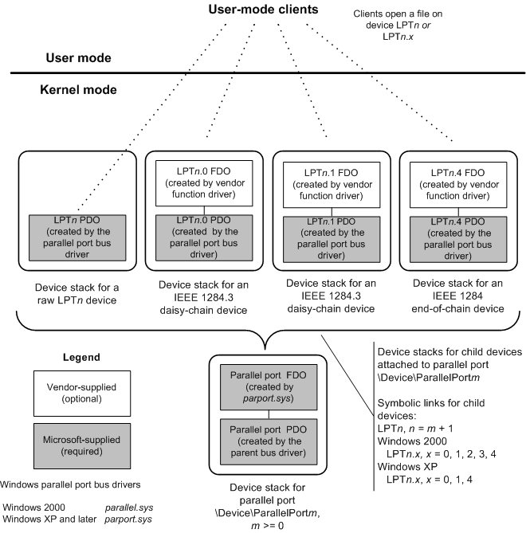

# Device Stacks for Parallel Ports and Devices

This section describes the device stacks created by the system-supplied parallel drivers for parallel ports and devices that are attached to parallel ports.

The following figure shows the type of device stacks that the system-supplied parallel drivers create for parallel ports and devices attached to parallel ports.

Vendor-supplied function drivers for parallel devices that are attached to parallel ports are optional. The system-supplied parallel drivers provide extensive support for directly controlling a parallel device as a raw device, and for controlling a device's parent parallel port.

For more information about how to operate parallel ports and devices that are attached to parallel ports, see:

[Parallel Device Interfaces, Internal Names, and Symbolic Links](parallel-device-interfaces--internal-names--and-symbolic-links.md)

[IOCTL and Callback Support for Parallel Ports and Devices](ioctl-and-callback-support-for-parallel-ports-and-devices.md)

[Operating a Parallel Port](operating-a-parallel-port.md)

[Operating a Parallel Device Attached to a Parallel Port](operating-a-parallel-device-attached-to-a-parallel-port.md)

[Client Interfaces to System-Supplied Parallel Drivers](https://msdn.microsoft.com/library/windows/hardware/ff543926)

 

 

