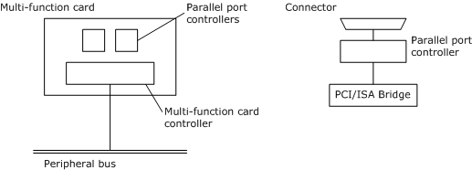

# Physical Configuration of Parallel Ports

## 

This section describes typical physical configurations of parallel ports.

The following figure shows two typical parallel port configurations.

A parallel port can be one device on a multifunction peripheral bus card or a device attached to a system bus.

 

 

--------------------

