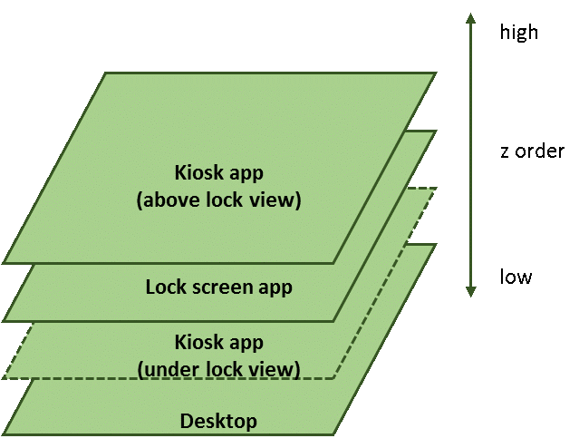

# Kiosk apps for assigned access: Best practices


In Windows 10, you can use assigned access to create a kiosk device, which enables users to interact with just a single Universal Windows app. This topic describes how to implement a kiosk app, and best practices.

There are two different experiences that assigned access provides:

1. The single-app kiosk experience
    1. Assign one app to an account. When a user logs in, they will have access to only this app and nothing else on the system. During this time, the kiosk device is locked, with the kiosk app running above the lock screen. This experience is often used for public-facing kiosk machines. see [Set up a kiosk on Windows 10 Pro, Enterprise, or Education](https://docs.microsoft.com/windows/configuration/set-up-a-kiosk-for-windows-10-for-desktop-editions) for more information.

2. The multi-app kiosk experience (available in Windows 10, version 1709 and later)
    1. You can assign one or more apps to an account. When a user logs in, the device will start in a restricted shell experience with access to only your selected apps. See [Create a Windows 10 kiosk that runs multiple apps](https://docs.microsoft.com/windows/configuration/lock-down-windows-10-to-specific-apps) for more information.

> [!NOTE]
> This article describes the single-app kiosk experience only. In the multi-app experience, selected apps run in a regular desktop context and require no special handling or modification.

## Terms


<table>
<colgroup>
<col width="50%" />
<col width="50%" />
</colgroup>
<thead>
<tr class="header">
<th>Term</th>
<th>Description</th>
</tr>
</thead>
<tbody>
<tr class="odd">
<td><p><span id="assigned_access"></span><span id="ASSIGNED_ACCESS"></span>assigned access</p></td>
<td><p>A feature that allows a system administrator to manage the user’s experience by limiting application entry points exposed to the user of the device. For example, you can restrict customers at your business to using one app so your PC acts like a kiosk. Whenever someone signs in with the specified account, they&#39;ll only be able to use that one app. They won&#39;t be able to switch apps or close the app using touch gestures, a mouse, the keyboard, or hardware buttons. They also won&#39;t see any app notifications.</p></td>
</tr>
<tr class="even">
<td><p><span id="lock_screen_app__or_lock_app_"></span><span id="LOCK_SCREEN_APP__OR_LOCK_APP_"></span>lock screen app (or lock app)</p></td>
<td><p>An application that either takes advantage of the ability to set a dynamic wallpaper or that takes advantage of the new lock extensibility framework.</p></td>
</tr>
<tr class="odd">
<td><p><span id="above_lock_screen_app__or_above_lock_app_"></span><span id="ABOVE_LOCK_SCREEN_APP__OR_ABOVE_LOCK_APP_"></span>above lock screen app (or above lock app)</p></td>
<td><p>An application that launches above the lock screen while lock screen app is running (for example, when the desktop is locked).</p></td>
</tr>
<tr class="even">
<td><p><span id="under_lock_app"></span><span id="UNDER_LOCK_APP"></span>under lock app</p></td>
<td><p>An application that runs normally, in an unlocked Windows context.</p></td>
</tr>
<tr class="odd">
<td><p><span id="LockApplicationHost"></span><span id="lockapplicationhost"></span><span id="LOCKAPPLICATIONHOST"></span><a href="http://go.microsoft.com/fwlink/?LinkId=691219" data-raw-source="[LockApplicationHost](http://go.microsoft.com/fwlink/?LinkId=691219)">LockApplicationHost</a></p></td>
<td><p>A WinRT class that allows above lock screen apps to request that the device unlocks, and allows the app to register to be notified when the device begins to unlock.</p></td>
</tr>
<tr class="even">
<td><p><span id="View_or_Application_View"></span><span id="view_or_application_view"></span><span id="VIEW_OR_APPLICATION_VIEW"></span>View or Application View</p></td>
<td><p>Each view is a separate window into the app. An app can have a main view, and create multiple and secondary views on demand. See <a href="http://go.microsoft.com/fwlink/?LinkId=691220" data-raw-source="[ApplicationView]( http://go.microsoft.com/fwlink/?LinkId=691220)">ApplicationView</a> for more information.</p></td>
</tr>
</tbody>
</table>


## The windows.aboveLockScreen extension

Assigned access in Windows 10 leverages the lock framework. When an assigned access user logs in, a background task locks the desktop and launches the kiosk app above the lock. The app's behavior may differ, depending on whether it uses the windows.aboveLockScreen extension.

Using **windows.aboveLockScreen** enables your kiosk app to access the [LockApplicationHost](https://docs.microsoft.com/uwp/api/Windows.ApplicationModel.LockScreen.LockApplicationHost) runtime class, which enables the app to know when it is running above the lock (and therefore running as a kiosk experience). If an instance cannot be returned, the app is running in a regular desktop context. 

When the lock framework launches the kiosk app above the lock and the app has the **windows.aboveLockScreen** extension, the lock framework automatically creates a new secondary view above the lock. The main view is located under the lock. This secondary view will contain your app's content and be what the user sees. This additional view can be used with the extension to tailor your kiosk experience. For example, you can:

* [secure your kiosk experience](#secureinfo) by creating a separate page to display kiosk-only content.

* Call the **LockApplicationHost.RequestUnlock()** method from your app to [exit Assigned Access mode](#addaway) and go back to the login screen.   

* [Add an event handler](#eventhandler) to the **LockApplicationHost.Unlocking* event that fires when a user presses Ctrl+Alt+Del to exit the kiosk experience. The handler could also be used to save any data before exiting.


If the app does not have the **windows.aboveLockScreen** extension, no secondary view is created and the app launches as if it’s running normally. Additionally, because the app will not have access to an instance of LockApplicationHost it won't be able to determine if it's running in a regular context, or for a kiosk experience. Not including the extension has benefits, such as being able to support [multiple monitors](#multiplemonitors)


Regardless of whether your app uses the extension, be sure to secure its data. See the [guidelines for assigned access apps](https://docs.microsoft.com/windows/configuration/guidelines-for-assigned-access-app#secure-your-information) for more information.

> [!NOTE]
> Starting in Windows 10, version 1607, there is no longer a restriction on the Universal Windows Platform (UWP) extension, so most apps can be shown in **Settings** when user configures assigned access.

## Best practices


> [!NOTE]
> This section applies to a Kiosk application that uses the **windows.aboveLockScreen** extension.


### Secure your information <a name="secureinfo"></a>

If the kiosk app is meant to run both above lock in assigned access and also in the unlocked Windows context, you may want to create a different page to render above lock, and another page for under the lock. This will allow you to avoid showing sensitive information in kiosk mode, since kiosk mode usually means anonymous access. Here are the steps you'd follow to use two different pages, one for under the lock and one for above the lock:

1.  Inside the override of the **OnLaunched** function in App.xaml.cs, try to obtain an instance of the [LockApplicationHost](http://go.microsoft.com/fwlink/?LinkId=691219) class before rootFrame navigation.
2.  If the call fails, the kiosk app should launch normally, under the lock.
3.  If the call succeeds, the kiosk app should launch above the lock running in assigned access mode. You may want this version of the kiosk app to have a different main page to hide sensitive information.

The following sample demonstrates how to do this. AssignedAccessPage.xaml is predefined, and the app navigates to AssignedAccessPage.xaml once it detects that is running in above lock mode. As a result, the normal page would display only in the under lock scenario.

You can use this method to determine if the app is running above lock screen anytime in the app lifecycle and react accordingly.
```cpp
using Windows.ApplicationModel.LockScreen;

// inside the override OnLaunched function in App.xaml.cs

if (rootFrame.Content == null)
{
    LockApplicationHost host = LockApplicationHost.GetForCurrentView();
    if (host == null)
    {
        // if call to LockApplicationHost is null, this app is running under lock
        // render MainPage normally
        rootFrame.Navigate(typeof(MainPage), e.Arguments);
    }
    else
    {
        // If LockApplicationHost was successfully obtained
        // this app is running as a lock screen app, or above lock screen app
        // render a different page for assigned access use
        // to avoid showing regular main page to keep secure information safe
        rootFrame.Navigate(typeof(AssignedAccessPage), e.Arguments);
    }
}
```

### Multiple views, windows, and threads <a name="multiplemonitors"></a>

Starting in Windows 10, version 1803, [Multiple views](https://docs.microsoft.com/windows/uwp/design/layout/show-multiple-views) are supported in the kiosk experience for apps that do not have the **windows.aboveLockScreen** extension. To use multiple views, ensure the kiosk device’s **Multiple displays** option is set to **Extend these displays**.

When an app with multiple views (and without **windows.aboveLockScreen**) is launched during a kiosk experience, the main view of the app will be rendered on the 1st monitor. If a new view is created by app using [CreateNewView()](https://docs.microsoft.com/uwp/api/windows.applicationmodel.core.coreapplication), it will be rendered on the second monitor. If the app creates another view, it’ll go to the third monitor, and so on.

> [!IMPORTANT]
> Kiosk devices can only display one view per monitor. For example, if the kiosk device has only one monitor, it will always show the main view of the kiosk app. New views created by the app will not be displayed.

When a kiosk app has the **windows.aboveLockScreen** extension, and is running above the lock, it’s initialized differently. Its main view is located under the lock, with a secondary view above it. This secondary view will be what the user will see. Note that even if you don’t explicitly create any new views, you’ll still have two views in the app instance.  



You can run the following code in the main window of your app (in assigned access mode) to see the view count and whether the current screen is the main view.

```cpp
using Windows.ApplicationModel.Core;

CoreApplication.GetCurrentView().IsMain //false
CoreApplication.Views.Count //2
```

### Dispatcher

Each view or window has its own dispatcher. Because the main view is hidden to the user, use **GetCurrentView()** to access the app’s secondary view running above the lock instead of MainView(). 

```cpp
using Windows.ApplicationModel.Core;

private async void Button_Click(object sender, RoutedEventArgs e)
{
    button.IsEnabled = false;

    // start a background task and update UI periodically (every 1 second)
    // using MainView dispatcher in below code will end up with app crash
    // in assigned access mode, use GetCurrentView().Dispatcher instead
    await CoreApplication.GetCurrentView().Dispatcher.RunAsync(
        CoreDispatcherPriority.Normal,
        async () =>
        {
            for (int i = 0; i < 60; ++i)
            {
                // do some background work, here we use Task.Delay to sleep
                await Task.Delay(1000);
                // update UI
                textBlock1.Text = "   " + i.ToString();
            }
            button.IsEnabled = true;
        });
}
```

When the app has windows.aboveLockScreen and runs as a kiosk experience, creating new views will cause an exception within the app:

```cpp
Windows.ApplicationModel.Core.CoreApplication.CreateNewView(); //causes exception
```

Because of this, you cannot have multiple views or run on multiple monitors. If your app needs to support either, you will need to remove the windows.aboveLockScreen extension from your app.


### Add a way out of assigned access <a name="addaway"></a>

In some situations, the power button, escape button, or other buttons used to stop an application may not be enabled or available on the keyboard. In these situations, provide a way to stop assigned access, for instance a software key. The following event handler shows how to stop assigned access mode by responding to button click event that could be triggered by a software key.

```cpp
LockApplicationHost^ lockHost = LockApplicationHost::GetForCurrentView();
    if (lockHost != nullptr)
    {
        lockHost->RequestUnlock();
    }
```

### Lifecycle management <a name="eventhandler"></a>

A kiosk app's lifecycle is handled by the assigned access framework. If the app ends unexpectedly, the framework will attempt to relaunch it. If however, a user presses Ctrl+Alt+Del to bring up the login screen, an unlocking event is triggered. The assigned access framework listens to the event, and will try to terminate the app.

Your kiosk app can also register a handler for this event and perform actions before exiting. Saving any data is an example of this. See the code below for an example of registering a handler.

```cpp
using Windows.ApplicationModel.LockScreen;

public AssignedAccessPage()
{
    this.InitializeComponent();

    LockApplicationHost lockHost = LockApplicationHost.GetForCurrentView();
    if (lockHost != null)
    {
        lockHost.Unlocking += LockHost_Unlocking;
}
}

private void LockHost_Unlocking(LockApplicationHost sender, LockScreenUnlockingEventArgs args)
{
    // save any unsaved work and gracefully exit the app
    App.Current.Exit();
}
```

After the user presses Ctrl+Alt+Del and a login screen is shown, two things could happen:

1.  The user knows the assigned access account password and unlocks the desktop. The assigned access framework starts, locks the desktop, and the lock screen app launches which in turn launches the kiosk app.
2.  The user doesn’t know the password or doesn’t take any further action. The login screen timeouts and the desktop relocks; the lock screen app launches which in turn launches the kiosk app.

### <span id="Don_t_create_new_windows_or_views_in_assigned_access_mode"></span><span id="don_t_create_new_windows_or_views_in_assigned_access_mode"></span><span id="DON_T_CREATE_NEW_WINDOWS_OR_VIEWS_IN_ASSIGNED_ACCESS_MODE"></span>Don't create new windows or views in assigned access mode

The following function call will end up with a runtime exception if it’s invoked in assigned access mode. If the same app, when used under lock, calls the function, it does not cause a runtime exception. It’s helpful to use [LockApplicationHost](http://go.microsoft.com/fwlink/?LinkId=691219) to determine the app's assigned access mode, and code your app accordingly, such as not creating new views if the app is in assigned access mode.

```cpp
Windows.ApplicationModel.Core.CoreApplication.CreateNewView(); //causes exception
```

## <span id="Appendix_1__UWP_extension"></span><span id="appendix_1__uwp_extension"></span><span id="APPENDIX_1__UWP_EXTENSION"></span>Appendix 1: UWP extension


The following sample application manifest uses the **windows.aboveLockScreen**UWP extension. 

> [!NOTE]
> Starting in Windows 10, version 1607, there is no longer a restriction on the Universal Windows Platform (UWP) extension, so most apps can be shown in **Settings** when user configures assigned access.


```cpp
<Package xmlns="http://schemas.microsoft.com/appx/manifest/foundation/windows10" xmlns:mp="http://schemas.microsoft.com/appx/2014/phone/manifest" xmlns:uap="http://schemas.microsoft.com/appx/manifest/uap/windows10" IgnorableNamespaces="uap mp">
  <Identity Name="bd4df68b-dc18-4748-a14e-bc21dac13736" Publisher="Contoso" Version="1.0.0.0" />
  <mp:PhoneIdentity PhoneProductId="bd4df68b-dc18-4748-a14e-bc21dac13736" PhonePublisherId="00000000-0000-0000-0000-000000000000" />
  <Properties>
    <DisplayName>AboveLock</DisplayName>
    <PublisherDisplayName>Contoso</PublisherDisplayName>
    <Logo>Assets\StoreLogo.png</Logo>
  </Properties>
  <Dependencies>
    <TargetDeviceFamily Name="Windows.Universal" MinVersion="10.0.0.0" MaxVersionTested="10.0.0.0" />
  </Dependencies>
  <Resources>
    <Resource Language="x-generate" />
  </Resources>
  <Applications>
    <Application Id="App" Executable="$targetnametoken$.exe" EntryPoint="AboveLock.App">
      <uap:VisualElements DisplayName="AboveLock" Square150x150Logo="Assets\Square150x150Logo.png" Square44x44Logo="Assets\Square44x44Logo.png" Description="AboveLock" BackgroundColor="transparent">
        <uap:DefaultTile Wide310x150Logo="Assets\Wide310x150Logo.png">
        </uap:DefaultTile>
        <uap:SplashScreen Image="Assets\SplashScreen.png" />
      </uap:VisualElements>
      <Extensions>
        <uap:Extension Category="windows.lockScreenCall" />
        <uap:Extension Category="windows.aboveLockScreen" />
      </Extensions>
    </Application>
  </Applications>
  <Capabilities>
    <Capability Name="internetClient" />
  </Capabilities>
</Package>
```

## <span id="Appendix_2__troubleshooting"></span><span id="appendix_2__troubleshooting"></span><span id="APPENDIX_2__TROUBLESHOOTING"></span>Appendix 2: troubleshooting


Normally, if a Kiosk app fails to activate above the lock screen app, you can find the activation error code in the lockdown screen. Use the error code to discover the issue by looking up Windows [System Error Codes](https://msdn.microsoft.com/library/windows/desktop/ms681381). In addition Event Viewer contains more information about activation failures. To do so:

1.  Open **Event Viewer**. There are two likely places to find activation errors.
2.  In the **Event Viewer (Local)** pane, expand **Windows Logs**, and then click **Application**.
3.  Also, in **Event Viewer (local)**, expand **Applications and Services Logs**, expand **Windows**, expand **Apps**, and then click **Microsoft-Windows-TWinUI/Operational**.

Note that because kiosk apps with assigned access do not run in full-screen mode, **ApplicationView.GetForCurrentView().IsFullScreenMode** will return false.

## <span id="related_topics"></span>Related topics


[Assigned access](https://msdn.microsoft.com/library/windows/hardware/mt620040)

[Show multiple views for an app]( http://go.microsoft.com/fwlink/?LinkId=708251)


