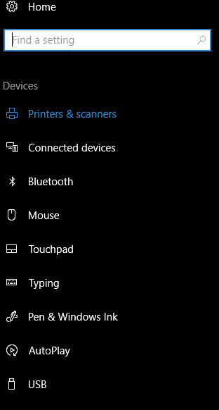

# Create a partner settings app

OEMs and mobile operators can expose custom settings for device hardware features that differentiate it from other devices. Some examples are speakers, sensors, or microphones. Up to five of these custom settings will appear as additional links in one of the Settings app's level two pages.  

For example, in the **Devices** tab of the **Settings** app, the following pages can each have up to five additional links to custom settings apps:

* Printers & scanners
* Connected devices
* Bluetooth
* Mouse
* Touchpad
* Typing
* Pen and Windows Ink
* AutoPlay
* USB



You can find a list of all level two pages in the [Launch the Windows Settings app](/windows/uwp/launch-resume/launch-settings-app) topic. It is important to note that all links must be relevant to the page they are placed on.

Additionally, you are able to add up to five search terms on each page, which must be relevant to the content on the page. For the best search experience, use specific phrases. Using general and one-word terms may cause your links to not appear in relevant searches.  

For example, if you have a “Fabricam multipen” device, create a search phrase such as “set up fabricam mulitipen” instead of a generic search term such as “pen”.

## Characteristics of partner settings app

Partner settings apps have the following characteristics:

* They are either Universal Windows Platform (UWP) apps, or Windows Phone Silverlight apps.

* Users can uninstall them directly, like other app.

* They can be upgraded by updating the settings app in the Store, like other Windows apps.

* They are preinstalled applications installed at first boot.

    As with any other preinstalled application, partners must submit a system settings application to the Windows Dev Center in order to:
  * Certify the application
  * Obtain the signed .appx file and license file needed to include the application in a device image.

* They are published to a hidden location in the Store that users cannot browse to or find by using search.

## Creating system settings applications

> [!NOTE]
> Settings applications are Universal Windows Platform apps and should conform to all UWP programming guidelines. See [Guidelines for Universal Windows Platform (UWP) apps](https://developer.microsoft.com/windows/apps/design) for more information.

1. Use the Windows Software Development Kit (SDK) to create a Windows Universal app. For more information on creating a Windows Universal app, see [Build UWP apps with Visual Studio](/windows/uwp/get-started/create-uwp-apps).

    If you're writing a settings app targeting Windows Phone, you can also create a Windows Phone Silverlight app.

2. In the application manifest below:

    `xmlns:rescap=http://schemas.microsoft.com/appx/manifest/foundation/windows10/restrictedcapabilities`
  
    Describe the page where your application link is listed using the `SettingsPageUri` attribute. Use the `AppActivationMode` attribute to point to this link. Use the code sample below as an example:

    ```xml
    <Extensions>
      <rescap:Extension Category="windows.settingsApp">
        <rescap:SettingsApp SettingsPageUri="ms-settings:yourl2pageuri">
          <rescap:AppLinks>
            <rescap:Link AppActivationMode ="uri://yourapp#deeplink" DisplayName="Link 1 Title" />
            <rescap:Link AppActivationMode ="uri://yourapp#deeplink" DisplayName="Link 2 Title" />
          </rescap:AppLinks>
            <rescap:SearchTerms>
            <rescap:Term>setup foo</rescap:Term>
            <rescap:Term>disable foo</rescap:Term>
            </rescap:SearchTerms>
          </rescap:SettingsApp>
        </rescap:Extension>
    </Extensions>
    ```

   Note that this package cannot have an entry in the all apps list. To accomplish this, set the [AppListEntry](/uwp/api/windows.applicationmodel.core.applistentry) property to **none**.

    ```xml
     <uap:VisualElements AppListEntry="none" DisplayName="OptionalPackage"
       ....
     </uap:VisualElements>
    ```

3. To be configured as a preinstalled application, submit your settings application to the Windows Dev Center. After receiving a signed .appx file and obtaining a license file, include the application in the device image.

## Updating system settings applications

Submit settings application updates to the Microsoft Store. After an update is submitted, customers who have the settings app installed are notified of the update and can install the update through the Store.

System settings apps don't appear in device application lists. To avoid confusion when users are notified of updates for the app, ensure its Store description specifies that it provides system-level settings that appear in **settings** for the device.

## What happens to legacy Control Panel or system settings apps when the OS upgrades to Windows 10

If your Control Panel application was written for Windows 7, Windows 8, or Windows 8.1, it will continue to work and be displayed in the legacy Control Panel (until its removal in a future release), but won't be displayed in the Windows 10 system settings app, and support any of its features.

Similarly, if your legacy system settings app was written for Windows 8 or Windows 8.1, it will continue to work, but will not support any of the features of the Windows 10 system settings app.
