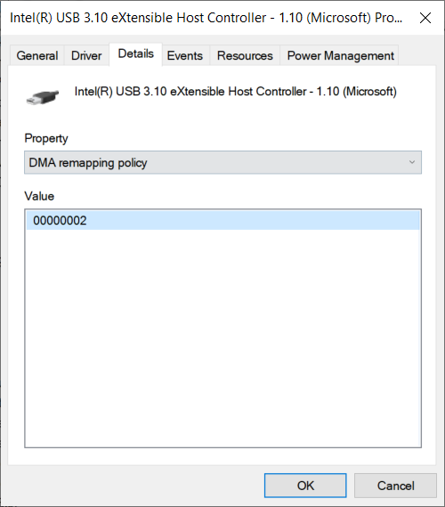

# Enabling DMA remapping for device drivers

To ensure compatibility with [Kernel DMA Protection](/windows/security/information-protection/kernel-dma-protection-for-thunderbolt) and [DMAGuard Policy](/windows/client-management/mdm/policy-csp-dmaguard#dmaguard-deviceenumerationpolicy), PCIe device drivers can opt into Direct Memory Access (DMA) remapping.

DMA remapping for device drivers protects against memory corruption and malicious DMA attacks, and provides a higher level of compatibility for devices. Also, devices with DMA remapping-compatible drivers can start and perform DMA regardless of lock screen status.

On Kernel DMA Protection enabled systems, DMAGuard Policy may block devices, with DMA remapping-incompatible drivers, connected to [external](./dsd-for-pcie-root-ports.md#identifying-externally-exposed-pcie-root-ports)/[exposed](./dsd-for-pcie-root-ports.md#identifying-internal-pcie-ports-accessible-to-users-and-requiring-dma-protection) PCIe ports (e.g. M.2, Thunderbolt™), depending on the policy value set by the system administrator.

## Driver requirements for enabling and opting into DMA remapping

Drivers perform DMA using the following interfaces:

* [WDF DMA interfaces](../wdf/introduction-to-dma-in-windows-driver-framework.md)
* [WDM interfaces](/windows-hardware/drivers/ddi/wdm/)
* [NDIS interfaces](/windows-hardware/drivers/ddi/_netvista/)

To adjust the DMA remapping policy for your driver, add an INF directive such as the following to the service installation section:

  ```inf
    [MyServiceInstall_AddReg]
    HKR,Parameters,DmaRemappingCompatible,0x00010001,1    ; where 1 = opt-in
  ```
  
Valid values for **DmaRemappingCompatible** are:

| Value | Meaning |
| ----- | ------- |
| 0     | Opt out. This indicates to the system that your driver is incompatible with DMA remapping. |
| 1     | Opt in. This indicates to the system that your driver is fully compatible with DMA remapping. |
| 2     | Opt in, but only when one or more of the following conditions are met: A. If the device is an external device (eg. Thunderbolt); B. If DMA verification is enabled in Driver Verifier. |
| No registry key | Let the system determine the policy. |

When testing your driver, enable Driver Verifier. For testing purposes under Driver Verifier, the value of the INF directive for opting in external devices is promoted to 1.

Use the latest Windows 10 build with VT-d/AMD-Vi enabled to test driver functionality on Intel x64 and AMD64 systems.

> [!NOTE]
> DMA remapping is not supported for graphics device drivers.

## Validating that DMA remapping is enabled for a specific device driver instance

To check if a specific driver has opted into DMA remapping, look in Device Manager, in the device's **Details** tab, for the values corresponding to the DMA remapping policy property. A driver can query the [**DEVPKEY_Device_DmaRemappingPolicy**](../install/devpkey-device-dmaremappingpolicy.md) property to determine the DMA remapping capability of the device. See potential return values on that page, and note that these return values are not the same as the values for **DmaRemappingCompatible** listed in the previous section.



>[!NOTE]
> For Windows 10, versions 1803 and 1809, the property field in Device Manager uses a GUID {83da6326-97a6-4088-9453-a1923f573b29}[18]