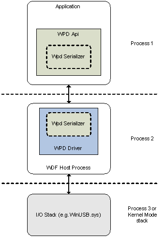

# Architecture Overview

The WPD architecture can be divided into three processes. Within these processes are the three primary components of WPD: the API, the serializer, and the driver. The following illustration depicts these processes and components that constitute the WPD architecture.

## The WPD Application Programming Interface

The WPD API is implemented as an in-proc COM server. The API uses standard Microsoft Win32 APIs to communicate with the appropriate WPD driver. A component called the WPD serializer is used by both API objects and the driver to pack or unpack parameters to or from Windows Driver Frameworks (WDF)-User-Mode Driver Framework (UMDF) buffers.

## The WPD Serializer

The WPD serializer is also implemented as an in-proc COM server. The WPD API uses the serializer to pack commands and parameters into message buffers that are sent to the driver. The driver uses the serializer to unpack these message buffers for processing. The driver also uses the serializer to pack data and parameters into response buffers that are returned to the WPD API, and the WPD API uses the serializer to unpack these response buffers to return the results to callers.

## WPD Driver

The WPD driver is implemented as a standard Windows Driver Frameworks (WDF)-User-Mode Driver Framework (UMDF) driver. WPD drivers are hosted by WUDF in a separate process called the Driver Host.

The driver receives messages from the WUDF reflector (this is not shown in the diagram, since how the buffers are received is not important to the driver. See WUDF documentation for more information). The driver implements a WPD-specific IOCTL handler to process WPD messages received by the WPD API. The driver uses the WPD serializer to unpack commands and parameters from these message buffers, and to pack the response into the buffer.

WPD drivers may communicate with their devices by going through a kernel-mode driver, typically accessed via Win32 file operations (such as CreateFile, ReadFile, WriteFile, and so on). For the common buses, Microsoft will provide standard kernel drivers for vendors to use, which will allow vendors to ship a user-mode-only driver solution.

 

 

