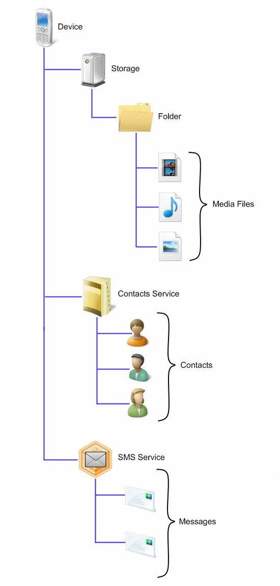

# Device Representation

Devices have two main behaviors that are addressed by the WPD architecture:

-   Accessing and storing content. For example, applications must be able to add music files to a portable music player.
-   Programming the device. This includes simple operations such as changing settings and preparing the device for data capture, or more complex operations such as uploading firmware. For example, a **Take Picture** command might be issued to a digital still camera.

In WPD, these behaviors are described by representing the device as a hierarchy of objects. The following picture shows a WPD object representation for a multifunction device, in this case, a mobile phone.

This hierarchy illustrates the following functionality and contents.

## Functionality

-   Storage object. This device has data storage.
-   Contacts Service. This service is a functional object that can be used to synchronize and store contacts on the phone.
-   SMS Service. This service is a functional object that can be used to send, receive, and store SMS messages.

## Contents

-   Media objects. This device stores images, music, and video files in folders on the Storage object. While the files shown above are stored under one folder, a device can subdivide content into folders organized by the type of media stored (such as an image folder, a music folder, or a video folder).
-   Contact objects. This device stores contact information (such as name, phone number, address, and so on) as children of the Contacts Service.
-   Message objects. This device stores SMS (Short Message Service) messages as children of the SMS Service.

## Related topics

[**WPD Drivers Overview**](wpd-drivers-overview.md)

 

 

