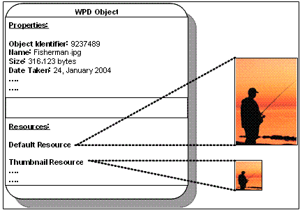

# The Conceptual Model

The WPD conceptual model describes a device in terms of objects, properties, and resources. The following topics describe these elements.

## Objects

In WPD, logical entities on devices are referred to as objects. Typically, but not always, these represent data on the device. Objects have properties, and are referenced by object identifiers. Examples of objects include pictures and folders on a camera, songs and playlists on a media player, contacts on a mobile phone, and so on.

Objects can also represent functional or informational parts of the device. Examples of these include player controls (play/record/pause), camera settings, a mobile phone's short message service (SMS) capabilities, and so on. Objects can also have binary data, which is stored as a resource.

## Properties

Object properties provide a mechanism for exchanging object-describing metadata. For example, an image object may include properties that describe its filename, size, format, width in pixels, and so on.

Properties have a current value, as well as attributes. WPD defines a set of standard properties that make up the API and DDI definitions. Vendors are not limited to the predefined WPD properties and are free to add their own.

## Property Attributes

Property attributes describe the access rights, valid values, and other information related to a property. For example, the property representing bit rate could be a range from 8 kilobits per second (Kbps) to 20 Kbps with a step value of 1 Kbps.

Access rights indicate whether callers can read, write and/or delete the property. Valid values indicate restrictions for property values. Valid values are said to be of a specific form. Valid value forms include Range (that is, property can take a value from Min to Max with specified Step), Enumeration (that is, property value is one of those in the specified List), and None (that is, there are no specific valid values).

## Resources

Resources are placeholders for binary data. An object can have more than one resource. For example, if the object represented an image file with an audio annotation, then the resources for this object might be as follows:

-   A default resource. This resource represents the entire image file. (This includes any embedded data such as audio annotations, thumbnails, and so on)
-   A thumbnail resource. This resource represents the thumbnail data for the image.
-   An audio annotation resource. This resource represents the audio data associated with the image.

## Resource Attributes

Similar to property attributes, resource attributes describe the access rights, size, format and other information related to a resource. For example, the attributes for an audio annotation resource on an image object may specify the bit rate, channel count, and data format of the audio.

## Object Illustration

The following diagram shows the relationship between an object, its properties, and its resources, using an Image object as an example.

## Related topics

[**WPD Drivers Overview**](wpd-drivers-overview.md)

 

 

