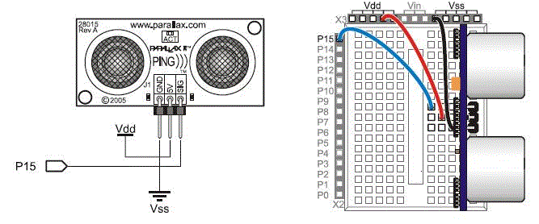

# Creating the Sensor Devices


The sensor circuits are based on the sample circuits that are provided by Parallax in their sensor data sheets. These circuits are designed to integrate each sensor with the Parallax BS2 programmable microcontroller.

For example, the datasheet for the Ultrasonic distance sensor shows the following circuit diagram and image:



In this diagram, Pin 15 on the BS2 receives the sensor data. The firmware for each of the sensors is very similar. It consists of two primary functions: PollSensor and RetrieveInterval.

The code found in the PollSensor function varies from sensor to sensor. In the case of the Ultrasonic distance sensor, the PollSensor function issues a pulse with the ultrasonic transducer, listens for a response, and then measures the time that it takes for the response to occur.

```
PollSensor:
  PULSOUT 15, 5
  PULSIN 15, 1, time
  cmDistance = cmConstant ** time
RETURN
```

The RetrieveInterval function is identical for every sensor. This function retrieves a new interval packet from the WPD driver (if one was sent), and then updates the interval property accordingly in the firmware. If no interval was received from the driver, the RetrieveInterval function invokes a default Timeout function. This function transmits the sensor data back to the WPD driver.

```
RetrieveInterval:
    SERIN 16, 16780, Interval, Timeout, [DEC NewInterval]   &#39;Retrieve interval
    IF NewInterval >= 10 AND NewInterval <= 60000 THEN
      Interval = NewInterval
    ENDIF
RETURN
```

The Timeout function has the following format:

```
Timeout:
  SEROUT 16, 16780, [DEC1 SensorID, DEC1 ElementSize, DEC1 ElementCount, DEC5 cmDistance, DEC5 Interval]
GOTO Main
```

Be aware that the Timeout function returns to the Main routine, which invokes PollSensor.

```
Main:
  GOSUB PollSensor                   &#39;Determine distance
  GOSUB RetrieveInterval             &#39;Retrieve interval data
```

The following is the complete source code for the ultrasonic distance sensor:

```
&#39; Smart Sensors and Applications - PingMeasureCmAndIn.bs2
&#39; Measure distance with Ping))) sensor and display in both in & cm
&#39; {$STAMP BS2}
&#39; {$PBASIC 2.5}
&#39; Conversion constants for room temperature measurements.
CmConstant CON 2260
&#39;InConstant CON 890
cmDistance VAR Word
&#39;inDistance VAR Word
time VAR Word
SensorID  VAR   Byte  &#39;Sensor identifier = 5 for PIR
ElementSize VAR Byte  &#39;Size (in bytes) of each element
ElementCount  VAR   Byte  &#39;Count of elements in packet
Padding VAR Byte      &#39;Padding for the 8-byte element

SensorID = 4
ElementSize = 1
ElementCount = 5      &#39;5bytes for distance data

NewInterval VAR  Word  &#39;New interval requested by user
Interval  VAR   Word   &#39;Interval value utlized by firmware

Interval = 2000
NewInterval = 2000


Main:
  GOSUB PollSensor                  &#39;Was motion detected?
  GOSUB RetrieveInterval            &#39;Retrieve units data

Timeout:
  SEROUT 16, 16780, [DEC1 SensorID, DEC1 ElementSize, DEC1 ElementCount, DEC5 cmDistance, DEC5 Interval]
GOTO Main

PollSensor:
  PULSOUT 15, 5
  PULSIN 15, 1, time
  cmDistance = cmConstant ** time
RETURN

RetrieveInterval:
    SERIN 16, 16780, Interval, Timeout, [DEC NewInterval]   &#39;Retrieve interval
    IF NewInterval >= 10 AND NewInterval <= 60000 THEN
      Interval = NewInterval
    ENDIF
RETURN
```

## <span id="related_topics"></span>Related topics


****
[The WpdBasicHardwareDriverSample](the-wpdbasichardwaredriver-sample.md)

[The WPD Driver Samples](the-wpd-driver-samples.md)

 

 

[Send comments about this topic to Microsoft](mailto:wsddocfb@microsoft.com?subject=Documentation%20feedback%20[wpd_dk\wpddk]:%20Creating%20the%20Sensor%20Devices%20%20RELEASE:%20%281/5/2017%29&body=%0A%0APRIVACY%20STATEMENT%0A%0AWe%20use%20your%20feedback%20to%20improve%20the%20documentation.%20We%20don't%20use%20your%20email%20address%20for%20any%20other%20purpose,%20and%20we'll%20remove%20your%20email%20address%20from%20our%20system%20after%20the%20issue%20that%20you're%20reporting%20is%20fixed.%20While%20we're%20working%20to%20fix%20this%20issue,%20we%20might%20send%20you%20an%20email%20message%20to%20ask%20for%20more%20info.%20Later,%20we%20might%20also%20send%20you%20an%20email%20message%20to%20let%20you%20know%20that%20we've%20addressed%20your%20feedback.%0A%0AFor%20more%20info%20about%20Microsoft's%20privacy%20policy,%20see%20http://privacy.microsoft.com/default.aspx. "Send comments about this topic to Microsoft")


