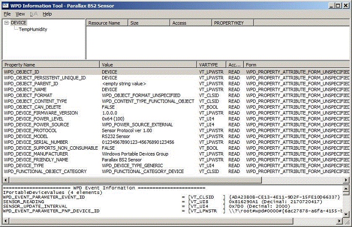
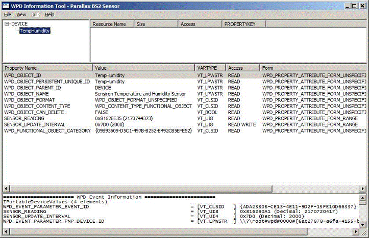

# Defining the Sensor Properties


The Windows Portable Devices (WPD) properties are object-description metadata. This section describes the properties that the sample driver supports. The Device Object supports 18 properties, and the individual sensor objects support 10 properties. Some object properties are required for driver functionality, such as WPD\_OBJECT\_ID and WPD\_OBJECT\_PERSISTENT\_UNIQUE\_ID. Other properties exist to provide information that describes the object, such as WPD\_DEVICE\_MANUFACTURER.

The WDK includes several tools for WPD driver developers. One of these tools, *WpdInfo.exe*, enables a developer to examine the objects and properties that are exposed by a given driver. The following screenshot of the *WpdInfo.exe* tool shows the properties that the Device object in the driver supports.



In the previous image, the leftmost column in the top pane lists the objects that the driver supports. The center pane lists the 18 properties that the driver for the DEVICE object supports. The first column in this pane lists the property name, the second column lists the value of that property, the third column lists the type, and so on. The lower pane shows information that is returned by the event that the driver supports.

The following screenshot of the *WpdInfo.exe* tool shows the properties that the TempHumidity object supports.



This object supports 10 properties. Among them, SENSOR\_READING and SENSOR\_UPDATE\_INTERVAL are custom properties that are defined by WpdBasicHardwareDriver, and represent data that is issued by the sensor firmware. In this example, the SENSOR\_READING property identifies the sensor (2=Sensiron Temperature and Humidity sensor), the element count (1), the element size (7 bytes), the current temperature (74.4 F), and relative humidity (37.3%). The SENSOR\_UPDATE\_INTERVAL property specifies the frequency at which the device fires the event. This value, 02000, is specified in milliseconds, which indicates a 2-second update interval. The firmware supports the configuration of an update interval between 2 and 60 seconds.

In WPD, properties are represented by the PROPERTYKEY data structure. This structure consists of two parts: a GUID and a DWORD. The globally unique identifier (GUID) identifies a property category, and the DWORD identifies a particular property in that category. For more information about the PROPERTYKEY structure, see [PROPERTYKEYs and GUIDs in WPD](propertykeys-and-guids-in-windows-portable-devices.md) in the Windows Driver Kit (WDK) documentation.

By using the DECLARE\_PROPERTYKEY macro, you can declare a PROPERTYKEY structure for a new property in your driver. The following example shows the declaration of a PROPERTYKEY for the SENSOR\_READING property. This example appears in the *WpdObjectProperties.cpp* file.

```cpp
DECLARE_PROPERTYKEY(SENSOR_READING, 0xa7ef4367, 0x6550, 0x4055, 0xb6, 0x6f, 0xbe, 0x6f, 0xda, 0xcf, 0x4e, 0x9f, 2);
```

In addition to declaring a PROPERTYKEY, you must define the key. The definition of the SENSOR\_READING key appears in the *Stdafx.h* file.

```cpp
DEFINE_PROPERTYKEY(SENSOR_READING, 0xa7ef4367, 0x6550, 0x4055, 0xb6, 0x6f, 0xbe, 0x6f, 0xda, 0xcf, 0x4e, 0x9f, 2);
```

The *WpdObjectProperties.cpp* file contains definitions for three arrays of PROPERTKEY structures. These arrays identify collections of related, supported properties. The first is an array of PROPERTYKEYs that identify properties that are common to both the device and sensor objects.

```cpp
const PROPERTYKEY g_SupportedCommonProperties[] =
{
    WPD_OBJECT_ID,
    WPD_OBJECT_PERSISTENT_UNIQUE_ID,
    WPD_OBJECT_PARENT_ID,
    WPD_OBJECT_NAME,
    WPD_OBJECT_FORMAT,
    WPD_OBJECT_CONTENT_TYPE,
    WPD_OBJECT_CAN_DELETE,
};
```

If you use the *WpdInfo.exe* tool to retrieve the current device and sensor properties, you will notice that the properties in the previous array appear in both lists.

The second array is an array of PROPERTYKEYS that identifies properties that the device object supports.

```cpp
const PROPERTYKEY g_SupportedDeviceProperties[] =
{
    WPD_DEVICE_FIRMWARE_VERSION,
    WPD_DEVICE_POWER_LEVEL,
    WPD_DEVICE_POWER_SOURCE,
    WPD_DEVICE_PROTOCOL,
    WPD_DEVICE_MODEL,
    WPD_DEVICE_SERIAL_NUMBER,
    WPD_DEVICE_SUPPORTS_NON_CONSUMABLE,
    WPD_DEVICE_MANUFACTURER,
    WPD_DEVICE_FRIENDLY_NAME,
    WPD_DEVICE_TYPE,
    WPD_FUNCTIONAL_OBJECT_CATEGORY,
};
```

The values that are assigned to the various static properties in this array are defined in *WpdObjectProperties.h*.

```cpp
#define DEVICE_PROTOCOL_VALUE            L"Sensor Protocol ver 1.00"
#define DEVICE_FIRMWARE_VERSION_VALUE    L"1.0.0.0"
#define DEVICE_POWER_LEVEL_VALUE         100
#define DEVICE_MODEL_VALUE               L"RS232 Sensor"
#define DEVICE_FRIENDLY_NAME_VALUE       L"Parallax BS2 Sensor"
#define DEVICE_MANUFACTURER_VALUE        L"Windows Portable Devices Group"
#define DEVICE_SERIAL_NUMBER_VALUE       L"01234567890123-45676890123456"
#define DEVICE_SUPPORTS_NONCONSUMABLE_VALUE    FALSE
```

These values are assigned in the **WpdObjectProperties::GetPropertyValuesForObject** method.

For example, the following excerpt from this method assigns the device model string (Parallax BS2 Sensor) to the WPD\_DEVICE\_MODEL property.

```cpp
if (IsEqualPropertyKey(Key, WPD_DEVICE_MODEL))
{
    hr = pValues->SetStringValue(WPD_DEVICE_MODEL, DEVICE_MODEL_VALUE);
    CHECK_HR(hr, "Failed to set WPD_DEVICE_MODEL");
}
```

The third array is an array of PROPERTYKEYS that identifies properties that the sensor object supports, in addition to the common object properties.

```cpp
const PROPERTYKEY g_SupportedSensorProperties[] =
{
    SENSOR_READING,
    SENSOR_UPDATE_INTERVAL,
    WPD_FUNCTIONAL_OBJECT_CATEGORY,
};
```

These values are also assigned in the **WpdObjectProperties::GetPropertyValuesForObject** method. However, the values that are assigned to the SENSOR\_READING and SENSOR\_UPDATE\_INTERVAL properties are not constants; instead, they are values retrieved in real time by two helper functions: **WpdObjectProperties::GetSensorReading** and **WpdObjectProperties::GetUpdateInterval**.

## <span id="related_topics"></span>Related topics


****
[The WpdBasicHardwareDriverSample](the-wpdbasichardwaredriver-sample.md)

[The WPD Driver Samples](the-wpd-driver-samples.md)


