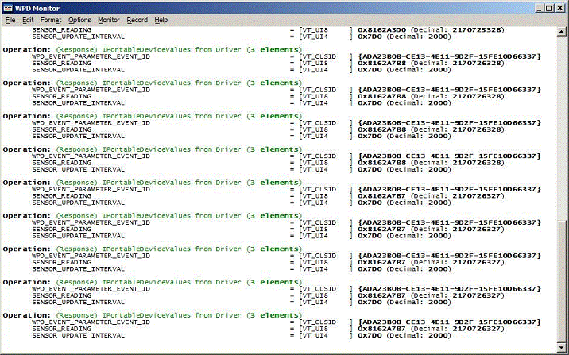
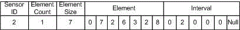

# The WpdBasicHardwareDriver Protocol


The WpdBasicHardwareDriver sample driver supports a simple protocol that includes a device identifier, packet size, and sensor data. The protocol defines a basic data format for sensor data that is transmitted by the programmable microcontroller and received by the sample driver. The sample driver parses the data packets and translates them into custom WPD events that are received by a WPD application.

After you install a device and the sample driver, you can view packets of this data by using the WpdMon tool that ships with the Windows Driver Kit (WDK). This tool monitors traffic (WPD commands and events) between a WPD driver and the WPD API. The following screenshot shows sensor data for the Sensiron Temperature and Humidity sensor that is being transmitted from the driver to the API as custom WPD events. The custom event GUID is defined by the WpdBasicHardwareDriver in *Stdafx.h*.

```ManagedCPlusPlus
DEFINE_GUID (EVENT_SENSOR_READING_UPDATED, 0xada23b0b, 0xce13, 0x4e11, 0x9d, 0x2f, 0x15, 0xfe, 0x10, 0xd6, 0x63, 0x37);
```



**Note**  The SENSOR\_READING and SENSOR\_UPDATE\_INTERVAL event parameters are not part of the WPD schema. It is necessary to edit the WpdInfo Properties file to add the following entries. (If these entries are not added, the WpdMon and WpdInfo tools will display raw PROPERTYKEYs rather than friendly names.)

 

```cpp
{a7ef4367-6550-4055-b66f-be6fdacf4e9f}.2, SENSOR_READING, VT_UI8
{a7ef4367-6550-4055-b66f-be6fdacf4e9f}.3, SENSOR_UPDATE_INTERVAL, VT_UI4
```

In the previous image, the SENSOR\_READING line contains data that is sent by the sensor by using the driver to the WPD API. This data is a multibyte packet that has the format that is shown in the following image:



The first byte identifies the sensor, the second specifies a count of elements, the third specifies the size of an element, the fourth through (fourth + count) bytes contain the actual data elements, and the last six bytes specify the interval at which the sensor publishes its data to the computer.

The seven bytes of element data indicate that the current temperature is 72.6 degrees Fahrenheit and the relative humidity is 32.8 percent. The five bytes of interval data indicate that the sensor transmits data to the computer every 2,000 milliseconds (or, every two seconds).

The following table specifies the packet format for each of the nine sensors that are found in the Parallax Sensor Sample kit.

<table>
<colgroup>
<col width="16%" />
<col width="16%" />
<col width="16%" />
<col width="16%" />
<col width="16%" />
<col width="16%" />
</colgroup>
<thead>
<tr class="header">
<th align="left">Sensor</th>
<th align="left">Sensor ID</th>
<th align="left">Element count</th>
<th align="left">Element size</th>
<th align="left">Elements</th>
<th align="left">Interval</th>
</tr>
</thead>
<tbody>
<tr class="odd">
<td align="left">Compass</td>
<td align="left">1</td>
<td align="left">1</td>
<td align="left">3</td>
<td align="left">Heading (3 bytes)</td>
<td align="left">6 bytes</td>
</tr>
<tr class="even">
<td align="left">Sensiron</td>
<td align="left">2</td>
<td align="left">1</td>
<td align="left">7</td>
<td align="left">Temp (4 bytes)
<p>Humidity (3 bytes)</p></td>
<td align="left">6 bytes</td>
</tr>
<tr class="odd">
<td align="left">Flex Force</td>
<td align="left">3</td>
<td align="left">1</td>
<td align="left">5</td>
<td align="left">Force (5 bytes)</td>
<td align="left">6 bytes</td>
</tr>
<tr class="even">
<td align="left">Ultrasonic Ping</td>
<td align="left">4</td>
<td align="left">1</td>
<td align="left">5</td>
<td align="left">Distance (5 bytes)</td>
<td align="left">6 bytes</td>
</tr>
<tr class="odd">
<td align="left">Passive Infrared</td>
<td align="left">5</td>
<td align="left">1</td>
<td align="left">1</td>
<td align="left">State (1 byte)</td>
<td align="left">6 bytes</td>
</tr>
<tr class="even">
<td align="left">Memsic</td>
<td align="left">6</td>
<td align="left">1</td>
<td align="left">8</td>
<td align="left">x-axis G (4 bytes)
<p>y-axis G (4 bytes)</p></td>
<td align="left">6 bytes</td>
</tr>
<tr class="odd">
<td align="left">QTI</td>
<td align="left">7</td>
<td align="left">1</td>
<td align="left">4</td>
<td align="left">Light measurement (4 bytes)</td>
<td align="left">6 bytes</td>
</tr>
<tr class="even">
<td align="left">Piezo Vibration</td>
<td align="left">8</td>
<td align="left">1</td>
<td align="left">1</td>
<td align="left">State (1 byte)</td>
<td align="left">6 bytes</td>
</tr>
<tr class="odd">
<td align="left">Hitachi</td>
<td align="left">9</td>
<td align="left">3</td>
<td align="left">4</td>
<td align="left">x-axis G (4 bytes)
<p>y-axis G (4 bytes)</p>
<p>z-axis G (4 bytes)</p></td>
<td align="left">6 bytes</td>
</tr>
</tbody>
</table>

 

## <span id="related_topics"></span>Related topics


****
[The WpdBasicHardwareDriverSample](the-wpdbasichardwaredriver-sample.md)

[The WPD Driver Samples](the-wpd-driver-samples.md)

 

 


