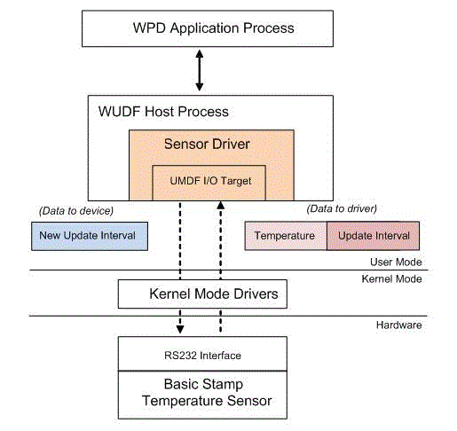

# Supporting I/O

The sample driver communicates with the Parallax Basic Stamp microcontroller by using an RS 232 connection.

The microcontroller is programmed to send periodic sensor readings and receive an input command from the driver to update the transmit interval.

The following diagram shows the data flow between the sample driver and the Basic Stamp unit. For demonstration purposes, the Basic Stamp firmware uses a very simple protocol to update the sensor data:

-   The Basic Stamp sends a multibyte data packet to the driver, which consists of *n*-bytes for the sensor reading and 5 bytes for the update interval. The data is transmitted in ANSI characters by using the SEROUT command, without a terminating null character. The update interval defines how many milliseconds elapse before the next data packet is sent and has a default of 02000 (2 seconds).
-   To dynamically configure the update interval, the sample driver can send a 6 byte data packet that contains the new update interval in ANSI characters with a terminating null character (such as 05000\\0). The terminating null character is required for the Basic Stamp program to receive the data by using the SERIN command.

The sample driver is hosted in the UMDF host process (WUDF in the diagram) and receives commands from the WPD application. The driver exchanges data with the RS 232 port by using a UMDF file-handle I/O target object.

The I/O target management and completion callback routines are implemented in the RS232Target object and involves the following steps:

1.  On initialization in **WpdBaseDriver::Initialize**, the driver configures the RS 232 connection settings, using COM1 as the default port. The setup code that is specific to RS 232 is implemented in the **RS232Connection** object.
2.  The Sample driver connects to COM1 by calling **CreateFileW** to get a handle to the RS 232 port.
3.  The Sample driver uses **IWDFFileHandleTargetFactory::CreateFileHandleTarget** to create a file handle–based I/O target object and assign it to the handle that was retrieved for COM1 in step 2. This setup code is implemented in the **RS232Target::Create** method.
4.  After the I/O target is created, the Sample driver starts the I/O target in **IPnpCallback::OnDOEntry** by calling **RS232Target::Start**. If the target is ready to process requests, the driver sends the first asynchronous read request to it. The driver also sends an asynchronous write request whenever it receives a command from the application to modify the update interval property.
5.  When the driver is uninitialized (for example, when the devnode is disabled in Device Manager), **IPnpCallback::OnD0Exit** is called and the sample driver will stop the I/O target by calling **RS232Target::Stop**. If there are any pending I/O requests to the target, they will automatically be canceled by UMDF.

RS232 read requests are implemented as shown in the following steps:

1.  They are generated in **RS232Target::SendReadRequest** as **IWDFIoRequest** objects,
2.  They are initialized by using **IWDFIoTarget::FormatRequestForRead**, and
3.  They are forwarded by using **IWDFIoRequest::Send**.

The **RS232Target::OnCompletion** callback routine processes the request data and sends the next read request.

RS232 write requests are implemented as shown in the following list:

1.  They are generated in **RS232Target::SendWriteRequest** as **IWDFIoRequest** objects,
2.  They are initialized by using **IWDFIoTarget::FormatRequestForWrite**, and
3.  They are forwarded by using **IWDFIoRequest::Send**.

When the application sets the SENSOR\_UPDATE\_INTERVAL property value, the **WpdObjectProperties::OnSetPropertyValues** command handler calls the helper function **WpdObjectProperties::SendUpdateIntervalToDevice**, which, in turn calls **RS232Target::SendWriteRequest**.

UMDF I/O targets provide multiple benefits, that include state management and error handling, and lead to simpler and more robust driver code. For more advanced driver scenarios or stack configurations, UMDF I/O targets also natively support cancellation, request queuing, and request forwarding to the next lower driver.

For the sample driver, there is no perceived performance overhead when using UMDF file handle–based I/O target objects instead of the Microsoft Win32® APIs.

## Related topics

****
[The WpdBasicHardwareDriverSample](the-wpdbasichardwaredriver-sample.md)

[The WPD Driver Samples](the-wpd-driver-samples.md)

 

 

