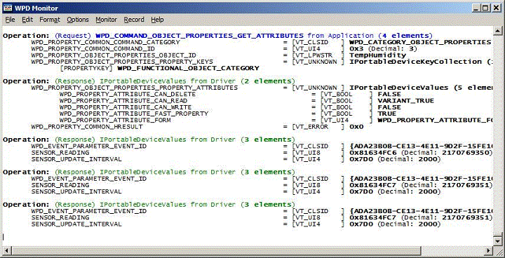

---
Description: Supporting the WPD Infrastructure
MS-HAID: 'wpddk.the\_wpdbasichardwaredriver\_supporting\_wpd\_infrastructure'
MSHAttr: 'PreferredLib:/library/windows/hardware'
title: Supporting the WPD Infrastructure
---

# Supporting the WPD Infrastructure


The WPD infrastructure is command driven. When a WPD application calls one of the methods in a given interface, the WPD serializer (an in-process COM server) converts the method call into one or more commands that it sends to the driver. The driver then processes these commands and returns a response. For more information about the infrastructure, see the [Architecture Overview](architecture-overview.md) topic.

The following image of the *WpdMon.exe* tool shows the result of an application calling the **IPortableDeviceProperties::GetPropertyAttributes** method to retrieve the property attributes for the temperature and humidity sensor.



In the previous image, the WPD serializer converted the **GetPropertyAttributes** call into the WPD\_COMMAND\_OBJECT\_PROPERTIES\_GET\_ATTRIBUTES command and the corresponding parameters. The driver processed this command and issued a response to the WPD API.

The WPD\_COMMAND\_OBJECT\_PROPERTIES\_GET\_ATTRIBUTES command is first handled in the **WpdObjectProperties::DispatchWpdMessage** method. This method, in turn, invokes the **WpdObjectProperties::OnGetPropertyAttributes** method. Both of these methods are found in the *WpdObjectProperties.cpp* source file.

The following excerpt from the **WpdObjectProperties::DispatchWpdMessage** method in *WpdObjectProperties.cpp* shows the call to the **WpdObjectProperties::OnGetPropertyAttributes** handler for the retrieval of property attributes. The **DispatchWpdMessage** method passes the command parameters to the handler. These parameters include an object identifier for the object whose properties the driver should retrieve. Additionally, the parameters include a collection of property keys that identify the attributes to be retrieved.

```
HRESULT WpdObjectProperties::DispatchWpdMessage(
    const PROPERTYKEY&     Command,
    IPortableDeviceValues* pParams,
    IPortableDeviceValues* pResults)
{
    HRESULT hr = S_OK;

    if (hr == S_OK)
    {
        if (Command.fmtid != WPD_CATEGORY_OBJECT_PROPERTIES)
        {
            hr = E_INVALIDARG;
            CHECK_HR(hr, 
                     "This object does not support this command category %ws",
                     CComBSTR(Command.fmtid));
        }
    }

    if (hr == S_OK)
    {
     …
        else if(IsEqualPropertyKey(Command, 
                                   WPD_COMMAND_OBJECT_PROPERTIES_GET_ATTRIBUTES))
        {
            hr = OnGetPropertyAttributes(pParams, pResults);
            if(FAILED(hr))
            {
                CHECK_HR(hr, "Failed to get property attributes");
            }
        }
        …
    return hr;
}
```

The **WpdObjectProperties::OnGetPropertyAttributes** method returns the collection of requested attributes in a collection of device values (IPortableDeviceValues).

## <span id="related_topics"></span>Related topics


****
[The WpdBasicHardwareDriverSample](the-wpdbasichardwaredriver-sample.md)

[The WPD Driver Samples](the-wpd-driver-samples.md)

 

 

[Send comments about this topic to Microsoft](mailto:wsddocfb@microsoft.com?subject=Documentation%20feedback%20[wpd_dk\wpddk]:%20Supporting%20the%20WPD%20Infrastructure%20%20RELEASE:%20%281/5/2017%29&body=%0A%0APRIVACY%20STATEMENT%0A%0AWe%20use%20your%20feedback%20to%20improve%20the%20documentation.%20We%20don't%20use%20your%20email%20address%20for%20any%20other%20purpose,%20and%20we'll%20remove%20your%20email%20address%20from%20our%20system%20after%20the%20issue%20that%20you're%20reporting%20is%20fixed.%20While%20we're%20working%20to%20fix%20this%20issue,%20we%20might%20send%20you%20an%20email%20message%20to%20ask%20for%20more%20info.%20Later,%20we%20might%20also%20send%20you%20an%20email%20message%20to%20let%20you%20know%20that%20we've%20addressed%20your%20feedback.%0A%0AFor%20more%20info%20about%20Microsoft's%20privacy%20policy,%20see%20http://privacy.microsoft.com/default.aspx. "Send comments about this topic to Microsoft")


