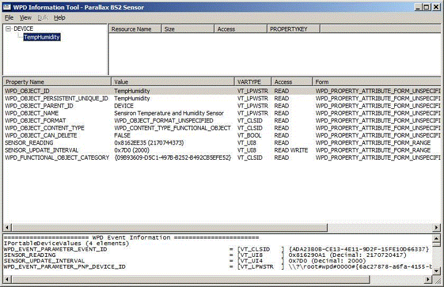

# Testing and Debugging the Sample Driver


The WDK includes three tools that you can use to test and debug a WPD driver. These tools are described in the following table.

|                          |                                                                                                                                                                                                                  |
|--------------------------|------------------------------------------------------------------------------------------------------------------------------------------------------------------------------------------------------------------|
| Tool                     | Description                                                                                                                                                                                                      |
| *WpdInfo.exe*            | With this tool you can open or close a device, create or delete objects on a device, view supported commands, issue commands, view events, retrieve readable property values, and set writeable property values. |
| *WpdDeviceInspector.exe* | Generates an HTML report that describes the device capabilities and content.                                                                                                                                     |
| *WpdMon.exe*             | Traces messages and commands that are passed between a WPD driver and the operating system or a WPD application.                                                                                                 |

 

For more information about these tools and their use, see [WPD Driver Development Tools](familiarizing-yourself-with-the-sample-driver.md) in the WDK documentation.

## <span id="tracking_the_sensor_reading_event_by_using_wpdinfo.exe"></span><span id="TRACKING_THE_SENSOR_READING_EVENT_BY_USING_WPDINFO.EXE"></span>Tracking the Sensor Reading Event by Using WpdInfo.exe


Before you start *WpdInfo.exe*, update the WpdInfo.Properties file with entries that map the PROPERTYKEYs for the SENSOR\_READING and SENSOR\_UPDATE\_INTERVAL properties to the corresponding friendly strings.

```ManagedCPlusPlus
{a7ef4367-6550-4055-b66f-be6fdacf4e9f}.2, SENSOR_READING, VT_UI8
{a7ef4367-6550-4055-b66f-be6fdacf4e9f}.3, SENSOR_UPDATE_INTERVAL, VT_UI4
```

The WpdInfo.Properties file is found in the same folder as *WpdInfo.exe*. If this file does not exist, run *WpdInfo.exe* one time to generate it.

When you start *WpdInfo.exe*, it prompts you to select a portable device from the list of installed WPD devices. After you choose the sensor device, the tool logs events in the lower pane of its window.



When the sensor reading event fired in the previous example, the following information was true:

-   The sensor-reading property, SENSOR\_READING, was 2170720417. This value indicates a sensor identifier of 2 (which corresponds to the Sensiron temperature and humidity sensor), a count of 1 element, a size of 7 bytes per element, a temperature of 72.0 degrees fahrenheit, and a relative humidity of 41.7%.
-   Its interval property, SENSOR\_UPDATE\_INTERVAL, was set to 2,000.

## <span id="updating_the_interval_property_by_using_wpdinfo.exe"></span><span id="UPDATING_THE_INTERVAL_PROPERTY_BY_USING_WPDINFO.EXE"></span>Updating the Interval Property by Using WpdInfo.exe


After you have selected the Parallax BS2 Sensor device, you can use the tool to change the interval property, SENSOR\_UPDATE\_ INTERVAL, from its default value of 2,000 ms to another value, between 2 and 60 seconds.

1.  The first step requires that you to select the TempHumidity functional object from the enumeration pane to display all the property values for that object. You can find this object as the direct child of the DEVICE object on the leftmost pane.
2.  Next, you click **SENSOR\_UPDATE\_INTERVAL**, which opens the **Edit** dialog box, where you can type the new value as a VT\_UI4 type.


The allowed range of values is between 02000 and 60000, inclusive. Click **OK**, and the new interval property value is sent to the device. Observe the Events pane, and you can see the events that arrive with the new update interval value in the event parameters.

## <span id="Debugging_the_Driver_with_Visual_Studio_8"></span><span id="debugging_the_driver_with_visual_studio_8"></span><span id="DEBUGGING_THE_DRIVER_WITH_VISUAL_STUDIO_8"></span>Debugging the Driver with Visual Studio 8


WPD drivers are based on the Windows Driver Frameworks (WDF) UMDF platform. UMDF drivers provide greater stability and security, as well as comparable performance, than kernel-mode drivers. And, UMDF drivers allow the use of user-mode debuggers, such as Visual Studio 8. Debugging a driver in user mode tends to be faster than debugging in kernel mode because an error affects only the current process rather than the entire computer.

After your driver is installed, you can create a debugging project in Visual Studio 8 by following these steps:

1.  Open Visual Studio 8 with elevated privileges (Run As Administrator) and navigate to the File &lt; New &gt; Project from Existing Code path.
    **Note**  You must open Visual Studio 8 with elevated privileges because the LocalService account requires these privileges. The WUDFHost process runs within the LocalService account. By using Visual Studio 8, you are able to debug the driver project.

     

2.  Follow the steps in the **Welcome to the Create Project from Existing Code Files Wizard**. Make sure to specify the language, the location of your driver source files, a project name, and so on.
3.  Open your newly created project.
4.  On the **Debug/Attach to Process** menu, select *WudfHost.exe* in the **Available Processes** list that appears in the **Attach to Process** dialog box. If there is more than one instance of the *WudfHost.exe* process, select the one that has loaded your driver's DLL.
5.  After you complete the previous steps, you can set breakpoints in the source code and debug your driver.

## <span id="Tips_for_Debugging_WPD_Driver_Initialization_Code"></span><span id="tips_for_debugging_wpd_driver_initialization_code"></span><span id="TIPS_FOR_DEBUGGING_WPD_DRIVER_INITIALIZATION_CODE"></span>Tips for Debugging WPD Driver Initialization Code


Initialization code for a WPD driver, for example, the code found in **WpdBaseDriver::Initialize** in the two WPD sample drivers that are packaged with the WDK, runs when your driver is installed To debug this initialization code, you should use the *WDFVerifier* tool that is included with the Windows Driver Kit. This tool enables the user-mode debugger to be launched automatically upon host-process startup, or, upon driver load.

## <span id="related_topics"></span>Related topics


****
[The WpdBasicHardwareDriverSample](the-wpdbasichardwaredriver-sample.md)

[The WPD Driver Samples](the-wpd-driver-samples.md)

 

 


