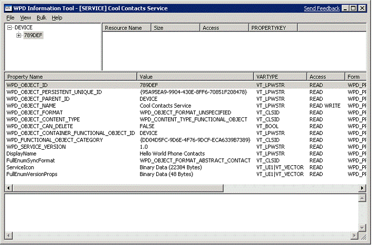
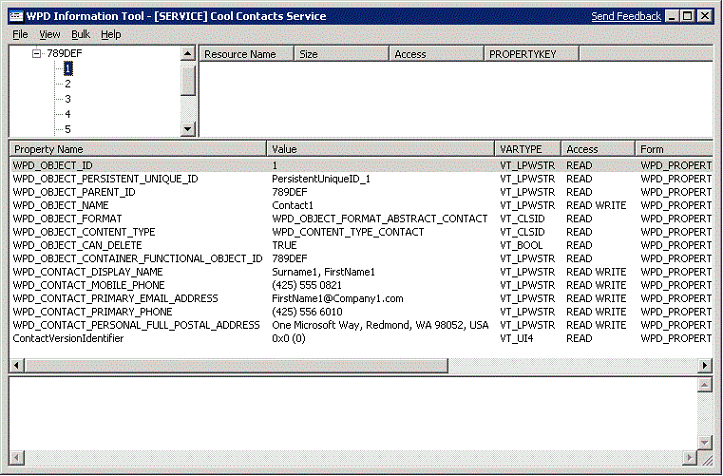

# Defining the Service Properties


WPD properties are object-description metadata. This section describes the properties that the sample driver supports. The Contacts Service Object supports 14 properties; and the individual contact objects also support 14 properties. Some object properties are required for driver functionality, such as WPD\_OBJECT\_ID and WPD\_OBJECT\_PERSISTENT\_UNIQUE\_ID. Other properties provide information to describe the object, such as WPD\_CONTACT\_DISPLAY\_NAME for the contact objects.

The WDK includes several tools for WPD driver developers. One of these tools, *WpdInfo.exe*, enables a developer to examine the objects and properties that are exposed by a given driver. The following image of the *WpdInfo.exe* tool shows the properties that the Contacts Service Object in the driver supports:



In the previous image, the leftmost column in the top pane lists the objects that the driver supports. The center pane lists the 14 properties that the driver for the Contacts Service Object supports. The first column in this pane lists the property name, the second column lists the value of that property, and the third column lists the type, and so on. The lower pane shows information that is returned by the event that the driver supports.

The following image of the *WpdInfo.exe* tool shows the properties that the first contact object supports.



This object supports 14 properties. The first eight properties are general WPD object properties. The last six properties are contact-specific (name, mobile-phone number, email address, and so on).

In WPD, properties are represented by the PROPERTYKEY data structure. This structure consists of two parts: a globally unique identifier (GUID) and a DWORD. The GUID identifies a property category, and the DWORD identifies a particular property in that category. For more information about the PROPERTYKEY structure, see [PROPERTYKEYs and GUIDs in WPD](propertykeys-and-guids-in-windows-portable-devices.md).

In the sample driver, the supported contact properties are defined in an array of **PropertyAttributeInfo** structures. This structure has the following format:

```cpp
typedef struct tagPropertyAttributeInfo
{
    const PROPERTYKEY*                pKey;
    VARTYPE                           Vartype;
    FakeDevicePropertyAttributesType  AttributesType;
    const LPWSTR                      wszName;
} PropertyAttributeInfo;
```

The *FakeContactContent.cpp* file defines the array of supported contact properties:

```cpp
const PropertyAttributeInfo g_SupportedContactProperties[] =
{
    {&WPD_OBJECT_ID,                             VT_LPWSTR, UnspecifiedForm_CanRead_CannotWrite_CannotDelete_Fast,  NULL}, 
    {&WPD_OBJECT_PERSISTENT_UNIQUE_ID,           VT_LPWSTR, UnspecifiedForm_CanRead_CannotWrite_CannotDelete_Fast,  NULL}, 
    {&WPD_OBJECT_PARENT_ID,                      VT_LPWSTR, UnspecifiedForm_CanRead_CannotWrite_CannotDelete_Fast,  NULL}, 
    {&WPD_OBJECT_NAME,                           VT_LPWSTR, UnspecifiedForm_CanRead_CanWrite_CannotDelete_Fast,     NULL}, 
    {&WPD_OBJECT_FORMAT,                         VT_CLSID,  UnspecifiedForm_CanRead_CannotWrite_CannotDelete_Fast,  NULL}, 
    {&WPD_OBJECT_CONTENT_TYPE,                   VT_CLSID,  UnspecifiedForm_CanRead_CannotWrite_CannotDelete_Fast,  NULL}, 
    {&WPD_OBJECT_CAN_DELETE,                     VT_BOOL,   UnspecifiedForm_CanRead_CannotWrite_CannotDelete_Fast,  NULL}, 
    {&WPD_OBJECT_CONTAINER_FUNCTIONAL_OBJECT_ID, VT_LPWSTR, UnspecifiedForm_CanRead_CannotWrite_CannotDelete_Fast,  NULL}, 
    {&WPD_CONTACT_DISPLAY_NAME,                  VT_LPWSTR, UnspecifiedForm_CanRead_CanWrite_CannotDelete_Fast,     NULL},
    {&WPD_CONTACT_MOBILE_PHONE,                  VT_LPWSTR, UnspecifiedForm_CanRead_CanWrite_CannotDelete_Fast,     NULL},
    {&WPD_CONTACT_PRIMARY_EMAIL_ADDRESS,         VT_LPWSTR, UnspecifiedForm_CanRead_CanWrite_CannotDelete_Fast,     NULL},
    {&WPD_CONTACT_PRIMARY_PHONE,                 VT_LPWSTR, UnspecifiedForm_CanRead_CanWrite_CannotDelete_Fast,     NULL},
    {&WPD_CONTACT_PERSONAL_FULL_POSTAL_ADDRESS,  VT_LPWSTR, UnspecifiedForm_CanRead_CanWrite_CannotDelete_Fast,     NULL},
    {&MyContactVersionIdentifier,                VT_UI4,    UnspecifiedForm_CanRead_CannotWrite_CannotDelete_Fast,  L"ContactVersionIdentifier"},
};
```

These properties are initialized in the *FakeContactsServiceContent.cpp* module in the **InitializeContent** method, as shown in the following example:

```cpp
        if (pContact)
        {
            pContact->Name.Format(L"Contact%d", *pdwLastObjectID);
            pContact->ParentID                    = ObjectID;
            pContact->ContainerFunctionalObjectID = ObjectID;
            pContact->ObjectID.Format(L"%d", *pdwLastObjectID);
            pContact->PersistentUniqueID.Format(L"PersistentUniqueID_%ws", pContact->ObjectID);
            pContact->ParentPersistentUniqueID    = PersistentUniqueID;
            pContact->RequiredScope               = CONTACTS_SERVICE_ACCESS;

            pContact->DisplayName.Format(L"Surname%d, FirstName%d", dwContactIndex, dwContactIndex);
            pContact->MobilePhoneNumber           = L"(425) 555 0821";
            pContact->PrimaryPhoneNumber          = L"(425) 556 6010";
            pContact->PrimaryEmail.Format(L"FirstName%d@Company%d.com", dwContactIndex, dwContactIndex);
            pContact->PersonalFullPostalAddress.Format(L"One Microsoft Way, Redmond, WA 98052, USA");

            m_Children.Add(pContact);
        }
```

The *FakeContactsServiceContent.cpp* file defines the array of supported service properties:

```cpp
const PropertyAttributeInfo g_SupportedServiceProperties[] =
{
    {&WPD_OBJECT_ID,                                VT_LPWSTR,          UnspecifiedForm_CanRead_CannotWrite_CannotDelete_Fast, NULL},
    {&WPD_OBJECT_PERSISTENT_UNIQUE_ID,              VT_LPWSTR,          UnspecifiedForm_CanRead_CannotWrite_CannotDelete_Fast, NULL},
    {&WPD_OBJECT_PARENT_ID,                         VT_LPWSTR,          UnspecifiedForm_CanRead_CannotWrite_CannotDelete_Fast, NULL},
    {&WPD_OBJECT_NAME,                              VT_LPWSTR,          UnspecifiedForm_CanRead_CanWrite_CannotDelete_Fast,    NULL},
    {&WPD_OBJECT_FORMAT,                            VT_CLSID,           UnspecifiedForm_CanRead_CannotWrite_CannotDelete_Fast, NULL},
    {&WPD_OBJECT_CONTENT_TYPE,                      VT_CLSID,           UnspecifiedForm_CanRead_CannotWrite_CannotDelete_Fast, NULL},
    {&WPD_OBJECT_CAN_DELETE,                        VT_BOOL,            UnspecifiedForm_CanRead_CannotWrite_CannotDelete_Fast, NULL},
    {&WPD_OBJECT_CONTAINER_FUNCTIONAL_OBJECT_ID,    VT_LPWSTR,          UnspecifiedForm_CanRead_CannotWrite_CannotDelete_Fast, NULL},
    {&WPD_FUNCTIONAL_OBJECT_CATEGORY,               VT_CLSID,           UnspecifiedForm_CanRead_CannotWrite_CannotDelete_Fast, NULL},
    {&WPD_SERVICE_VERSION,                          VT_LPWSTR,          UnspecifiedForm_CanRead_CannotWrite_CannotDelete_Fast, NULL},
    {&PKEY_Services_ServiceDisplayName,             VT_LPWSTR,          UnspecifiedForm_CanRead_CannotWrite_CannotDelete_Fast, L"DisplayName"},
    {&PKEY_FullEnumSyncSvc_SyncFormat,              VT_CLSID,           UnspecifiedForm_CanRead_CannotWrite_CannotDelete_Fast, L"FullEnumSyncFormat"},
    {&PKEY_Services_ServiceIcon,                    VT_VECTOR | VT_UI1, UnspecifiedForm_CanRead_CannotWrite_CannotDelete_Fast, L"ServiceIcon"},
    {&PKEY_FullEnumSyncSvc_VersionProps,            VT_VECTOR | VT_UI1, UnspecifiedForm_CanRead_CannotWrite_CannotDelete_Fast, L"FullEnumVersionProps"}
};
```

The service properties are set in the **GetValue** method that is found in the same module.

## <span id="related_topics"></span>Related topics


****
[The WpdServiceSampleDriverSample](the-wpdservicesampledriver-sample.md)

[The WPD Driver Samples](the-wpd-driver-samples.md)

 

 


