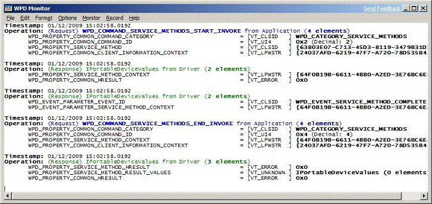

# Support for WPD infrastructure (WpdServiceSampleDriverSample)


The WPD infrastructure is command driven. When a WPD application calls one of the methods in a given interface, the WPD serializer (an in-process COM server) converts the method call into one or more commands that it sends to the driver. The driver, in turn, processes these commands and then returns a response. For more information about the infrastructure, see the [Architecture Overview](architecture-overview.md) topic.

The following image of the *WpdMon.exe* tool shows the result of an application calling the **IPortableDeviceServiceMethods::Invoke** method to invoke the BeginSync method that is supported by the sample driver:



In the previous image, the WPD serializer converted the **Invoke** call into the WPD\_COMMAND\_SERVICE\_METHODS\_START\_INVOKE command and the corresponding parameters. The driver processed this command and issued two responses to the WPD API. The first response is the result of WPD\_COMMAND\_SERVICE\_METHODS\_START\_INVOKE to indicate that the **StartInvoke**command was successful and that the method started running on the device. The second response is the WPD\_EVENT\_SERVICE\_METHOD\_COMPLETE event that the driver sent when the method completed. The driver sent WPD\_EVENT\_SERVICE\_METHOD\_COMPLETE so that the WPD API could perform the necessary method completion and cleanup. For the sample driver, the two responses followed immediately with no time delay; on an actual device, there can be a delay between the two responses, if a method takes a long time to complete.

The WPD\_COMMAND\_SERVICE\_METHODS\_START\_INVOKE command is first handled in the **WpdService::DispatchWpdMessage** method. This method, in turn, invokes the **WpdServiceMethod::OnStartInvoke** method. The first method is found in the file *WpdService.cpp*; the second is found in the file *WpdServiceMethod.cpp*.

The following excerpt from the **WpdService::DispatchWpdMessage** method in *WpdService.cpp* shows the call to the **WpdServiceMethod::OnStartInvoke** handler. The **DispatchWpdMessage** method passes the command parameters to the handler. These command parameters consist of a pointer to the parameters for the **Invoke** method as well as a pointer to the *pResults* variable that receives the method results:

```cpp
HRESULT WpdService::DispatchWpdMessage(
            REFPROPERTYKEY         Command,
    __in    IPortableDeviceValues* pParams,
    __out   IPortableDeviceValues* pResults)
{
    HRESULT     hr                  = S_OK;
    LPWSTR      pszRequestFilename  = NULL;

    // Get the request filename to process the service message
    hr = pParams->GetStringValue(PRIVATE_SAMPLE_DRIVER_REQUEST_FILENAME, &pszRequestFilename);
    if (FAILED(hr))
    {
        hr = E_INVALIDARG;
        CHECK_HR(hr, "Failed to get the required requested filename");
    }

    if (hr == S_OK)
    {    
        hr = CheckRequestFilename(pszRequestFilename);
        CHECK_HR(hr, "Unknown request filename %ws received", pszRequestFilename);
    }

    if (hr == S_OK)
    {
     …
        else if (IsEqualPropertyKey(Command, WPD_COMMAND_SERVICE_METHODS_START_INVOKE))
        {
            hr = m_ServiceMethods.OnStartInvoke(pParams, pResults);
        }
        …
    return hr;
}
```

## <span id="related_topics"></span>Related topics


****
[The WpdServiceSampleDriverSample](the-wpdservicesampledriver-sample.md)

[The WPD Driver Samples](the-wpd-driver-samples.md)

 

 


