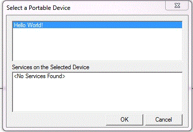
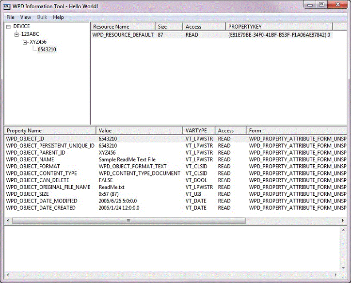
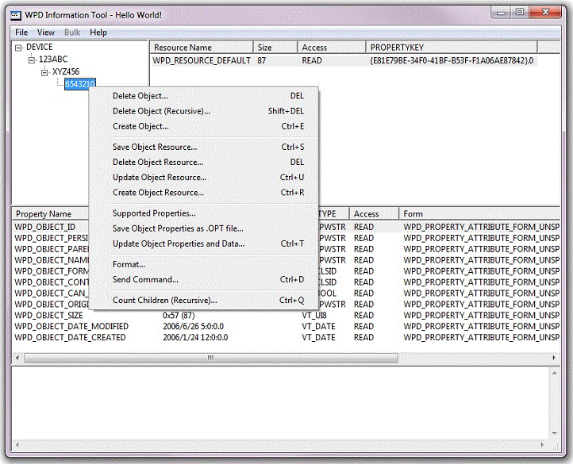

# Using the WpdInfo Tool

The *WpdInfo.exe* tool is a Windows-based application that you can use to test the functionality in your driver. You can use this tool to perform the following tasks:

-   Open or close a device
-   Create or delete an object on the device
-   Create, save, or delete an object resource
-   Send a command to the device
-   View the supported device commands
-   View the supported device content types
-   View the supported events
-   View the supported properties
-   View the attributes of a given resource
-   View the attributes of a given property
-   Perform bulk property operations
-   Open or close a device service
-   Invoke a method on a device service

When you start the tool, it prompts you to choose one of the available WPD devices.

After you choose a device, a connection is established and the WpdInfo application windows are initialized. The upper-left frame of the main window displays the hierarchy of supported objects. The upper-right frame displays resource data that is associated with the object that is currently selected. The lower-middle pane displays the properties that are supported by the object. The pane at the bottom of the window displays any error information returned by the driver during a given operation.

You can right-click a given object, resource, or property to display a menu of options that apply to the selected element. For example, you can right-click an object that appears in the upper-left pane to delete it, operate on its resources, view associated properties and so on.

 

 

