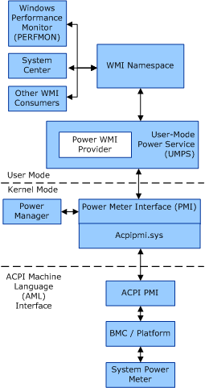

# Overview of the Power Metering and Budgeting Infrastructure

Starting with Windows 7 and Windows Server 2008 R2, Windows supports the Power Metering and Budgeting (PMB) infrastructure. This infrastructure promotes energy efficiency on computer systems by providing power consumption and management features. Additionally, PMB provides additional options to configure power metering and budgeting. System manufacturers, IT professionals, and end-users can use the PMB infrastructure to tune their systems so that they balance power and performance to meet their needs.

The PMB infrastructure provides the following information to user-mode applications and services:

Power Metering Information  
This information is used to determine how the computer system or subcomponents use power. Power consumption is monitored, or *metered*, by a power meter in the system. Power metering also provides the current configuration of a power meter, such as metering capabilities and power consumption thresholds.

Power Budgeting Information  
This information is used to determine the power limit, or *budget*, that is supported by the computer system. Depending on the hardware platform, this information might also allow you to configure the system's power budget.

A power meter is a hardware component of the system that reports information about power consumption, in watts. This information is typically provided as part of a power supply or by using a baseboard management controller (BMC). A power meter monitors the power consumption of the whole system or a subsystem of the computer, and generates events (if configured to do so) when one of the following conditions occurs:

-   The power consumption exceeds the configured power threshold for a power supply.

-   The power consumed by the system reaches the configured power budget.

Multiple power meters could be installed in a computer system, with each power meter monitoring its own set of components.

The following figure provides an overview of the PMB infrastructure.

PMB consists of the following components:

User-Mode Power Service (UMPS)  
The UMPS is a user-mode service that exposes the system's power metering and budgeting information by using a set of WMI classes. This information is used by applications, such as the Windows Performance Monitor (PerfMon), for power management and reporting.

The PMB WMI classes are provided by the Power WMI Provider component of the UMPS. These WMI classes comply with version *1.1.0 of the Distributed Management Task Force (DMTF) Power Supply Profile*. For more information, see to the [DMTF Power Supply Profile](http://go.microsoft.com/fwlink/p/?linkid=145048).

For more information about UMPS, see [User-Mode Power Service](user-mode-power-service.md).

Power Meter Interface (PMI)   
PMI is a WDM interface that is provided by a driver. By using this interface, the driver services PMI I/O request packets (IRPs) from the [Power Manager](https://msdn.microsoft.com/library/windows/hardware/ff559829) and the Power WMI Provider component of the UMPS. These IRPs are used to query and set the current power metering and budgeting information from a power meter.

Starting with Windows 7 and Windows Server 2008 R2, the operating system provides a driver (*ACPIPMI.SYS*) that implements the PMI for systems that support the ACPI 4.0 Power Metering objects. This driver enables original equipment manufacturers (OEMs) to build systems that can participate within the PMB infrastructure without having to install third-party drivers.

For more information about the PMI, see [Power Meter Interface](power-meter-interface.md).

ACPI PMI  
The ACPI PMI exposes the power metering and budgeting capabilities of the hardware platform to the drivers that provide the WDM PMI interface.

The ACPI PMI is provided by using the ACPI 4.0 Power Metering objects. These ACPI objects provide an abstraction layer to the underlying technology, such as the Intelligent Platform Management Interface (IPMI), which is used for power metering and budgeting by the hardware platform.

The ACPI 4.0 Power Metering objects are modeled after the ACPI Control Method battery paradigm. The system firmware must implement the ACPI 4.0 Power Metering objects. The system firmware must also implement the ACPI 4.0 Power Metering objects. The implementation details are proprietary and specific to each system.

For more information, see [ACPI Power Meter Interface](acpi-power-meter-interface.md).

 

 

