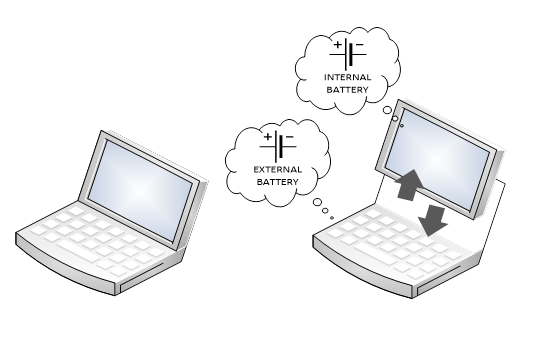
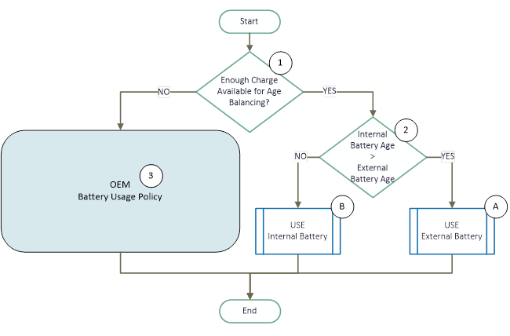
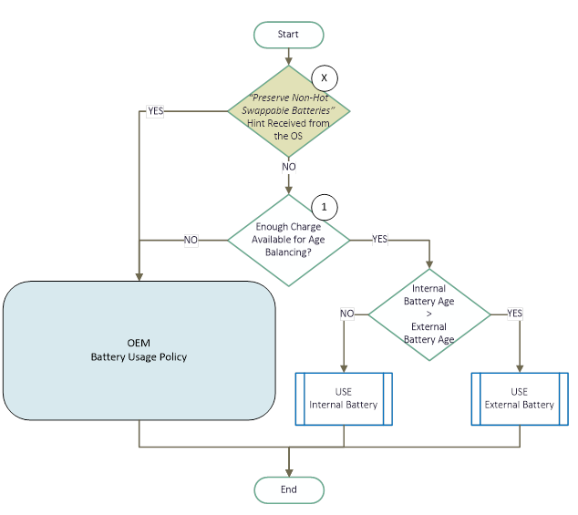
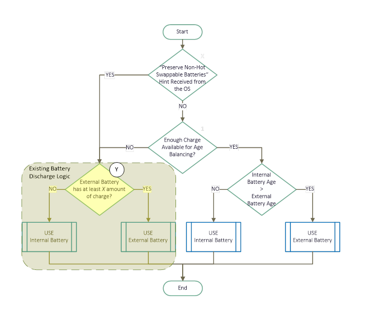
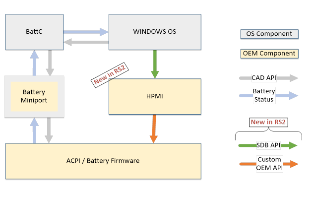
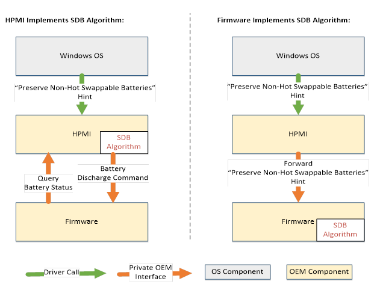

# Software Defined Battery

>[!NOTE]
> Some information relates to pre-released product which may be substantially modified before it's commercially released. 
> Microsoft makes no warranties, express or implied, with respect to the information provided here.

## Introduction

The goal of this topic is to introduce Software Defined Batteries (SDB), describe Windows SDB architecture and detail the Windows API and DDI contracts for this feature. 

The topic starts by introducing the Simple Age Balancing SDB algorithm for a hypothetical two battery system. This is followed by architecture layout and API contract needed to implement the SDB algorithm.

## Nomenclature

- BattC - Battery class driver

- CAD - The Charge Arbitration Driver (CAD) is a Microsoft driver that arbitrates power between USB Legacy, USB Type-C and wireless charging sources

- Cold Swappable Batteries - Batteries that cannot be removed from the system without a risk of brownouts or total power failure

- Cycle Count - The number of full charge-discharge cycles undergone by the battery, as described in the ACPI specification

- Hot Swappable Batteries - Batteries that can be safely removed while the system is in operation, without any risk of brownouts

- HPMI - Hardware Power Manager Interface

- Non-Hot Swappable Batteries - One or more Cold Swappable and Non-Swappable Batteries installed in the system

- Non-Swappable Batteries - Batteries that are not designed and meant to be removed by the end user

## SDB Overview
The MSR research paper on Software Defined Batteries can be found here: [https://www.microsoft.com/research/wp-content/uploads/2016/02/multibattery_sosp2015.pdf](https://www.microsoft.com/research/wp-content/uploads/2016/02/multibattery_sosp2015.pdf). 

This topic reprises select ideas described in this paper and presents them with a view of productizing software based battery age balancing feature in laptops and other mobile devices. 

Imagine a two battery system. Where one battery is a non removable battery, situated next to the SOC – let’s call this *internal battery*. The other battery is hot swappable battery, situated next to a removable keyboard – let’s call this *external battery*. 

*A Multi-Battery System*



As the keyboard is attached-detached over a period of time, it forces the two batteries to age differently. This creates a scope for age balancing the batteries and prolonging system usability period by employing the SDB simple age balancing algorithm.

## Simple Age Balancing SDB Algorithm

The algorithm is called *simple age balancing* because it attempts to balance the battery age. The simple age balancing algorithm causes the system to prefer discharging the battery that has aged the least. A battery that has accrued lesser cycle counts not only has higher capacity to hold power, but also generally more efficient in delivering the power. Thereby prolonging the time that the system can sustain on batteries.

*Simple Age Balancing SDB Algorithm*



The core idea behind the simple age balancing algorithm is to simply use the battery that has accrued least battery cycle counts, as depicted by decision box (2) in the flowchart above. The hypothetical system in this example, allows for exclusive use of either internal or external batteries. However, this may not be true for all the systems. Other systems may not be as flexible or may have electrical constraints on use of batteries. In such cases the algorithm expects a best attempt of age balancing. For example consider the following.  

1. A system that is unable to sustain power exclusively on the external battery (may be because the external battery is designed to be only a supplementary power source). This system may implement the simple age balancing algorithm by simultaneously discharging both the internal and external batteries in process block (A) in the above flowchart.

2. A system that requires the external battery be used whenever it is present (may be because of the additional power draw associated with keeping the removable keyboard powered up): This system may implement the simple age balancing algorithm by simultaneously discharging both the internal and external batteries in process block (B) in the above flowchart.

The simple age balancing algorithm may be put to use only when there is enough charge present in the internal and external batteries to run the system, decision box (1) depicts this condition check in the above flowchart. For example (again going back to the hypothetical system) if the external battery has no charge in it, there is no scope for age balancing the batteries and the decision box (1) would result in “NO” branch.

The OEM is free to choose the constraints and conditions when the simple age balancing algorithm is not put into effect, besides when either internal or external batteries are out of power. For example the OEM may choose to not perform any age balancing when:

1.  The SOC/Processor is running in high performance mode
2.  The system is thermally unstable

When the simple age balancing algorithm is not put in use (because of one or more conditions described above), the logic will revert back to OEM’s proprietary battery usage policy as depicted by process box (3) in the above flowchart. Process box (3) is the logic OEM would have put into effect if SDB was not supported.


## <span id="adapting-sdb"></span><span id="ADAPTING-SDB"></span>Adapting SDB Algorithm for use with Hot Swappable Batteries

The simple age balancing SDB algorithm attempts to use the battery that is healthiest, although this strategy is works well to improve the long term battery life, it may severely impact the short term usability of the system as described in the following scenario.

In the two battery system described above, consider the following situation:

1.  The user is expected to use the system long enough until charge in both internal and external Batteries is exhausted.

2.  The external battery has aged more compared to the internal battery.

When the simple age balancing algorithm is exercised on this system it will attempt to deplete the charge stored in the internal battery first (based on condition #1 and #2 listed above). When user decides to detach the external battery after a while, it would result in a bad user experience because the battery capacity made available for use would dramatically decrease once external battery is detached as the internal battery would be used up.

On a non-SDB system, this problem generally does not occur, because in most cases the external battery is depleted before the internal battery is put to use.

It is therefore desired to selectively disable the simple age balancing algorithm when above scenario is likely to happen. 

To summarize, whenever the user is expected to use the system for long duration with external battery removed, it is optimal to disable the SDB Algorithm and revert to using the OEM battery usage policy (which generally favors using the external battery first).

Windows calculates the battery availability and produces a “Preserve Non-Hot Swappable Batteries” hint. When this hint is consumed by the SDB algorithm, as depicted by the decision box (X) in the following flow diagram.

*Simple Age Balancing SDB Algorithm Adapted for Hot Swappable Batteries*




## <span id="implementing-sdb"></span><span id="IMPLEMENTING-SDB"></span>Implementing SDB Algorithm in Firmware

This section depicts the full battery discharge control logic implemented in the system firmware. This builds on the battery age balancing logic described above to demonstrate how an existing multi-battery discharge logic (marked in (Y) block) would be incorporated with it.

Note that this is not a prescription of how the SDB algorithm should be implemented by the OEMs, but rather a comprehensive example for the simplistic, hypothetical, multi-battery device described in this section that is used to illustrate SDB behavior.


*Full Firmware Implemenation of Simple Age Balancing SDB Algorithm*




## Power Stack Architecture

This section describes the component layout for all components participating in the power stack and their relative relationship with each other.




### Battery Miniport

The battery miniport interfaces remain the same.

SDB interfaces do not affect or influence OEM’s desire to rely on ACPI/CmBatt mechanism or to develop their proprietary miniport.

Note: Windows forwards all [IOCTL_BATTERY_SET_INFORMATION](https://msdn.microsoft.com/library/windows/desktop/aa372701.aspx) commands to all battery devices enumerated on the system.

### HPMI

The Hardware Power Manager Interface (HPMI), is a new component introduced in the power stack.

HPMI is a driver developed and owned by the OEM/device manufacturer.

HPMI has intimate knowledge of the underlying hardware configuration and state, and has access to the system firmware. 

To implement the SDB feature, the HPMI driver will:

1.  Register itself with Windows.
2.  Advertise SDB Support.
3.  Consume SDB control parameters provided by Windows.

Multi-battery systems that support SDB are required to implement HPMI interface going forward. The HPMI API protocol is a new standard for implementing multiple battery systems.

There are plans so that in the future, HPMI will be updated to support other charging, discharging and charge management functions.

### Driver Characteristics

No more than one instance of HPMI driver should be present on a system.
HPMI may be implemented as either a user mode or a kernel mode driver.

### Installation

HPMI may be manifested as either an ACPI device or be root enumerated by one of the other OEM services/drivers at the discretion of the OEM.

### Implementation of SDB Algorithm

The following diagram illustrates two examples of how the SDB algorithm may be implemented if the firmware component already hosts bulk of battery control logic.




### HPMI Implements SDB Algorithm

HPMI may choose to implement the SDB Algorithm, this will require HPMI to forward charge/discharge hints to the firmware. 

### Firmware Implements SDB Algorithm

Alternatively, HPMI may act as a forwarder and simply forward the Windows battery utilization hints to the firmware where SDB Algorithm is implemented, as depicted in the above figure. The use of this model is recommended for following reasons:

1. The information needed to implement the SDB algorithm is readily available – there is no need to pass this information up to HPMI

2. SDB algorithm is an extension to discharge logic already implemented in the multi battery systems

A full flow-chart model depicting how SDB Algorithm is implemented is shown in [Implementing SDB Algorithm in Firmware](#IMPLEMENTING-SDB).


## Interface Definitions

A new Device Interface Class GUID for HPMI device is introduced. HPMI device must identify itself as implementing the [Device Interface Classes](https://docs.microsoft.com/windows-hardware/drivers/install/device-interface-classes). For more information, see [Using Device Interfaces](https://docs.microsoft.com/windows-hardware/drivers/wdf/using-device-interfaces) in the WDK.

Windows uses the device arrival notification for querying and configuring the HPMI device.

```cpp
//
// HPMI Device Interface Class.
//

// {DEDAE202-1D20-4C40-A6F3-1897E319D54F}
DEFINE_GUID(GUID_DEVINTERFACE_HPMI, 
            0xdedae202, 0x1d20, 0x4c40, 0xa6, 0xf3, 0x18, 0x97, 0xe3, 0x19, 0xd5, 0x4f);
```

HPMI should be able to services multiple simultaneous IOCTL calls.

Note that the device index should be set to zero.

### Feature Discovery

[IOCTL_HPMI_QUERY_CAPABILITIES](https://msdn.microsoft.com/library/windows/hardware/mt828475.aspx) is used to discover features supported by HPMI. IOCTL_HPMI_QUERY_CAPABILITIES is a required IOCTL.

Windows will issue this IOCL to HPMI once after a new HPMI driver instance is discovered. 


```cpp
//
// Query command sent to HPMI to query features supported by HPMI and Windows
// services requested by HPMI.
//
// This IOCTL may be issued multiple times, HPMI must respond with same 
// information in HPMI_QUERY_CAPABILITIES_RESPONSE, as a response to all
// subsequent IOCTL calls.
//

#define IOCTL_HPMI_QUERY_CAPABILITIES                     
    CTL_CODE(FILE_DEVICE_BATTERY, 0x200, 
             METHOD_BUFFERED, FILE_READ_ACCESS | FILE_WRITE_ACCESS)
```

```cpp
//
// IOCTL_HPMI_QUERY_CAPABILITIES - Command.
//

typedef struct _HPMI_QUERY_CAPABILITIES {

    //
    // Set to HPMI_QUERY_CAPABILITIES_VERSION_1.
    //

    ULONG Version;

} HPMI_QUERY_CAPABILITIES, *PHPMI_QUERY_CAPABILITIES;
```

```cpp
#define HPMI_QUERY_CAPABILITIES_VERSION_1                   
    (1)
#define HPMI_QUERY_CAPABILITIES_SIZEOF_VERSION_1         
    sizeof(HPMI_QUERY_CAPABILITIES)
```

```cpp
//
// IOCTL_HPMI_QUERY_CAPABILITIES - Response.
//

#define HPMI_REQUEST_SERVICE_NONE                           
    (0x00000000)    // No Windows services is requested.
#define HPMI_REQUEST_SERVICE_BATTERY_UTILIZATION_HINTS      
    (0x00000001)    // Battery utilization hints requested from Windows.

#define HPMI_CAPABILITY_NOT_SUPPORTED                       
    (0x00000000)    // HPMI supports no capabilities.
#define HPMI_CAPABILITY_SDB_OEM_SIMPLE_AGE_BALANCING        
    (0x00000001)    // OEM device specific age balancing SDB support
```

```cpp
typedef struct _HPMI_QUERY_CAPABILITIES_RESPONSE {

    //
    // Set to HPMI_QUERY_CAPABILITIES_RESPONSE_VERSION_1.
    //

    ULONG Version;

    //
```


### Command Format

Windows issues this IOCTL with [HPMI_QUERY_CAPABILITIES](https://msdn.microsoft.com/library/windows/hardware/mt828472.aspx).

The Version is set to HPMI_QUERY_CAPABILITIES_VERSION_1.


### Response Format 

HPMI must return STATUS_SUCCESS code.

HPMI responds by setting the following values in [HPMI_QUERY_CAPABILITIES_RESPONSE](https://msdn.microsoft.com/library/windows/hardware/mt828473.aspx) struct:

- Version is set to HPMI_QUERY_CAPABILITIES_RESPONSE_VERSION_1
- RequestService is set to HPMI_REQUEST_SERVICE_BATTERY_UTILIZATION_HINTS to ensure HPMI driver receives [IOCTL_HPMI_BATTERY_UTILIZATION_HINT](https://msdn.microsoft.com/library/windows/hardware/mt828474.aspx).
- SdbCapabilities is set to HPMI_CAPABILITY_SDB_OEM_SIMPLE_AGE_BALANCING to indicate battery age balancing support.


#### Battery Utilization

Windows issues [IOCTL_HPMI_BATTERY_UTILIZATION_HINT](https://msdn.microsoft.com/library/windows/hardware/mt828474.aspx) to HPMI to provide most updated battery utilization hints. IOCTL_HPMI_BATTERY_UTILIZATION_HINT is a required IOCTL.

HPMI may utilize the PreserveNonHotSwappableBatteries hint as described in [Adapting SDB Algorithm for use with Hot Swappable Batteries](#ADAPTING-SDB) to conserve the internal batteries.

```cpp
//
// Set command sent to HPMI to provide battery utilization hints.
//
// This IOCTL may be issued multiple times if HPMI requests
// HPMI_REQUEST_SERVICE_BATTERY_UTILIZATION_HINTS service.
//

#define IOCTL_HPMI_BATTERY_UTILIZATION_HINT                 
    CTL_CODE(FILE_DEVICE_BATTERY, 0x201, 
             METHOD_BUFFERED, FILE_READ_ACCESS | FILE_WRITE_ACCESS)

//
// Boolean type value.
//

typedef enum _HPMI_HINT_BOOL {
    // No data is available.
    HpmiBoolUnavailable = 0,

    // Condition is asserted to be false.
    HpmiBoolFalse,

    // Condition is asserted to be true.
    HpmiBoolTrue,

    // Value not used.
    HpmiBoolMax

} HPMI_HINT_BOOL, *PHPMI_HINT_BOOL;
```

```cpp
//
// IOCTL_HPMI_BATTERY_UTILIZATION_HINT - Command.
//

typedef struct _HPMI_BATTERY_UTILIZATION_HINT {

    //
    // Set to HPMI_BATTERY_UTILIZATION_HINT_VERSION_1.
    //

    ULONG Version;

    //
    // This hint indicates if the OEM Battery Manager should attempt to save as
    // much charge as possible in the non-hot swappable batteries (i.e. the
    // batteries are generally referred to as "internal batteries", these
    // batteries cannot be removed while system is operational).
    //
    // Interpretation of values:
    //  - HpmiBoolUnavailable:
    //      Battery utilization hint is unavailable at the moment.
    //  - HpmiBoolFalse:
    //      It is not necessary to preserve charge in the internal batteries
    //      at the moment.
    //  - HpmiBoolTrue:
    //      Every attempt should be made to save as much charge as possible in
    //      the internal batteries.
    //

    HPMI_HINT_BOOL PreserveNonHotSwappableBatteries;

} HPMI_BATTERY_UTILIZATION_HINT, *PHPMI_BATTERY_UTILIZATION_HINT;
```

```cpp
#define HPMI_BATTERY_UTILIZATION_HINT_VERSION_1              
    (1)
#define HPMI_BATTERY_UTILIZATION_HINT_SIZEOF_VERSION_1       
    sizeof(HPMI_BATTERY_UTILIZATION_HINT)
```


### Command Format 

Windows issues this IOCTL with HPMI_BATTERY_UTILIZATION_HINT. Version is set to *HPMI_BATTERY_UTILIZATION_HINT_VERSION_1*.

[HPMI_BATTERY_UTILIZATION_HINT](https://msdn.microsoft.com/library/windows/hardware/mt828469.aspx)

PreserveNonHotSwappableBatteries is set to one of the following values:

- HpmiBoolUnavailable: Set when no battery utilization hint can be provided. As a response, HPMI/Fimware should generally engage the defacto discharge policies.
- HpmiBoolFalse: Set when Windows determines an opportune time for battery age balancing to occur.
- HpmiBoolTrue: Set when Windows determines need to conserve the energy stored in the internal batteries.

### Response Format

HPMI must return STATUS_SUCCESS code.

No data is returned in the response.


## Sample Interface Contract

Refer to [HMPI.h](https://msdn.microsoft.com/library/windows/hardware/mt828470.aspx) for a full (sample) API contract for the interface definitions described here.


>[!NOTE]
> Contents of this document are subject to change without notice.


