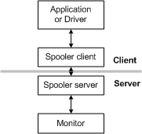

# Adding Bidirectional Communication

## 

The spooler provides support for bidirectional ("BiDi") communication between an application or driver and a printer. This support enables the application or driver to send one or more requests to the printer, and the printer to respond to these requests.

### Bidirectional Communication Requirements

Before an application or driver can use bidi communication, it must implement [bidirectional communication interfaces](bidirectional-communication-interfaces.md): either the IBidiSpl COM interface or the IbidiSpl2 COM interface, together with at least one of the IBidiRequest and IBidiRequestContainer COM interfaces. In addition, one or both of the following must be true:

-   The [**SendRecvBidiData**](https://msdn.microsoft.com/library/windows/hardware/ff562068) function is implemented in a print provider DLL.

-   The [**SendRecvBidiDataFromPort**](https://msdn.microsoft.com/library/windows/hardware/ff562071) function is implemented in a language monitor server DLL or in a port monitor server DLL.

To send a single request to the printer, an application or printer driver must first compose the request, and then call the IBidiSpl::SendRecv method. To send multiple requests, the application or driver composes a list of requests, and then calls the IBidiSpl::MultiSendRecv method.

After receiving the request, the client-side portion of the spooler (Winspool.drv) passes it on to the server-side spooler (spoolsv.exe). The server-side spooler can be on the local computer, or on a remote network print server. When the server-side spooler receives the request, it parses the data in the request, and fills in the members of a [**BIDI\_REQUEST\_CONTAINER**](https://msdn.microsoft.com/library/windows/hardware/ff545193) structure. The server-side spooler then calls [**SendRecvBidiData**](https://msdn.microsoft.com/library/windows/hardware/ff562068) or [**SendRecvBidiDataFromPort**](https://msdn.microsoft.com/library/windows/hardware/ff562071). When either function returns, its *ppResData* parameter points to a memory location that contains the address of a filled-in [**BIDI\_RESPONSE\_CONTAINER**](https://msdn.microsoft.com/library/windows/hardware/ff545202) structure that contains the printer's response. The server-side spooler converts the data in this structure to a form suitable for use by the application or driver, and passes it back to the client-side spooler, and finally back to the originator of the request.

 

 

[Send comments about this topic to Microsoft](mailto:wsddocfb@microsoft.com?subject=Documentation%20feedback%20%5Bprint\print%5D:%20Adding%20Bidirectional%20Communication%20%20RELEASE:%20%283/29/2016%29&body=%0A%0APRIVACY%20STATEMENT%0A%0AWe%20use%20your%20feedback%20to%20improve%20the%20documentation.%20We%20don't%20use%20your%20email%20address%20for%20any%20other%20purpose,%20and%20we'll%20remove%20your%20email%20address%20from%20our%20system%20after%20the%20issue%20that%20you're%20reporting%20is%20fixed.%20While%20we're%20working%20to%20fix%20this%20issue,%20we%20might%20send%20you%20an%20email%20message%20to%20ask%20for%20more%20info.%20Later,%20we%20might%20also%20send%20you%20an%20email%20message%20to%20let%20you%20know%20that%20we've%20addressed%20your%20feedback.%0A%0AFor%20more%20info%20about%20Microsoft's%20privacy%20policy,%20see%20http://privacy.microsoft.com/default.aspx. "Send comments about this topic to Microsoft")

