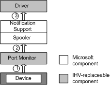

# Autoconfiguration During Configuration Change

After the device has been installed, the port monitor is responsible for keeping the configuration data current either by sending events or by polling. Whenever a driver or application is interested in the current configuration of the device, it can use the [bidi communication interfaces](https://msdn.microsoft.com/library/windows/hardware/ff545163) and the [bidi communications schema](https://msdn.microsoft.com/library/windows/hardware/ff545175) to query the port monitor for this information.

The following figure shows the data flow in autoconfiguration when the device's configuration changes:

1.  When the device configuration changes, a device that uses the Web Services Eventing (WS-Eventing) protocol notifies the print subsystem that its status has changed, but does not describe the specific change. The standard TCP/IP port monitor polls devices that do not support WS-Eventing.

2.  The port monitor generates a notification that the device configuration has changed and sends the notification to the spooler.

3.  The spooler sends a notification to the driver by calling `DrvPrinterEvent` and passing PRINTER\_EVENT\_CONFIGURATION\_UPDATE in the call. This function call serves to inform the driver that the configuration of the device has changed.

The driver can determine when there is a change in configuration for the device, because the notification message carries the changed value (the schema is defined in the Bidi Notification design specification). However, if the notification is too large to be sent through the notification mechanism, the notification will have one or more ReducedSchema instances, each of which indicates that a device characteristic has changed, but without any details of its new value.

 

 

