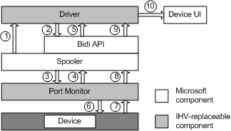

# Autoconfiguration During Device Installation

The following figure shows the data flow in autoconfiguration when a device is installed.

1.  When a printer is installed, the spooler initializes the driver by calling `DrvPrinterEvent` and passing PRINTER\_EVENT\_INITIALIZE in the call.

2.  The driver uses [bidi communication interfaces](https://msdn.microsoft.com/library/windows/hardware/ff545163) to obtain the data of interest to it, including values for installable options such as \\Printer.Configuration.DuplexUnit:Installed and \\Printer.Configuration.HardDisk:Installed.

3.  The bidi communication interface queries the port monitor for values of these attributes. The port monitor might have some of the data requested in its cache. For illustrative purposes in the following steps, assume that the value for \\Printer.Configuration.HardDisk:Installed is in the port monitor's cache, but the value for \\Printer.Configuration.DuplexUnit:Installed is not.

4.  If the port monitor has a cache, and has saved one or more of the requested values in it, the port monitor returns these values to the bidi communication interface. For any values not in its cache, the port monitor returns ERROR\_NO\_DATA. Note that a bidi query can fail if the port monitor implements a cache but the cache is empty. To prevent this problem, the port monitor should notify the bidi communication interface when its cache is populated.

5.  The bidi communication interface passes the information it receives from the port monitor to the driver. If the call from the bidi communication interface to the port monitor results in failure for any reason, the driver should set default values for these attributes. As soon as the port monitor receives information about the requested attributes, it should send a notification containing this information to the bidi communication interface.

    The driver updates the registry with the value for \\Printer.Configuration.HardDisk:Installed (obtained from the port monitor's cache) and the default value for \\Printer.Configuration.DuplexUnit:Installed.

6.  The port monitor queries the device for both values, including the value that was cached (\\Printer.Configuration.HardDisk:Installed).

7.  The device sends its values for the queried attributes to the port monitor. For any attribute whose value was not already present in the cache, or whose value differs from the one in the cache, the port monitor places the new value in its cache.

8.  The port monitor sends to the spooler a notification containing any values that formerly were not in the cache or that changed. In this example, the port monitor sends a notification to the spooler about the new value for \\Printer.Configuration.DuplexUnit:Installed. Note that if the cached value is the same as the new value received from the device, the port monitor does not send a notification to the spooler.

9.  The spooler responds to the notification from the port monitor by calling `DrvPrinterEvent`, passing PRINTER\_EVENT\_CONFIGURATION\_UPDATE in addition to information about all changed values in the call. This action serves two purposes: to notify the driver of the value of any attribute whose value was placed in the cache for the first time or whose value changed (\\Printer.Configuration.DuplexUnit:Installed, in this example); to update the registry. For each printer, the spooler serializes its calls to `DrvPrinterEvent`, so that the driver does not need to be thread-safe.

    Because device information is stored in the registry, the driver can satisfy calls to update UI or device capabilities information without the need to communicate directly with the physical device. The driver can be certain that the information stored in the registry is correct, because change notifications trigger the driver to query the device and update the device configuration state.

10. The driver updates the UI according to the latest configuration.

    The driver can determine when a change has occurred during device installation, because the notification message carries the changed value. However, if the notification is too large to be sent through the notification mechanism, the notification will have one or more ReducedSchema instances, each of which indicates that a device characteristic has changed, but without any details of its new value.

 

 

--------------------
[Send comments about this topic to Microsoft](mailto:wsddocfb@microsoft.com?subject=Documentation%20feedback%20%5Bprint\print%5D:%20Autoconfiguration%20During%20Device%20Installation%20%20RELEASE:%20%289/1/2016%29&body=%0A%0APRIVACY%20STATEMENT%0A%0AWe%20use%20your%20feedback%20to%20improve%20the%20documentation.%20We%20don't%20use%20your%20email%20address%20for%20any%20other%20purpose,%20and%20we'll%20remove%20your%20email%20address%20from%20our%20system%20after%20the%20issue%20that%20you're%20reporting%20is%20fixed.%20While%20we're%20working%20to%20fix%20this%20issue,%20we%20might%20send%20you%20an%20email%20message%20to%20ask%20for%20more%20info.%20Later,%20we%20might%20also%20send%20you%20an%20email%20message%20to%20let%20you%20know%20that%20we've%20addressed%20your%20feedback.%0A%0AFor%20more%20info%20about%20Microsoft's%20privacy%20policy,%20see%20http://privacy.microsoft.com/default.aspx. "Send comments about this topic to Microsoft")

